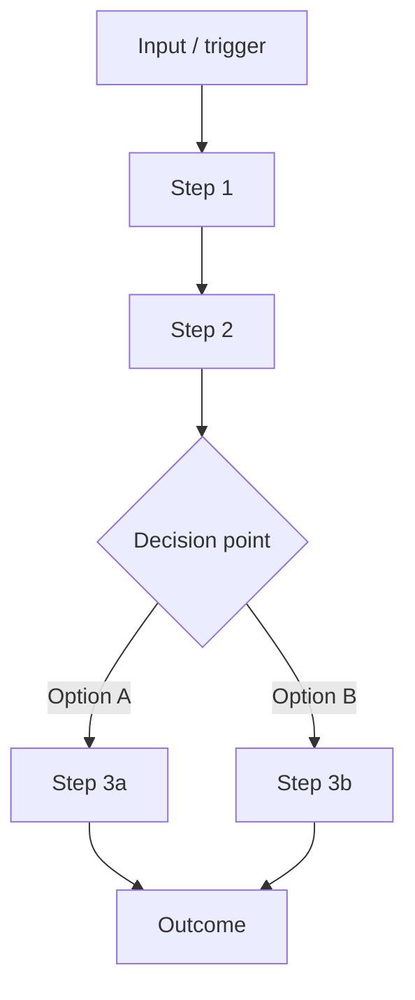
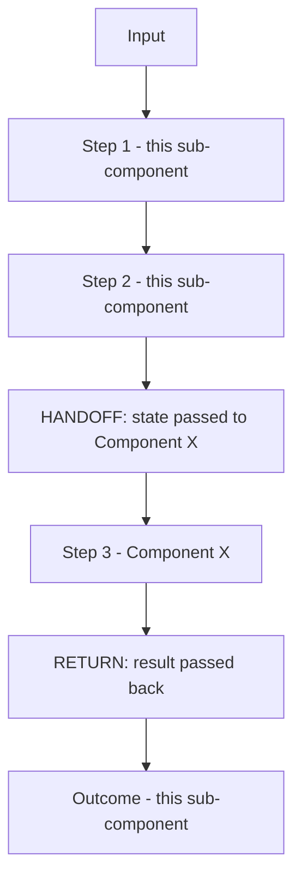
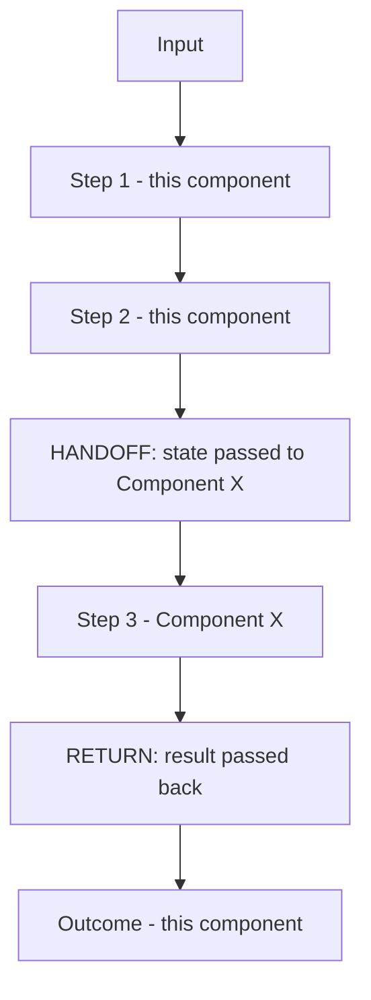

# Sub-Component Template

## About This Document

This template defines the structure for a **sub-component document** — a detailed, granular description of a specific piece within a component. Sub-components are where the decomposition gets concrete and buildable. This is the level where entity journeys, acceptance criteria, and data requirements are defined — the things an agent or engineer needs to start building.

**Where it sits in the hierarchy:**
- The **vision document** describes the overall product.
- The **component document** describes a major functional part of the product. It links down to this document via its backfilled Sub-Components table.
- **This document** describes one piece within a component. It contains the entity journeys, look and feel (when applicable), and data requirements. It's either a leaf node (buildable directly) or it decomposes further into sub-sub-components that follow this same template.
- When this document is detailed enough, it feeds into the **development workflow** — spec generation, implementation, deployment.

**Product components, not technical components.** At this level, think about what the user or agent interacts with — the product experience. Not APIs, microservices, or database tables. The frontend/backend split is a technical concern that gets resolved in the development workflow's spec and architecture phases, not here.

**Entity journeys, not user journeys.** An entity can be a user (human interacting with a UI) or an agent (processing an event, executing a workflow). For client-facing products like InPlay, most journeys are user journeys. For Project Genesis deployments, many journeys are agent journeys (event → processing → outcome). The template accommodates both.

**When this document is complete enough:** An agent or engineer can read this document and produce a spec without asking clarifying questions about what the sub-component should do, what the expected journeys are, or what data it needs. The development workflow picks up from here.

**Who fills this in:** Both roles together, but at this level the balance shifts. Entity journeys and data requirements often need the engineering-focused person to validate feasibility. Look and feel needs the client-facing person to ensure it matches the client's expectations.

---

# [Project Name] — [Sub-Component Name]

> **Component:** [[component-name]]  <!-- Replace with the actual component name, e.g. [[bloomberg-terminal]] -->
> **Date:** ___
> **Status:** Collecting | Defined | Ready for build | In build | Complete
> **Owner:** ___
> **Sources:** _[[meetings/YYYY-MM-DD-slug]]_

---

## 1. What Does This Sub-Component Do?

_More granular than the parent component's description. This should describe exactly what this specific piece does — not the whole component, just this part. What is its job? What would be missing from the product if this sub-component didn't exist?_

**Functional purpose:**

_Describe what this sub-component does in specific terms. For example, within a Bloomberg Terminal component, the "Match Detail" sub-component's purpose might be: "Displays comprehensive data for a single selected match — team metrics, historical performance, head-to-head stats, and current form. This is where the user decides whether a match is worth trading on." Be specific enough that someone could look at the built thing and say "yes, this does what the document said."_

___

**Entities that interact with it:**

_Which users and/or agents interact with this sub-component? Note any access restrictions — e.g., "only verified users," "admin only," "agent-triggered, no direct user interaction." If different entities interact differently, describe each._

- ___

---

## 2. What Needs to Happen?

_Functional requirements at the granular level. Each requirement should be specific and testable — not "show data" but "display the team's win/loss record for the current season, broken down by home and away."_

**Functional requirements:**

- ___
- ___
- ___

**Business rules:**

_Rules that govern behaviour. These come from the client, from regulation, or from product design decisions._

- ___

**Edge cases:**

_What happens when things go wrong or when the entity does something unexpected?_

- ___

---

## 3. Entity Journeys

_The core of this document. Each journey describes a complete flow: an entity (user or agent) has an input or intent, takes steps, and reaches an outcome. Journeys are defined as text + Mermaid flowcharts -- not screens or wireframes. The journey itself encodes UX and process decisions (e.g., "just the postcode, not the full address")._

_Journeys are split into two categories:_

- _**3a. Isolated journeys** -- journeys that stay within this component. They start in this sub-component and may touch sibling sub-components within the same parent component -- that's fine, it's all the same component. These define what this component does on its own._
- _**3b. Cross-component journeys** -- journeys that cross into a different component entirely (e.g., Information Layer -> Trading, not Information Layer sub-component A -> Information Layer sub-component B). These define the integration points between components. Document the full flow but clearly mark the **handoff point** -- what state is passed, what the user expects when they return. Each side of the handoff becomes a contract between the two components._

_Why the split matters: isolated journeys can be built and tested within the component. Cross-component journeys require coordination between different components and define the integration contracts that both sides must honour._

### 3a. Isolated Journeys

_Journeys that stay within this component. May span sibling sub-components (e.g., navigating from a game page to a team page within the same Information Layer) -- that's still an isolated journey because it doesn't leave the component._

#### Journey 1: ___

**Entity:** _User / Agent / Both_

**Input:** _What triggers this journey? What does the entity start with? For a user: "User has selected a specific match from the match browser." For an agent: "Receives a new-lead event from the webhook."_

**Outcome:** _What is true when this journey completes successfully? Be specific -- this is the eval. "User can see the team's full performance data and has enough information to decide whether to trade on this match." Or: "Agent has enriched the lead record with company data and qualification score."_

**Steps:**



**Acceptance criteria:**

_Specific, testable conditions that must be true for this journey to be considered complete. These are the evals. Write them so that someone (human or agent) can verify each one against the built product._

- [ ] ___
- [ ] ___
- [ ] ___

---

### 3b. Cross-Component Journeys

_Journeys that start in this sub-component and cross into another component, or that originate elsewhere and pass through here. Mark the handoff point clearly -- this defines the integration contract._

#### Journey 1: ___

**Entity:** ___

**Input:** ___

**Handoff point:** _Where does the journey cross into another component? What state is passed? What does the user expect when they return?_

**Components involved:** _List the components this journey touches (e.g., "Information Layer -> Trading -> Information Layer")_

**Outcome:** ___

**Steps:**



**Acceptance criteria:**

- [ ] ___
- [ ] ___

---

## 4. Look and Feel (Optional)

_Only applicable when this sub-component has a user-facing interface. Skip this section entirely for agent-only or backend sub-components._

_If the parent component already defines the design direction, reference it and only add specifics for this sub-component. Don't repeat the component-level design direction — extend it._

**Design specifics for this sub-component:**

_What should this particular piece look and feel like? Be opinionated — "data-dense with a dark background, key metrics in large type at the top, detailed breakdowns in collapsible sections below" is useful. "Should look nice" is not._

___

**Reference products / screen-grabs:**

_Specific examples to study for this sub-component. Link to products, include screen-grabs where possible._

- ___

**UX principles specific to this sub-component:**

_Principles that go beyond the component-level ones. For example: "Historical data should be visualised as a chart, not a table — users need to see trends, not raw numbers."_

- ___

---

## 5. Data Requirements

_What data does this sub-component need, produce, and store? Describe from the experience perspective — what goes in, what comes out, what the entity sees or provides. Not data models or schemas — those are resolved in the development workflow._

_Think of it as: what does the entity put in, and what do they get back?_

| What | Direction | Description | Source / Destination |
|------|-----------|------------|---------------------|
| _Name the data in plain terms — e.g., "team name", "performance history", "trade amount"_ | In (entity provides or system receives) / Out (entity sees or system produces) / Stored (persists for later use) | _What is this data? What does it represent? How fresh does it need to be?_ | _Where does it come from or go to? User input, external API, another sub-component, internal storage_ |
| | | | |
| | | | |

---

## 6. Dependencies

_What does this sub-component need from other sub-components, components, or external services? Start loose if names aren't finalised — describe the dependency by what it provides rather than by name. Backfill with specific links as the knowledge graph builds out._

| Depends on | What we need | Blocking? |
|-----------|-------------|----------|
| _Sibling sub-component, parent component, external service, or "something that provides X"_ | _What specifically — data, auth, state, API_ | _Yes / No — can mock_ |
| | | |

**What siblings or other components need from this one:**

- ___

---

## 7. Risks

_Granular risks specific to this sub-component. What could go wrong at this level? What controls need to be built directly into the entity journeys? This is the most specific level of risk assessment — the vision and component documents capture the big picture, this captures the detail._

**Specific risks:**

_What could go wrong with this particular sub-component? Think about: abuse vectors (how could someone exploit this specific flow?), data issues (stale data, missing data, inconsistent data at this point), UX risks (where could a user lose trust or get confused?), edge cases that could be exploited._

- ___

**Controls to build into the journeys:**

_What specific controls should be part of the entity journeys defined in section 3? For example: "add a visible 'data last updated: X seconds ago' indicator to the match detail view", "rate limit research queries to 50/day per user", "flag trades that are placed within 5 seconds of a data refresh as potentially latency-exploiting." These are product decisions that directly modify the journeys and acceptance criteria._

- ___

---

## 8. Priority

_How important is this sub-component relative to its siblings? Consider: does the parent component work without this? Is this the part that delivers the most value? Is this the riskiest piece that should be validated first?_

**Must-have at launch?** ___

**Sequencing rationale:** ___

---

## Sub-Sub-Components

_This section is **backfilled** if this sub-component decomposes further. If it does, each sub-sub-component gets its own document following this same template (the structure is recursive). If this sub-component is a leaf node — small enough to build without further decomposition — note that here._

_Leaf node — no further decomposition needed._

_OR:_

| Sub-Sub-Component | Overview | Status | Link |
|------------------|----------|--------|------|
| _Name_ | _One-line description_ | _Status_ | _[[path]]_ |
| | | | |

---

## Skeleton: What the Filled-In Document Looks Like

```markdown
# [Project Name] — [Sub-Component Name]

> **Component:** [[component-name]]  <!-- Replace with the actual component name, e.g. [[bloomberg-terminal]] -->
> **Date:** [Date]
> **Status:** [Status]
> **Owner:** [Names]

---

## 1. What Does This Sub-Component Do?

**Functional purpose:**

[1-2 paragraphs — specific to this piece, not the whole component]

**Entities that interact with it:**

- [Entity 1 — how they interact, any access restrictions]
- [Entity 2 — if applicable]

---

## 2. What Needs to Happen?

**Functional requirements:**
- [Specific, testable requirement]
- [Specific, testable requirement]

**Business rules:**
- [Rule with conditions]

**Edge cases:**
- [Scenario → expected behaviour]

---

## 3. Entity Journeys

### 3a. Isolated Journeys

#### Journey 1: [Name]

**Entity:** [User / Agent]
**Input:** [What triggers this]
**Outcome:** [What is true when complete]

**Steps:**
[Mermaid flowchart]

**Acceptance criteria:**
- [ ] [Testable condition]
- [ ] [Testable condition]

### 3b. Cross-Component Journeys

_Journeys that cross into a different component entirely. Mark the handoff point clearly -- this defines the integration contract between components._

#### Journey 1: ___

**Entity:** ___

**Input:** ___

**Handoff point:** _Where does the journey cross into another component? What state is passed? What does the user expect when they return?_

**Components involved:** _List the components this journey touches (e.g., "Information Layer -> Trading -> Information Layer")_

**Outcome:** ___

**Steps:**



**Acceptance criteria:**

- [ ] ___
- [ ] ___

---

## 4. Look and Feel (Optional)

**Design specifics:** [Description]
**References:** [Links, screen-grabs]
**UX principles:** [Specific principles]

---

## 5. Data Requirements

| What | Direction | Description | Source / Destination |
|------|-----------|------------|---------------------|
| [Data] | [In/Out/Stored] | [Description] | [Source] |

---

## 6. Dependencies

| Depends on | What we need | Blocking? |
|-----------|-------------|----------|
| [Dependency] | [What specifically] | [Yes/No] |

---

## 7. Risks

**Specific risks:**
- [Risk specific to this sub-component]

**Controls to build into the journeys:**
- [Specific control that modifies a journey or adds acceptance criteria]

---

## 8. Priority

**Must-have at launch?** [Yes/No]
**Sequencing rationale:** [1-2 sentences]

---

## Sub-Sub-Components

Leaf node — no further decomposition needed.
```
