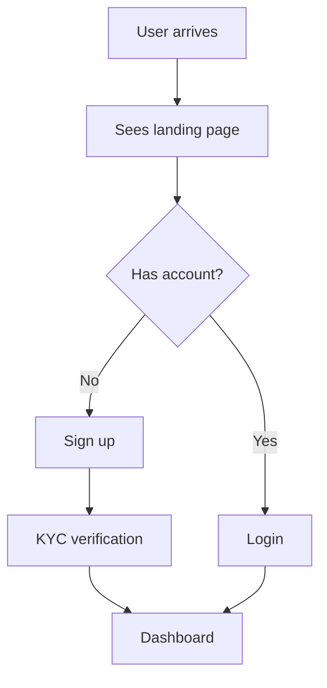
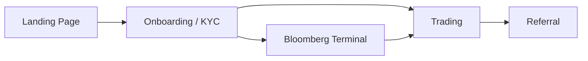
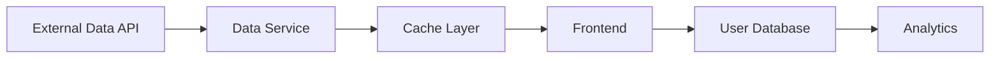
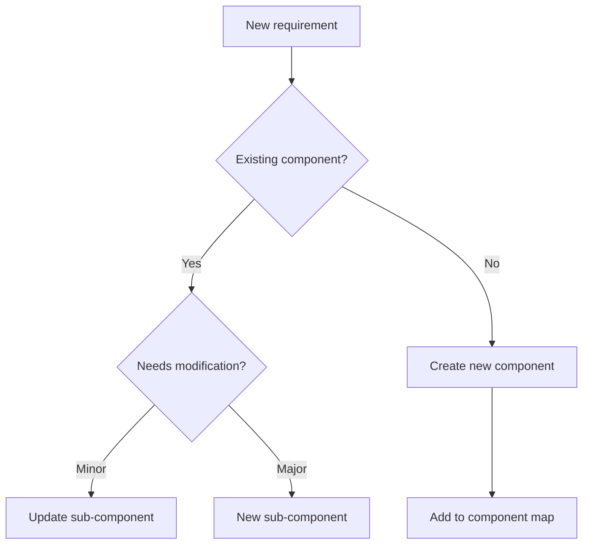
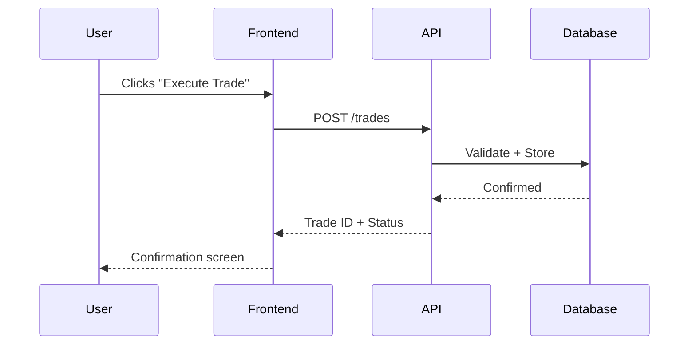

# Vision Template

## About This Document

This template defines the structure for a **vision document** — the first and most important document in any project. The vision document captures the holistic understanding of what we're building, who it's for, and why it matters. Everything downstream flows from this document.

**Where it sits in the hierarchy:**
- **This document** is the top of the tree. It describes the overall product at the highest level.
- The **component map** (`components/components.md`) sits below, listing all the major functional parts needed to deliver this vision. Components are identified by reading this vision and asking: "in order to deliver this to these personas, what functional parts need to exist?"
- **Component documents** sit below the map, one per component, describing each part in detail.
- **Architecture** (`architecture/architecture.md`) sits alongside the component map as a cross-cutting directory that captures technology decisions affecting multiple components — tech stack, infrastructure, and integrations.

**How it gets filled in:** The vision document is populated from client conversations. The client-facing person has natural conversations with the client, captures everything (via transcript), and then — behind closed doors — an agent extracts and structures the information into this document. The document goes through a loop: conversation → extraction → gap analysis → next conversation → until all sections have enough detail.

**When this document is complete enough:** Someone who wasn't in any of the conversations can read it and identify the major components that need to be built. That's the test. If they'd need to ask clarifying questions before they could decompose the product into functional parts, there are gaps to fill.

**Who fills this in:** Primarily the client-facing role, with input from the engineering role on sections 6 (Constraints) and 7 (What exists today). Sections 1-5 come from the client's world. Sections 6-7 come from both the client and internal knowledge.

---

# [Project Name] — Vision

> **Client:** ___
> **Date:** ___
> **Status:** Draft | Agreed | Evolving
> **Owner:** ___
> **Sources:** _[[meetings/YYYY-MM-DD-slug]]_

---

## 1. What Are You Building?

_The most important section in this document. This needs to be rich and detailed — not a summary, but the full picture of what this thing is. Someone who wasn't in any of the conversations should be able to read this section and understand what the product does, how people use it, and what it feels like. When this section is detailed enough, the major components of the product will start to become visible in the narrative itself._

**One-liner:**

_A single sentence that captures the essence of the product. Think elevator pitch — if you had 10 seconds to explain what this is to a stranger, what would you say?_

___

**Detailed narrative:**

_The full description of what the product is and does. Describe the experience from the user's perspective — what do they see when they first arrive? What can they do? How do the different parts of the product connect? What's the core loop (the thing the user does repeatedly that delivers value)? Don't just list features — paint the picture of what it's like to use this thing. This section should be long enough to capture the full scope. Multiple paragraphs are expected._

___

**Form factor:**

_How does the user access this product? Is it a web application, a mobile app, a desktop application, an API, a platform with multiple interfaces, or a combination? If it's multi-platform, which platform is primary and which are secondary?_

___

**Scope boundary:**

_What this product IS and what it explicitly IS NOT. This prevents scope creep and sets expectations. For example: "This is a sports trading platform, not a traditional betting app — there are no odds, no bookmakers, and no house edge. Users trade against each other." Clear boundaries help everyone (humans and agents) understand what's in and out of scope._

___

---

## 2. Who Are You Building It For?

_Define every distinct type of person who will use this product. Each persona should feel like a real person — not a generic demographic bucket but someone with specific behaviours, motivations, and frustrations. The personas defined here drive everything downstream: components exist because a persona needs them, user journeys are traced through the lens of a persona, and success metrics measure whether personas are getting what they need._

### Persona 1: ___

- **Demographics:** _Age range, gender split (if relevant), location, income level, education, profession. Paint a picture of who this person is in the real world._

- **Psychographic profile:** _What are their interests, attitudes, values, and lifestyle? How do they see themselves? What identity do they project? For example: "Sees themselves as a smart, data-driven decision maker. Follows financial Twitter. Reads The Athletic. Values being ahead of the crowd."_

- **Current behaviour:** _What does this person do today to solve the problem your product addresses? What products, tools, platforms, or workarounds do they currently use? How much time and money do they spend in this space? Understanding their current behaviour reveals what you're competing against and what habits you need to change._

- **Motivations:** _What drives this person to seek out a product like this? What are the deeper motivations behind the surface-level need? For example: "Wants to make money" is surface-level. "Wants to feel smarter than other traders and have data to prove it" is the deeper motivation that shapes product decisions._

- **Needs:** _Must-haves. Without these, the persona will not use the product at all. These are table stakes — the minimum bar. For example: "Must be able to see real-time match data" or "Must be able to execute trades instantly."_

- **Wants:** _Nice-to-haves that create delight and differentiation. These are the things that make the product feel special and keep users coming back. For example: "AI-powered research partner that helps analyse data" or "Leaderboards that let me see how I rank against other traders."_

- **Pain points with current alternatives:** _What specifically frustrates this person about what they use today? Be specific — not "it's slow" but "Robin Hood's onboarding takes 3 days because of payment delays, so by the time you're verified, the opportunity has passed."_

- **Switching trigger:** _What would make this person leave their current product/behaviour and adopt yours? What's the tipping point? This is critical for understanding what the product needs to deliver from day one to win users over._

### Persona 2: ___

_Same structure as above. Add as many personas as needed — but each one should be genuinely distinct, not just a demographic variation of the same person._

---

## 3. Why Are You Building It?

_The business case. Why does the client want this product to exist? This section should make clear whether the motivation is commercial opportunity, strategic positioning, personal conviction, competitive pressure, or some combination. It should also articulate what happens if they don't build it — the cost of inaction._

- **Business opportunity:** _What gap exists in the market that this product fills? Why is now the right time to build it? Has something changed (regulation, technology, consumer behaviour, competitor weakness) that creates a window? For example: "Sports prediction markets are growing 40% year-on-year but existing platforms are either pure gambling (Bet365) or pure prediction markets (Polymarket) — nobody combines intelligence-driven research with real-money trading."_

- **Client's motivation:** _Why does this specific client want to build this? Is it a personal passion project, a strategic bet within a larger business, a pivot from an existing product, or a commercial opportunity they've identified? Understanding the motivation helps calibrate how much risk they're willing to take and how patient they'll be._

- **Cost of inaction:** _What happens if they don't build this? Does a competitor fill the gap? Does a market window close? Does an existing business decline? Sometimes the cost of inaction is low (nice-to-have product) and sometimes it's existential (the market is moving and they'll be left behind)._

---

## 4. What Makes This Better Than the Alternatives?

_Name specific competitors and alternatives — not generic categories. Research each one. Link to their actual products so we can study them. The goal is to understand exactly what exists, what works, what doesn't, and where the gap is that this product fills. This section is also where screen-grabs, user flow references, and competitive research live._

| Competitor / Alternative | What they do | What works well | What doesn't work | Link |
|-------------------------|-------------|----------------|-------------------|------|
| | _Describe what this competitor's product actually does_ | _Specific things they get right that we should learn from_ | _Specific things they get wrong or miss entirely_ | _URL to the product, app store listing, or relevant page_ |
| | | | | |
| | | | | |

**The differentiation:**

_Specifically how this product is different from everything listed above. Not "we're better" — what is the structural difference in approach, capability, or experience? For example: "Nobody combines intelligence-gathering (Bloomberg-style terminal), community (trader rankings), and execution (trading) in a single platform. Existing products do one of these three but not all together."_

**Unfair advantage:**

_If there is one. Proprietary data, exclusive partnerships, regulatory position, first-mover advantage, unique technology, or unique domain expertise. If there isn't an unfair advantage, that's fine — say so. Not every product has one._

---

## 5. How Does It Make Money?

_The revenue model. How does this product generate income? This section directly affects what gets built — if the model is commission-per-trade, you need billing infrastructure. If it's subscription, you need tier management. If it's freemium, you need a conversion funnel. The revenue model creates or eliminates components._

- **Revenue model:** _The primary mechanism for generating revenue. Commission per transaction, monthly subscription, freemium with premium tier, advertising, marketplace fees, licensing, etc. Be specific about the mechanics — "2% commission on each executed trade" is better than "commission-based."_

- **Revenue streams:** _Primary stream (the main way money comes in) and any secondary streams (additional ways to monetise). For example: primary is commission per trade, secondary is premium data subscriptions for advanced analytics._

- **Who pays:** _The end user, the client's customers, advertisers, third-party partners, or some combination. This affects the product's relationship with each persona — a user who pays expects different things than a user who is the product._

---

## 6. Constraints

_Things that are fixed or non-negotiable that shape what we can build and how. These aren't problems to solve — they're boundaries to work within. Constraints create or eliminate components and affect technology decisions._

- **Technology:** _Existing systems that must be integrated with, required tech stack (e.g., client uses Azure and has £100K in credits), existing APIs or data sources that must be used, platform requirements (must work on iOS, must support specific browsers), existing infrastructure._

- **Legal / compliance:** _Regulatory requirements (FCA regulation for financial products, GDPR for EU data, KYC/AML for financial services, age verification for gambling-adjacent products), licensing requirements, data residency requirements, industry-specific compliance._

- **Dependencies:** _Third-party services or partners that must be in place for the product to work. API providers (SportsRadar for sports data), payment processors, identity verification services, data feeds. If a dependency doesn't exist yet or isn't confirmed, note that — it's a risk._

- **Non-negotiables:** _Decisions the client has already made that we can't change. These might be technology choices ("we're using Stripe, non-negotiable"), design choices ("the brand colours are X"), business rules ("users must be 18+"), or strategic choices ("we will not offer traditional betting"). Understanding non-negotiables early prevents wasted work._

---

## 7. What Exists Today?

_The starting point. Are we building from scratch or building on top of something? This section captures everything that already exists — systems, users, data, previous work, branding. For a greenfield project, this section may be short ("nothing — starting from scratch"). For a project building on existing foundations, this section is critical for understanding the constraints and assets we're working with._

- **Existing systems / platforms:** _Any software, infrastructure, or platforms already in place that we're building on top of, integrating with, or replacing. Include version information and current state (active, deprecated, legacy)._

- **Existing user base:** _Does the client already have users, a waitlist, beta testers, or an audience? How many? What do we know about them? An existing user base changes the launch strategy and the first components to build._

- **Existing data / content:** _Data sets, content libraries, research, analytics, or other data assets that already exist and could be used. For example: "Client has 3 years of historical sports trading data from a previous platform."_

- **Previous work:** _Specs, designs, prototypes, wireframes, research, or other work done before we got involved. This could be useful reference (shape and structure) even if the content is outdated. Note what's trustworthy vs. what's stale._

- **Existing branding / design language:** _Brand guidelines, style guides, logos, colour palettes, fonts, design systems. If the client has an established brand, we work within it. If not, this is a gap that needs addressing._

---

## 8. Risks

_High-level risks to the product as a whole. This is a product-level risk assessment, not a technical security audit. Think about: how could this platform be abused? What could undermine the value proposition? What industry-specific compliance requirements exist? Risks get more granular at the component and sub-component levels — this section captures the big-picture threats._

**Abuse and gaming:**

_How could bad actors exploit this product? Any platform where users can make money, gain status, or access valuable data will attract people trying to game the system. For example: bots automating actions to extract value at scale, fake accounts to manipulate leaderboards, scraping data for resale. What are the obvious attack vectors for this specific product?_

- ___

**Data and integrity risks:**

_What could go wrong with the data the product relies on? Stale data leading to bad decisions, data inconsistencies between components, data quality issues from third-party providers, loss of access to a critical data source._

- ___

**Compliance and regulatory:**

_What industry-specific compliance applies? Different industries have different requirements — financial services (FCA, SOC2, PCI-DSS), healthcare (HIPAA), data protection (GDPR, data residency), identity verification (KYC/AML). Some products need ISO 27001 certification. Note what applies and what the implications are for what we build. This goes beyond the constraints section — constraints are fixed facts, risks are things that could go wrong if we don't address them properly._

- ___

**User experience risks:**

_What could make users lose trust or abandon the product? Bad first impressions, confusing flows, performance issues under load, unclear pricing, unexpected charges. Think about the moments in the product where trust is most fragile._

- ___

---

## Components

_This section is **backfilled** as components are identified and documented. When the vision document is first created, this section may be empty or have only rough names. As component documents are created in `components/[name]/[name].md`, come back here and add the link and one-line overview. This is the routing mechanism — an agent or human reading the vision can see all components at a glance and navigate to any of them._

| Component | Overview | Status | Link |
|-----------|----------|--------|------|
| _Component name_ | _One-line description of what this component does and why it exists_ | _Collecting / Defined / Ready for build / In build / Complete_ | _[[component-name]]_ |
| | | | |
| | | | |

---

## Diagrams

_Use diagrams where they communicate structure or flow more clearly than text. Include them inline within the relevant section — not collected at the end._

### Mermaid — for flow and relationships

_Use when showing things connecting to things: user journeys, data flows, component relationships, decision trees, sequences._

**Entity journey (top-down flowchart):**



**Component relationships (left-to-right graph):**



**Data flow between systems:**



**Decision tree:**



**Sequence diagram (for interactions over time):**



### ASCII — for structure and hierarchy

_Use when showing things containing things: decomposition trees, directory structures, system layouts, simple categorisations._

**Product decomposition:**

```
Vision: [Product Name]
├── Component A
│   ├── Sub-component A1
│   └── Sub-component A2
├── Component B
│   ├── Sub-component B1
│   ├── Sub-component B2
│   └── Sub-component B3
└── Component C
    └── Sub-component C1
```

**Directory / file structure:**

```
project/
├── index.md
├── architecture.md
└── components/
    ├── components.md
    ├── component-a/
    │   ├── component-a.md
    │   └── sub-components/
    │       └── sub-comp-1/
    │           ├── sub-comp-1.md
    │           ├── changelog.md
    │           └── changes/
    └── component-b/
        ├── component-b.md
        └── ...
```

**System layout:**

```
┌─────────────────────────────────────────────┐
│                  Frontend                    │
│  ┌──────────┐  ┌──────────┐  ┌──────────┐  │
│  │ Landing  │  │ Terminal │  │ Trading  │  │
│  └──────────┘  └──────────┘  └──────────┘  │
└──────────────────────┬──────────────────────┘
                       │ API
┌──────────────────────┴──────────────────────┐
│                Backend Services              │
│  ┌──────────┐  ┌──────────┐  ┌──────────┐  │
│  │ Auth     │  │ Data     │  │ Trade    │  │
│  │ Service  │  │ Service  │  │ Engine   │  │
│  └──────────┘  └──────────┘  └──────────┘  │
└──────────────────────┬──────────────────────┘
                       │
┌──────────────────────┴──────────────────────┐
│              External Services               │
│  ┌──────────┐  ┌──────────┐  ┌──────────┐  │
│  │ Data API │  │ KYC      │  │ Payment  │  │
│  │          │  │ Provider │  │ Provider │  │
│  └──────────┘  └──────────┘  └──────────┘  │
└─────────────────────────────────────────────┘
```

**Simple categorisation:**

```
Personas
├── Primary
│   ├── [Persona 1] — [one-line description]
│   └── [Persona 2] — [one-line description]
└── Secondary
    └── [Persona 3] — [one-line description]
```

### When to use which

| Situation | Use | Why |
|-----------|-----|-----|
| Entity journey / flow | Mermaid `graph TD` | Shows steps, decision points, and outcomes |
| Component relationships | Mermaid `graph LR` | Shows what connects to what |
| API call sequence | Mermaid `sequenceDiagram` | Shows interactions over time between systems |
| Data flow between systems | Mermaid `graph LR` | Shows data moving between components |
| Product decomposition | ASCII tree | Shows hierarchy — what contains what |
| Directory / file structure | ASCII tree | Shows folder layout |
| System architecture | ASCII box diagram | Shows layers and boundaries |
| Simple categorisation | ASCII tree | Quick structural overview |

---

## Skeleton: What the Filled-In Document Looks Like

_Below is the expected output structure. Guidance text is removed. Placeholders show where content goes and how much is expected._

```markdown
# [Project Name] — Vision

> **Client:** [Name]
> **Date:** [Date]
> **Status:** [Draft | Agreed | Evolving]
> **Owner:** [Name]

---

## 1. What Are You Building?

**One-liner:** [Single sentence elevator pitch]

**Detailed narrative:**

[Paragraph 1 — what the product is and what it does at the highest level]

[Paragraph 2 — the core user experience: what the user sees, does,
and feels when using the product]

[Paragraph 3 — the core loop: the repeated activity that delivers
value. What brings users back]

[Paragraph 4+ — how the different parts of the product connect.
The narrative should be rich enough that components become visible]

[Inline diagram if helpful — e.g., a Mermaid flowchart of the core
user loop, or an ASCII tree of the product's major areas]

**Form factor:** [Platform type]

**Scope boundary:** [What it IS. What it explicitly IS NOT]

---

## 2. Who Are You Building It For?

### Persona 1: [Label]

- **Demographics:** [2-3 sentences]
- **Psychographic profile:** [2-3 sentences]
- **Current behaviour:** [2-3 sentences]
- **Motivations:** [Surface-level AND deeper motivations]
- **Needs:** [Bullet list of must-haves]
- **Wants:** [Bullet list of nice-to-haves]
- **Pain points with current alternatives:** [Specific frustrations]
- **Switching trigger:** [What tips them over]

### Persona 2: [Label]

[Same structure]

---

## 3. Why Are You Building It?

- **Business opportunity:** [1-2 paragraphs]
- **Client's motivation:** [1-2 sentences]
- **Cost of inaction:** [1-2 sentences]

---

## 4. What Makes This Better Than the Alternatives?

| Competitor | What they do | Works well | Doesn't work | Link |
|-----------|-------------|-----------|-------------|------|
| [Name] | [Description] | [Specifics] | [Specifics] | [URL] |
| [Name] | [Description] | [Specifics] | [Specifics] | [URL] |

**The differentiation:** [1-2 paragraphs]

**Unfair advantage:** [If any — otherwise "None identified"]

---

## 5. How Does It Make Money?

- **Revenue model:** [Specific mechanics]
- **Revenue streams:** [Primary and secondary]
- **Who pays:** [Which persona / party]

---

## 6. Constraints

- **Technology:** [List]
- **Legal / compliance:** [List]
- **Dependencies:** [List]
- **Non-negotiables:** [List]

---

## 7. What Exists Today?

- **Existing systems / platforms:** [Description or "Greenfield"]
- **Existing user base:** [Numbers and detail or "None"]
- **Existing data / content:** [Description or "None"]
- **Previous work:** [Description or "None"]
- **Existing branding:** [Description or "None"]

---

## 8. Risks

**Abuse and gaming:**
- [Identified risks]

**Data and integrity risks:**
- [Identified risks]

**Compliance and regulatory:**
- [Requirements and implications]

**User experience risks:**
- [Trust and abandonment risks]

---

## Components

| Component | Overview | Status | Link |
|-----------|----------|--------|------|
| [Name] | [One-line description] | [Status] | [[name]] |
```
