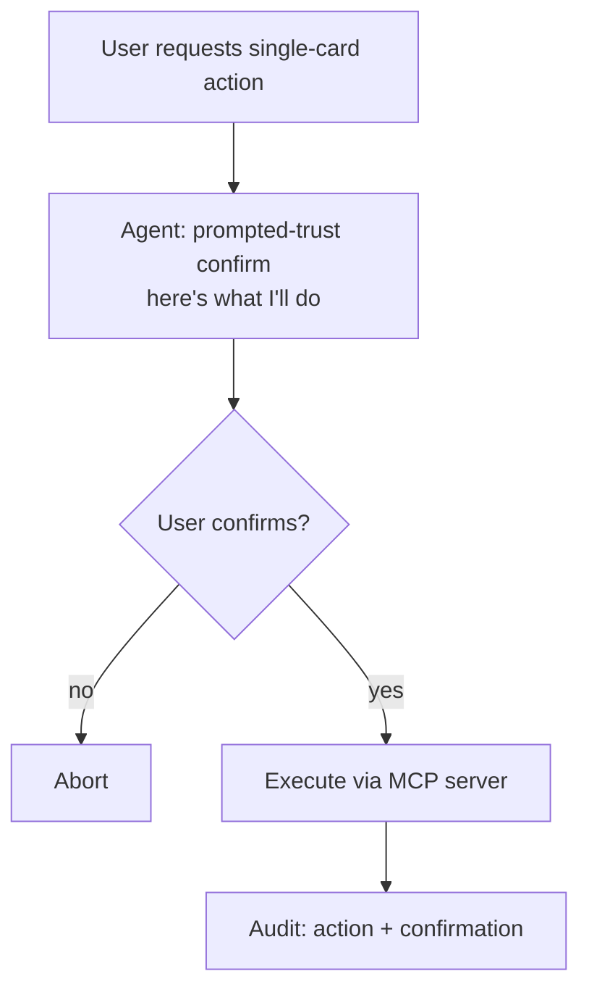
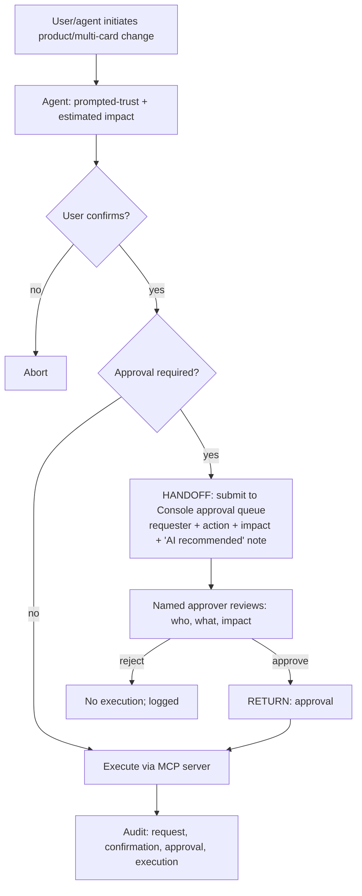

# TXN — Approval-Queue Integration

> **Component:** [[agent-access-layer]]
> **Date:** 2026-06-02
> **Status:** Defined
> **Owner:** _TBC_
> **Sources:** [[01-06-2026-component-1-Agent-Access-Layer]]

---

## 1. What Does This Sub-Component Do?

**Functional purpose:**

Approval-queue integration ensures that high-impact, AI-initiated changes go through TXN's existing two-person approval flow before they execute — so the agentic shortcut never bypasses the safeguard. In TXN's model **approval is itself a permission**: certain actions can only proceed once a *different* user approves them. Mike Moores (TXN's CTO) set the cut line at **anything product-level or affecting multiple cards** (e.g. spend-control or product changes); a single-card action like terminate is a **privileged** action but, because its blast radius is one card, it does not require a second approver.

Before any change — approval-required or not — the agent applies **prompted trust**: it states the change and its estimated impact and gets confirmation. Where approval is required, the request is routed to the **named approver** (or their agent), carrying the change, the impact, and a note that an AI agent recommended it (Dorte Dye's point, to keep the audit trail consistent). The approver becomes the initiator of the action; the two-person rule holds even if the requester is themselves an approver.

**Entities that interact with it:**

- **Requesting user + their agent** — initiate a change
- **The named approver** (or their agent) — approves/rejects
- **The Console approval queue** (built by Stackworkz) — the existing system this integrates with

---

## 2. What Needs to Happen?

**Functional requirements:**

- Determine whether an action requires approval (permission-driven; product/multi-card = yes).
- Apply **prompted-trust** confirmation (change + estimated impact) before proceeding.
- Route approval-required actions to the **named approver** with the change, impact, and AI-recommendation note.
- Enforce the **two-person rule** — the requester (even if an approver) cannot self-approve.
- Execute via [[mcp-server]] only after approval; record everything via [[audit-attribution]].
- Execute **privileged single-card** actions directly after confirmation (no second approver), still logged.

**Business rules:**

- **Product/multi-card → approval required.** Single-card terminate → privileged, no approval.
- **Approver ≠ requester.** Always a second person.
- **Prompted trust always** — confirm what will happen even when no extra context is needed.

**Edge cases:**

- Requester is the only approver available → action waits; cannot self-approve.
- "Just do it, don't advise me" → still confirm the action; don't nag *after* with "why did you do that?".
- Approver unavailable → action remains queued; requester informed.

---

## 3. Entity Journeys

### 3a. Isolated Journeys

#### Journey 1: Execute a privileged single-card action

**Entity:** User + agent (hybrid)

**Input:** User asks the agent to perform a single-card privileged action (e.g. suspend/terminate one card).

**Outcome:** The action executes after confirmation, with no second approver, and is audited.

**Steps:**

**Acceptance criteria:**
- [ ] A single-card terminate/suspend executes after a single confirmation (no second approver).
- [ ] The action still requires the relevant privilege permission.
- [ ] The confirmation and execution are audited.

### 3b. Cross-Component Journeys

#### Journey 1: Execute an approval-required change

**Entity:** Requesting user + agent → approver

**Input:** A user/agent initiates a product-level or multi-card change.

**Handoff point:** After the requester confirms, the request crosses into the **Console approval queue** (Stackworkz-built). State passed: requester identity, the action, the estimated impact, and the AI-recommendation note. Returned: the approve/reject decision.

**Components involved:** Agent Access Layer → Console approval queue (Stackworkz) → Agent Access Layer

**Outcome:** The change executes only after a second, named person approves; the full chain is auditable.

**Steps:**

**Acceptance criteria:**
- [ ] Any product-level/multi-card change routes to the approval queue.
- [ ] The requester cannot self-approve (two-person rule), even if they hold the approve permission.
- [ ] The approver sees the requester, the change, the estimated impact, and that an AI agent recommended it.
- [ ] On approval, the action executes via [[mcp-server]] and is audited end-to-end.
- [ ] On rejection, nothing executes and the rejection is logged.

---

## 5. Data Requirements

| What | Direction | Description | Source / Destination |
|------|-----------|------------|---------------------|
| Proposed action + estimated impact | In/Out | The change and its predicted effect | Agent / Data Lake |
| Approval requirement flag | In | Whether this action needs approval | [[permission-scoping]] / permission model |
| Approver identity | In | The named second person | Console permission model |
| Approval decision | Out | Approve / reject + who + when | Console approval queue → audit |

---

## 6. Dependencies

| Depends on | What we need | Blocking? |
|-----------|-------------|----------|
| Console approval queue (Stackworkz) | The existing two-person approval mechanism + a way to submit/consume requests | **Yes** (cross-component) |
| [[permission-scoping]] | Which actions require approval; approver identity | **Yes** |
| [[mcp-server]] | Execute on approval | **Yes** |
| [[audit-attribution]] | Record request → confirm → approve → execute | No — parallel |

**What siblings/other components need from this one:**
- [[agent-inbox-alerts]], [[co-pilot]], [[full-agentic-experience]], and [[a2a-endpoint]] all route high-impact actions through here.

---

## 7. Risks

**Specific risks:**
- Approval bypass — an agent finding a path around the queue or self-approving.
- Inconsistent audit if the AI-recommendation note isn't attached to the approval request.
- Approver fatigue if the cut line is set too low.

**Controls to build into the journeys:**
- Two-person rule enforced server-side, not in agent logic.
- Always attach the AI-recommendation note to the approval request.
- Keep the cut line at product/multi-card; single-card actions stay out of the queue.

---

## 8. Priority

_Phasing out of scope. Relative note: load-bearing for the "we help non-experts avoid costly mistakes" proposition; builds on the existing Console queue, so it's an integration rather than a from-scratch build._

---

## Sub-Sub-Components

Leaf node — no further decomposition needed.
