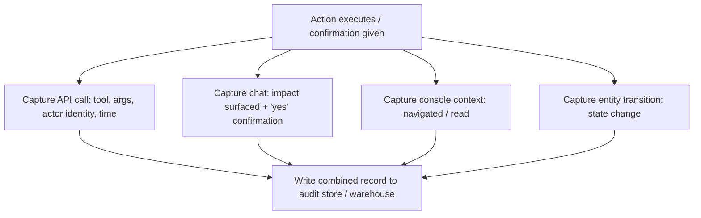
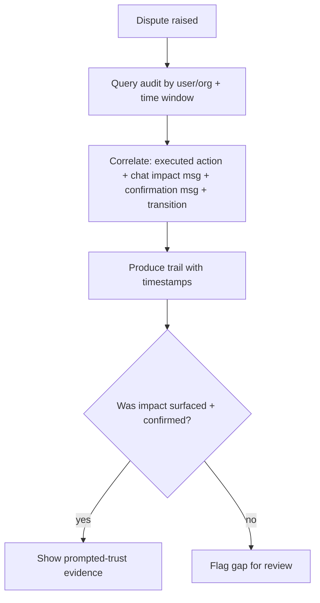

# TXN — Audit & Attribution

> **Component:** [[agent-access-layer]]
> **Date:** 2026-06-02
> **Status:** Defined
> **Owner:** _TBC_
> **Sources:** [[01-06-2026-component-1-Agent-Access-Layer]]

---

## 1. What Does This Sub-Component Do?

**Functional purpose:**

Audit & attribution makes every AI-initiated action **reconstructable and provable**. It is the backbone of "prompted trust" — TXN's selling point is that it helps non-experts avoid costly mistakes by confirming changes and showing impact, and Ian Johnson (TXN's CEO) was clear that when "the s\*\*\* hits the fan" weeks later ("why are my transactions down?"), TXN must be able to prove *we prompted, you confirmed*. Mike Moores (TXN's CTO) described a **combined audit**: the **Console** side (what the user navigated, read, clicked), the **Core API** side (what executed, and which identity triggered it — the AI gets its own attributed identity, tagged to the acting user), and the **AI chat** (where the impact was given and the user said "yes"). Entity **transitions** (card/account/cardholder state changes, which are time-bound and already logged) bolt into the same trail.

The point that makes this AI-specific: a normal API audit proves "this user asked, we did it." Here TXN also needs to prove the *contextual* exchange — that impact was surfaced (e.g. in chat message 3) and confirmed (message 4) — to defend the promise that it advises, not just executes.

**Entities that interact with it:**

- **The system / agents** — write audit records as actions occur
- **A support-investigation agent / human** — query and reconstruct trails for disputes
- _Storage destination: combined audit store / data warehouse (knowledge-graph style)_

---

## 2. What Needs to Happen?

**Functional requirements:**

- Record every AI-initiated action with: actor (agent + represented user), timestamp, tool/endpoint, before→after (or the transition), and the **linked chat confirmation**.
- Combine **Console + Core API + chat** events into one reconstructable trail.
- Capture **entity transitions** (lifecycle state changes) alongside actions.
- Support **reconstruction by user/org + time window** for dispute resolution.
- Keep records **immutable**; honour a retention policy (to be defined).

**Business rules:**

- **Provable prompted-trust** — the trail must link the action, the impact surfaced, and the user's confirmation.
- **AI attributed, not anonymous** — AI actions carry their own identity, tagged to the acting user.

**Edge cases:**

- A "just do it" action with no contextual impact → still log the confirmation that it was requested and confirmed.
- Multi-step / approval-routed action → log requester confirmation *and* approver approval.
- Chat logs contain PII → see Risks.

---

## 3. Entity Journeys

### 3a. Isolated Journeys

#### Journey 1: Record an AI-initiated action

**Entity:** Agent / system

**Input:** An action executes (via [[mcp-server]]) and/or a chat confirmation occurs.

**Outcome:** A combined, immutable audit record links the API action, the impact surfaced, the user's confirmation, and any resulting transition.

**Steps:**

**Acceptance criteria:**
- [ ] Each AI action logs actor (agent + represented user), timestamp, tool/endpoint, and before→after / transition.
- [ ] The record links the chat message where impact was surfaced and the message where the user confirmed.
- [ ] Approval-routed actions additionally log the approver and approval time.
- [ ] Audit records are immutable. _[⚠ open — see [[open-questions]] #6]_
- [ ] Retention policy is applied (value TBD with TXN).

#### Journey 2: Reconstruct a dispute trail

**Entity:** Support-investigation agent (or human)

**Input:** A dispute — e.g. "my transactions dropped 50% last week."

**Outcome:** A reconstructed trail showing what was changed, when, that the impact was surfaced, and that the user confirmed — the "we prompted, you confirmed" position.

**Steps:**

**Acceptance criteria:**
- [ ] Given an action, the trail links the executed call, the impact surfaced, and the user confirmation.
- [ ] Trails are reconstructable by user/org and time window.
- [ ] Timestamps are precise enough to order the prompt → confirm → execute sequence.

---

## 5. Data Requirements

| What | Direction | Description | Source / Destination |
|------|-----------|------------|---------------------|
| API action logs | In/Stored | Tool/endpoint, args, actor identity, time | Core API (DT) |
| Chat logs | In/Stored | Impact surfaced + user confirmation | Agent / chat surface |
| Console interaction logs | In/Stored | Navigated / read / clicked | Console (Stackworkz) |
| Entity transitions | In/Stored | Lifecycle state changes (card/account/holder) | Core API (DT) |
| Combined audit records | Stored/Out | The reconstructable trail | Data warehouse / knowledge-graph audit store |

---

## 6. Dependencies

| Depends on | What we need | Blocking? |
|-----------|-------------|----------|
| Core API (DT) | Action + transition logs, with AI identity attribution | **Yes** |
| Console logs (Stackworkz) | Navigation/read context for the combined trail | No — API+chat alone is a partial trail |
| Chat logging | The confirmation exchange | **Yes** (AI-specific part) |
| Data warehouse / audit store | Durable, immutable storage | **Yes** |

**What siblings/other components need from this one:**
- [[approval-queue-integration]], [[mcp-server]], and every agentic component write here.
- A future internal support-investigation agent (Internal Ops) reads here.

---

## 7. Risks

**Specific risks:**
- **Storage & retention undecided** — chat + transition history volume and retention window are open (raised but not resolved).
- **PII in chat/audit** — cardholder data may appear in chat logs; handling and residency must be respected.
- **Gaps undermine the defence** — if the impact/confirmation link is missing, the "we prompted, you confirmed" position fails exactly when it's needed.

**Controls to build into the journeys:**
- Immutable, append-only audit writes.
- Always link impact + confirmation to the executed action (acceptance criterion above).
- Define retention + PII-redaction policy with TXN before build.

---

## 8. Priority

_Phasing out of scope. Relative note: directly underwrites the trust proposition; must be in place before AI-initiated changes go live, even if reporting/retention features mature later._

---

## Sub-Sub-Components

Leaf node — no further decomposition needed.
