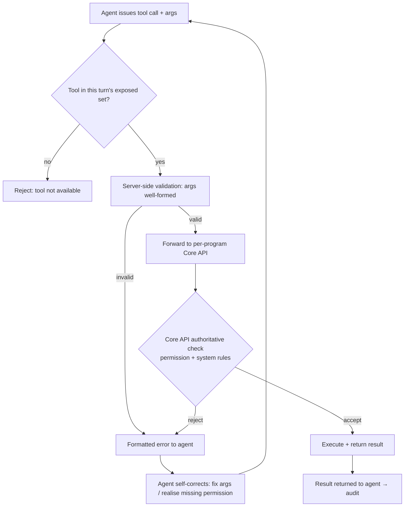

# TXN — MCP Server (validation & execution)

> **Component:** [[agent-access-layer]]
> **Date:** 2026-06-02
> **Status:** Defined
> **Owner:** _TBC_
> **Sources:** [[01-06-2026-component-1-Agent-Access-Layer]]

---

## 1. What Does This Sub-Component Do?

**Functional purpose:**

The MCP Server is the single runtime surface every TXN agent calls through. It exposes the catalogued tools ([[tool-catalogue]]) over the Model Context Protocol, gates which of them are callable on a given turn ([[permission-scoping]]), validates each call server-side, and forwards permitted calls to DT's Core API. The deep-dive landed on **one "monolith" MCP server with per-turn tool gating** rather than several semantically-bucketed servers — a single configuration could otherwise need "a bit of one, a bit of two, a bit of three" across servers, so one server that re-computes the exposed tool set each turn is simpler.

Its load-bearing job is **safe execution**: server-side validation plus the Core API's own authoritative rejection mean the one-in-a-thousand bad tool call never takes effect, and when a call is rejected the agent gets a machine-readable, formatted error it can self-correct from and retry — rather than relying on agent context alone to get permissions right.

**Entities that interact with it:**

- **TXN's agents** ([[co-pilot]], [[agent-inbox-alerts]], [[full-agentic-experience]]) — call tools through it
- **External / client agents** — reach it via the [[a2a-endpoint]]
- **DT Core API** — the downstream system the server forwards permitted calls to

---

## 2. What Needs to Happen?

**Functional requirements:**

- Expose catalogued tools over MCP, scoped to the **per-turn allowed set** from [[permission-scoping]].
- **Server-side validate** each call (tool is exposed this turn; arguments well-formed) before forwarding.
- Forward permitted calls to the Core API with the appropriate API key. _[⚠ open — see [[open-questions]] #2]_
- On Core API rejection, return a **formatted, machine-readable error** the agent can parse, correct, and retry.
- Carry the runtime context (universal API key + user-ID + the user's permissions in the payload) so tool exposure is recomputed each turn.

**Business rules:**

- **Server-authoritative, not agent-authoritative** — the Core API is the final arbiter; the agent's judgement is never the last line of defence.
- **No action outside the exposed set** — a tool not exposed this turn cannot be invoked.

**Edge cases:**

- Agent calls a tool it shouldn't → blocked at the server / rejected by Core API → formatted error → agent corrects.
- Retry after a corrected error must not double-execute a partially-applied change (idempotency). _[⚠ open — see [[open-questions]] #5]_
- Core API unavailable → graceful, surfaced failure (not a silent drop).

---

## 3. Entity Journeys

### 3a. Isolated Journeys

#### Journey 1: Validate and execute a tool call

**Entity:** Agent (hybrid — triggered by a user or agent intent)

**Input:** An agent issues a tool call (tool name + arguments) on behalf of an identified user.

**Outcome:** A permitted, well-formed action executes against the Core API; an impermissible or malformed one fails safely with an error the agent can recover from.

**Steps:**

**Acceptance criteria:**
- [ ] A tool not in the per-turn exposed set cannot be invoked.
- [ ] An unpermitted call is rejected by the Core API and never takes effect.
- [ ] Rejections return a structured, machine-readable error (reason + offending field).
- [ ] The agent can correct from the error and retry without human intervention.
- [ ] A corrected retry does not double-apply a change (idempotency). _[⚠ open — see [[open-questions]] #5]_
- [ ] Every executed call is handed to [[audit-attribution]].

### 3b. Cross-Component Journeys

#### Journey 1: Forward to DT's Core API

**Entity:** MCP Server → DT Core API

**Input:** A validated, permitted tool call.

**Handoff point:** The call crosses from Novosapien's MCP server to **DT's Core API** (the per-program instance). State passed: the operation + arguments + identity. Returned: success payload or a formatted error.

**Components involved:** Agent Access Layer → Core API (DT) → Agent Access Layer

**Outcome:** The authoritative system executes (or rejects) the action; the result returns for surfacing and audit.

**Acceptance criteria:**
- [ ] Calls route to the correct per-program Core API instance.
- [ ] Core API errors are normalised into the formatted-error contract the agent consumes.

---

## 5. Data Requirements

| What | Direction | Description | Source / Destination |
|------|-----------|------------|---------------------|
| Tool call + arguments | In | The agent's requested operation | Agent |
| Runtime context | In | Universal API key + user-ID + user permissions | Payload (see [[permission-scoping]]) |
| Core API response | Out | Success result or authoritative rejection | DT Core API |
| Formatted error | Out | Machine-readable failure (reason + field) for self-correction | MCP server → agent |

---

## 6. Dependencies

| Depends on | What we need | Blocking? |
|-----------|-------------|----------|
| [[permission-scoping]] | The per-turn exposed tool set | **Yes** |
| [[tool-catalogue]] | The tools to expose | **Yes** |
| DT Core API | Authoritative execution + formatted errors | **Yes** |
| [[approval-queue-integration]] | Handoff for actions that need approval before execute | No — separate path |

**What siblings/other components need from this one:**
- Every agentic component executes through this server.

---

## 7. Risks

**Specific risks:**
- Over-reliance on agent context instead of server validation (mitigated — server-authoritative).
- Double-execution on retry; partially-applied multi-step changes.
- Spoofed runtime context attempting to widen the exposed set.

**Controls to build into the journeys:**
- Server-side validation + Core API backstop as two independent gates.
- Idempotency keys on mutating calls. _[⚠ open — see [[open-questions]] #5]_
- Recompute exposed tools per turn from trusted permission source, never from agent-supplied claims.

---

## 8. Priority

_Phasing out of scope for this exercise. Relative note: this is the spine of the Agent Access Layer — every other component executes through it, so it is the natural first build alongside [[permission-scoping]]._

---

## Sub-Sub-Components

Leaf node — no further decomposition needed.
