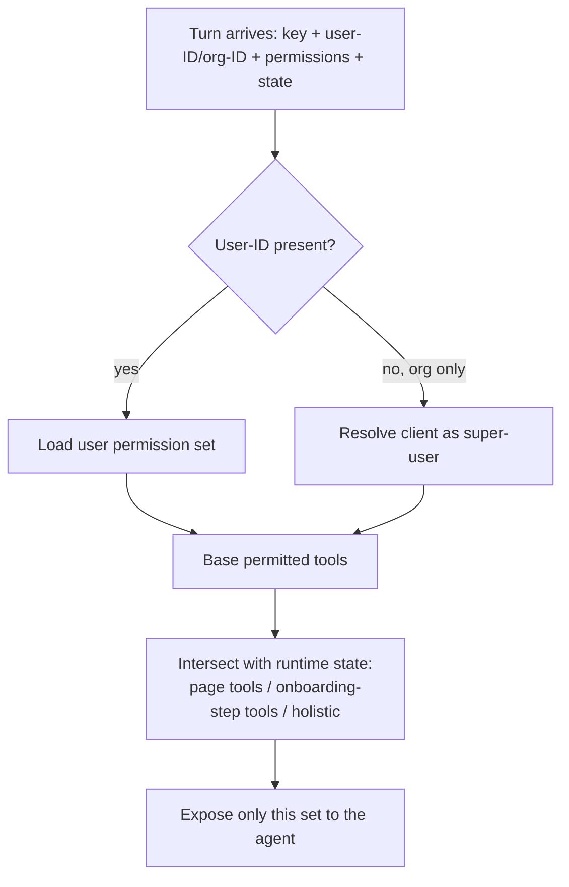
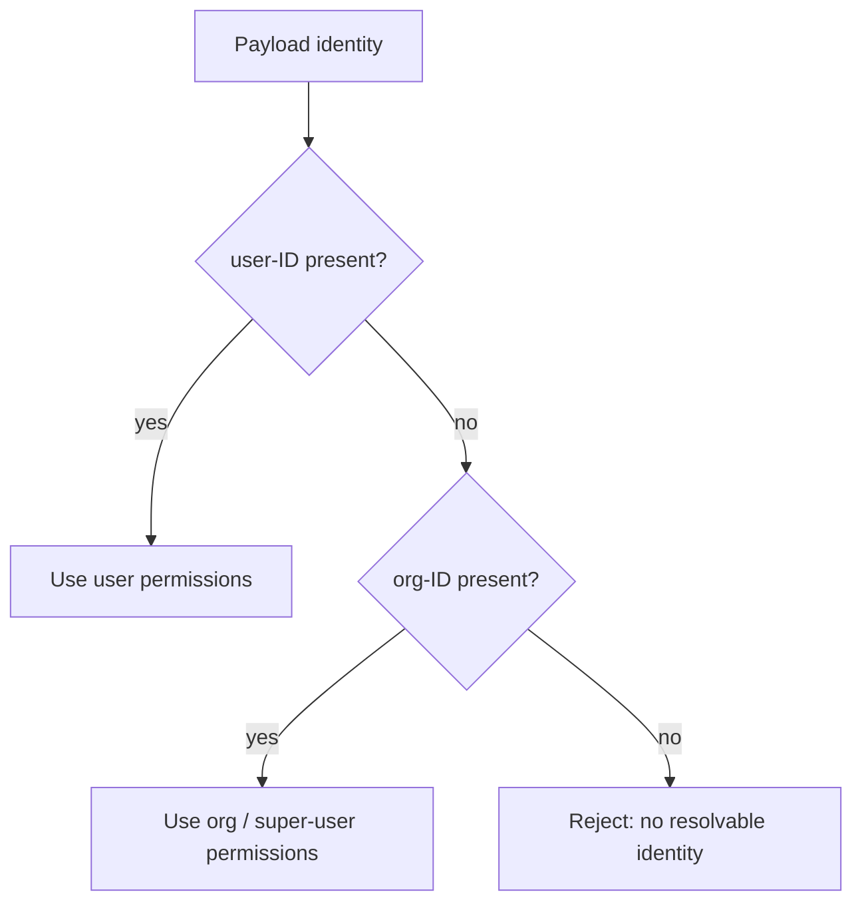

# TXN — Permission & Authorization Scoping

> **Component:** [[agent-access-layer]]
> **Date:** 2026-06-02
> **Status:** Defined
> **Owner:** _TBC_
> **Sources:** [[01-06-2026-component-1-Agent-Access-Layer]]

---

## 1. What Does This Sub-Component Do?

**Functional purpose:**

Permission & authorization scoping decides **which tools an agent may use, for this user, on this turn** — so that an agent can never do something the human it represents could not do in the Console. It resolves the acting identity, loads that identity's permissions, and hands [[mcp-server]] the exact set of tools to expose.

Permissions live in three places (per the deep-dive): **DT API keys** at the *program* level (`read` / `write` / `program-manager`); **Stackworkz's Console back-end** holds the *granular, role-based user* permissions; and — because neither covers AI used outside the Console — TXN will build a **third "AI permission config"** that mirrors the Console model at org + user level (Super Ultra designed a screen for it; no API exists today). The simplifying rule Ian Johnson (TXN's CEO) pushed: a user can never have more than the business, so the layer only ever needs to check the **user ID**; a **client with no Console users is treated as a single super-user** with everything TXN makes available to them.

Beyond the static permission set, the exposed tool set is further narrowed by **runtime state** — for the [[co-pilot]], the page the user is on; for onboarding, the step they've reached (step-six tools only once steps one-to-five are done). A set of **holistic tools** is always available.

**Entities that interact with it:**

- **The MCP server** — calls this to get the per-turn exposed tool set
- **TXN's agents** (indirectly) — only ever see permitted tools
- _No direct user interaction — this is backend scoping logic_

---

## 2. What Needs to Happen?

**Functional requirements:**

- Resolve the acting identity from the payload (**user-ID**, optionally **org-ID**).
- Load the identity's permission set (user → user permissions; org-only → super-user permissions).
- Compute the exposed tool set = permitted tools ∩ (current page tools ∪ onboarding-step tools ∪ holistic tools).
- Pass the runtime context (universal key + user-ID + permissions) so exposure is recomputed each turn.
- Mirror the Console's granular permission model in the AI permission config.

**Business rules:**

- **User ≤ business** — a user can never exceed the business's permissions; checking the user ID is sufficient.
- **Client = super-user** — a client with no individual users resolves to a super-user holding all available permissions.
- **Program relevance ≠ permission** — having permission to do X doesn't mean X is relevant to a given program type; irrelevant actions aren't offered even if permitted.

**Edge cases:**

- Org-only request (client using their own AI, no Console users) → resolve to super-user.
- A permitted-but-program-irrelevant action (e.g. an MCC change on a consumer-debit program) → surfaced as not applicable.
- AI permission config drifts from the Console model → see Risks.

---

## 3. Entity Journeys

### 3a. Isolated Journeys

#### Journey 1: Scope tools for a turn

**Entity:** Agent (backend scoping; no UI)

**Input:** A request turn arrives at the MCP server carrying the universal API key, user-ID (and/or org-ID), the user's permission set, and runtime state (page / onboarding step).

**Outcome:** Only the tools this identity may use, in this context, are exposed to the agent for this turn.

**Steps:**

**Acceptance criteria:**
- [ ] Only tools within the identity's permission set are ever exposed.
- [ ] Co-pilot on a given page exposes that page's tools plus holistic tools.
- [ ] Onboarding step-N tools are unavailable until prerequisite steps are complete.
- [ ] An org-only request resolves to the client super-user.
- [ ] No exposed tool exceeds what the user could do in the Console.

#### Journey 2: Resolve identity (user vs. client super-user)

**Entity:** Agent (backend)

**Input:** Payload contains a user-ID and/or org-ID.

**Outcome:** Exactly one permission set is resolved for the turn.

**Steps:**

**Acceptance criteria:**
- [ ] A client with no Console users resolves to a super-user with all available permissions.
- [ ] A user's resolved permissions never exceed the business's.
- [ ] An org-level permission lookup exists (new AI-config build).
- [ ] A request with no resolvable identity is rejected.

---

## 5. Data Requirements

| What | Direction | Description | Source / Destination |
|------|-----------|------------|---------------------|
| User permission set | In | Granular role-based permissions | Stackworkz Console back-end / AI permission config |
| Org / super-user permissions | In | All permissions available to the client | New AI permission config |
| Runtime state | In | Current page (co-pilot) / onboarding step | Console (Stackworkz) |
| Exposed tool set | Out | The tools the agent may call this turn | → [[mcp-server]] |

---

## 6. Dependencies

| Depends on | What we need | Blocking? |
|-----------|-------------|----------|
| Stackworkz Console permission model | The source of truth for user permissions | **Yes** |
| AI permission config (new build) | Org/user permission mirror for non-Console access | **Yes** |
| Console runtime state | Page / onboarding context for tool narrowing | No — holistic-only fallback assumed _[⚠ open — see [[open-questions]] #2]_ |

**What siblings/other components need from this one:**
- [[mcp-server]] consumes the per-turn exposed set.
- [[a2a-endpoint]] reuses identity resolution for external agents.

---

## 7. Risks

**Specific risks:**
- **Drift** between the AI permission config and the live Console permissions → an agent could be over- or under-scoped.
- Spoofed/injected identity or permission claims in the payload.
- Stale page/onboarding state leading to wrong tool exposure.

**Controls to build into the journeys:**
- Treat Console/Stackworkz as the source of truth; reconcile the AI config against it.
- Server-authoritative validation downstream ([[mcp-server]] + Core API) so scoping is defence-in-depth, not the only gate.
- Never trust agent-supplied permission claims.

---

## 8. Priority

_Phasing out of scope. Relative note: builds in lockstep with [[mcp-server]] — together they are the layer's spine._

---

## Sub-Sub-Components

Leaf node — no further decomposition needed.
