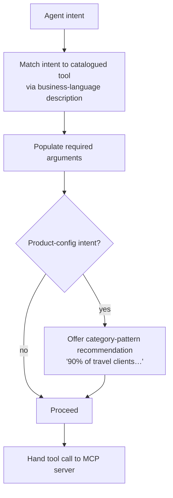

# TXN — Tool Catalogue

> **Component:** [[agent-access-layer]]
> **Date:** 2026-06-02
> **Status:** Collecting
> **Owner:** _TBC_
> **Sources:** [[01-06-2026-component-1-Agent-Access-Layer]]

---

## 1. What Does This Sub-Component Do?

**Functional purpose:**

The Tool Catalogue is the inventory of agent-callable tools mapped from DT's Core API — each one a business-language wrapper over an endpoint, so an agent can act in terms of intent ("suspend this card", "set up a travel product") rather than raw API mechanics. Mike Moores (TXN's CTO) walked through the endpoint shape the catalogue maps from:

- **Card holder** — the individual (name, address, optional data)
- **Card holder groups** — logical grouping (business / tier / rewards) for bulk actions
- **Account** — the balance that drives approve/decline (may or may not sit on TXN)
- **Card** — linked to an account; PAN + security; per-card overrides (contactless/online off); pulls from a product template
- **Product** — the configuration template, **~200 fields** controlling look, expiry, and what can transact; configured infrequently ("once per country per year")
- **Reporting** — endpoints whose full extent is still TBC

These split into **platform-management** (infrequent, high-impact — chiefly *product*) and **day-to-day operational** (issue/suspend a card, the kind of thing a banking app hits). The **product/configuration layer is the highest-value AI target**: most users don't understand the ~200 fields, so the catalogue's product tools wrap them in business language and lean on client-category patterns — "this is what 90% of travel clients do."

> **Status note:** kept at *Collecting* because the **exact tool list depends on the full Core API docs** (TXN is sending ~210 markdown/Word documents + the YAML spec). The *shape* is clear; the enumerated catalogue is not yet.

**Entities that interact with it:**

- **TXN's agents** — select tools to fulfil an intent
- **[[mcp-server]]** — exposes (a permitted subset of) the catalogue and executes calls
- _No direct user interaction_

---

## 2. What Needs to Happen?

**Functional requirements:**

- Map each Core API endpoint to one or more **agent-callable tools** with a business-language description.
- Each tool carries the **arguments the Core API requires** for that operation.
- **Product-configuration tools** wrap the ~200-field object in business-language choices, surfacing category-pattern recommendations.
- Group tools as **platform-management** vs **day-to-day operational** (informs exposure/permissions).
- Keep the catalogue **current** with the Core API (YAML spec).

**Business rules:**

- Business-language first — tools describe intent, not raw endpoints.
- A tool exists only where a corresponding Core API capability exists.

**Edge cases:**

- An endpoint exists but isn't yet documented → tool deferred until docs land.
- Core API changes → catalogue must re-sync (see Risks / [[agent-access-layer]] versioning question).

---

## 3. Entity Journeys

### 3a. Isolated Journeys

#### Journey 1: Fulfil an intent via a catalogued tool

**Entity:** Agent

**Input:** The agent holds an intent (e.g. "suspend this card", "apply the standard travel product").

**Outcome:** The intent is mapped to the correct catalogued tool with the right arguments, ready for [[mcp-server]] to validate and execute.

**Steps:**

**Acceptance criteria:**
- [ ] Every Core API endpoint group (card holder, groups, account, card, product, reporting) has at least one catalogued tool.
- [ ] Each tool has a business-language description and the Core API's required arguments.
- [ ] Product-configuration tools wrap the ~200-field object in business-language choices.
- [ ] Product tools can surface a client-category-pattern recommendation.
- [ ] Tools are tagged platform-management vs day-to-day.

---

## 5. Data Requirements

| What | Direction | Description | Source / Destination |
|------|-----------|------------|---------------------|
| Core API endpoint specs | In | The endpoints + required arguments to wrap | Core API docs + YAML (DT/TXN) |
| Business-language descriptions | Stored | The intent-level wrapper per tool | Authored / maintained |
| Client-category patterns | In | "What travel/lending/rewards clients do" | Data Lake (category tags) |

---

## 6. Dependencies

| Depends on | What we need | Blocking? |
|-----------|-------------|----------|
| Full Core API docs + YAML spec | The authoritative endpoint list to enumerate tools | **Yes** — gates the exact catalogue |
| [[mcp-server]] | Exposes and executes the tools | No — catalogue can be authored first |
| Data Lake (category patterns) | Recommendations for product tools | No — product tools work without it |

**What siblings/other components need from this one:**
- [[mcp-server]] and [[permission-scoping]] operate over this catalogue.
- [[co-pilot]] guided configuration relies on the product tools.

---

## 7. Risks

**Specific risks:**
- **Documentation drift** — a Core API change unreflected in the YAML silently breaks a tool.
- Mis-wrapped product fields → an agent makes a damaging config change in business-language clothing.

**Controls to build into the journeys:**
- Re-sync the catalogue from the YAML on each Core API release; contract-test tools.
- Route product-config changes through [[approval-queue-integration]] (multi-card impact).

---

## 8. Priority

_Phasing out of scope. Relative note: the day-to-day operational tools are straightforward; the product-configuration tools are the high-value, higher-effort piece. The exact catalogue is gated on the full Core API docs._

---

## Sub-Sub-Components

Leaf node — no further decomposition needed. _(If the product-configuration tooling grows complex, it may warrant its own decomposition later.)_
