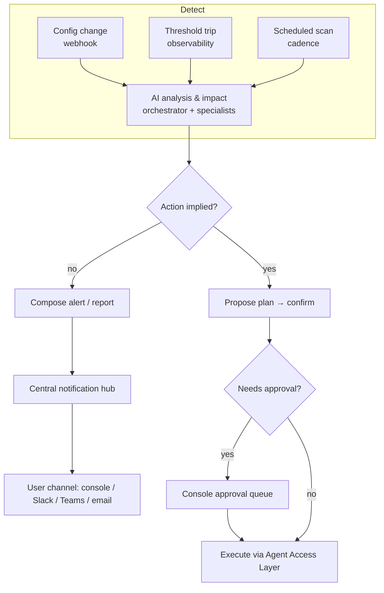

# TXN — Agent Inbox & Alerts

> **Component map:** [[components]] · **Vision:** [[vision]]
> **User journeys:** [[ux-ai-configurable-operational-alerting|Operational Alerting]], [[ux-entity-performance-insights|Entity Performance Insights]], [[ux-txn-Intelligence-ai-autonomous-anomaly-detection|Anomaly Detection]] — see [[user-journeys]]
> **Date:** 2026-06-02
> **Status:** Defined
> **Owner:** _TBC_
> **Sources:** [[02-06-2026-component-2-alerts-agent-inbox]] (primary), [[01-06-2026-component-1-Agent-Access-Layer]] (approval/audit), [[13-05-2026-txn-vision-meeting]]

---

## 1. What Does This Component Do?

**Functional purpose:**

Agent Inbox & Alerts is the **proactive** lane of TXN's trust spine — the AI reaches out to the user rather than waiting to be asked. It spans the C1→C2 graduation: at **C1 (alert)** it surfaces information — "this happened, here's what it means"; at **C2 (agent inbox)** it graduates to a plan — "here's the alert, here's the analysis, here's what I think you should do, shall I do it?" — and on approval it executes the change. The same surface therefore covers everything from a passive notification to a one-click delegated action.

The distinction that runs through the whole component is **alerting vs. reporting**. *Alerting* is point-in-time — "this just happened, you should know." *Reporting* is reflective — "I've analysed your program; here's what's going on and what you might want to do about it," delivered on a cadence (e.g. a written program-performance summary every Tuesday before a Wednesday exec meeting, including the drivers behind a change: "transactions down 20% because decline rate rose, because you lowered the max transaction limit from £400 to £200 on this date"). Ian Johnson (TXN's CEO) was explicit that the reflective, AI-first version — *"here are the key things you need to be aware of"* — is the differentiator, not bolting AI onto a traditional alert.

A second through-line is the **central notification hub**. TXN wants one place where *anything* can raise something for a user — the AI, DT, or the Console — and it is delivered to the user's preferred channel (in-console, Slack, Teams, email). Stackworkz owns notification *preferences* and delivery; this component is the AI brain that analyses and composes what gets surfaced. Where an alert implies a fix, the inbox carries it through to the [[full-agentic-experience]]-style execution, routing through the Console approval queue when policy requires it.

```
Agent Inbox & Alerts
├── Alert detection            (how an event/threshold/anomaly is found — see §4 cost model)
├── AI analysis & impact        (why it happened, what it means, estimated impact)
├── Plan & execute (C2)         (proposed action → confirm → execute via Agent Access Layer)
├── Scheduled reporting         (cadence-based program summaries — the "reflective" mode)
└── Notification routing        (into the central hub → user's preferred channel)
```

**Personas:**

| Persona | How they use this component | What they need from it |
|---------|---------------------------|----------------------|
| **Card Program Operators** (Console) | Receive proactive alerts and scheduled reports; review the AI's analysis and proposed plan; approve/decline execution | To be told what matters *with an action attached* — never noise; Ian's bar: *"if there isn't an action to take, why are you telling me?"* |
| **The less-experienced operator** | The primary beneficiary — a "smart notifications" layer that surfaces what they wouldn't have known to look for ("you've run at 20% declines for three days") | Guidance they didn't have to configure; the AI as their card expert |
| **The expert operator** | May prefer their own tooling on the webhook data; uses TXN alerts selectively | Not to be over-served; TXN must add *material value over what they can already do themselves* |

---

## 2. What Needs to Happen?

**Functional requirements — three alert mechanisms:**

1. **Change-impact** — when a user is about to change (or has changed) a setting, the AI analyses and surfaces the impact: *"you reduced the max transaction limit from £200 to £100; ~20% of recent transactions would now be declined."* Same information source whether the change came via Console, API, or a client's own agent (Ian's point) — only the delivery differs.
2. **Event / threshold** — user-defined monitors ("alert me if declines exceed 20%", "alert me if Amazon transactions drop 20% over 7 days"). Detection happens cheaply (see §4); when the threshold trips, the AI is notified via webhook, runs the analysis, and surfaces it.
3. **Scheduled analysis / anomaly & reporting** — on a cadence (e.g. twice daily), the AI scans the program's data for anomalies that no event would surface, and composes reflective reports/summaries.

- The AI must **estimate impact** from the data lake (e.g. how many prior transactions a new limit would have declined).
- At C2, the AI proposes a **plan** and, on confirmation, **executes** via [[agent-access-layer]] — the user doesn't need to know which page/button.
- Alerts can be created **two ways**: via the Console UI, or via the agent ("create this alert") through a structured `/alert` skill that captures enough to fill the tool calls.
- Surfacing is flexible: a notification centre, a modal with analysis, **or an insight embedded into a dashboard** (a "dot" explaining why a metric spiked/dropped). "Insight packaged at the right time."

**Business rules and constraints:**

- **System-defined vs user-defined.** TXN provides a baseline corpus of critical alerts it feels *obliged* to raise (severe decline, "no auth response from your host for 10 minutes", failed card creation); users define the finer-grained, interest-based ones.
- **Critical/instantaneous vs interest-based** (Ian's dividing line): critical alerts may need immediate, traditional detection (candidate for DT); interest-based monitors are fine on a scheduled cadence and are AI-friendly.
- **Bounded, not free-form.** The AI experience must not be "ask anything, we'll pay for it." A framework (semi-structured: slash commands, predefined workflows, "filters before search") keeps queries built-for-success and protects token cost.
- **Approval queue respected** — actions affecting multiple cards (product/spend-control level) route through the Console's two-person approval flow before execution.

**Edge cases and error states:**

- **Don't re-alert on a confirmed action** — if a user deliberately made a change, surfacing "why did you do that?" afterwards is a poor experience; confirm *before*, not nag *after*.
- **Threshold detection at scale** — analysing every transaction with AI is cost-prohibitive (see §4); detection must be cheap, AI invoked only on trip.
- **Cross-program benchmarking is data-gated** — see §5 / §10.

---

## 3. How Should It Look and Feel?

**Design direction:** A calm, high-signal surface — closer to a "smart inbox" that floats what matters than a firehose of notifications. Ian's reference: high-scale email providers' *smart/priority inbox* that floats the most important item into a central box.

**Reference products:**
- **Priority/smart email inboxes** — float the important thing; suppress the rest.
- **Claude scheduled tasks** — the model for "run this analysis on a cadence and deliver the result where I want it" (Slack/Teams).

**Key UX principles for this component:**
- **Action or silence** — every surfaced item carries an action or insight; if there's nothing to do, don't interrupt.
- **Analysis, then plan, then ask** — graduate from "here's what happened" to "here's what I'd do — shall I?" rather than dumping raw data.
- **Meet people where they are** — deliver to the user's chosen channel, not only in-console.

---

## 4. How Are We Going to Solve It?

| Capability | Build / Buy / Access | Provider / Approach | Rationale |
|-----------|---------------------|-------------------|-----------|
| Threshold / anomaly **detection** | Buy / Access (preferred) | Off-the-shelf **observability / alerting platform** — plug into the stack, configure rule-sets, expose an API | Brett's steer: building an alerting stack is "done a thousand times"; configure a standard tool, feed trips up to the AI. Avoids a bespoke rules-engine behemoth (Ian's fear). |
| Threshold detection (alt.) | Build (lightweight) | Traditional middleware near the transaction request — cheap query + calculation | Analysing every transaction with AI explodes token cost; only invoke AI when a threshold trips, via webhook → agent API. |
| **AI analysis & impact** | Build | Orchestrator agent + specialist sub-agents/skills; queries the data lake | Invoked *on trip* or *on schedule*. A main orchestrator delegates to siloed analysis agents, aggregates, and composes the report. |
| Scheduled reporting | Build | Scheduled agent task → composed summary → delivered to channel | The "reflective" mode; no real-time detection needed. |
| Notification delivery | Integrate | Stackworkz (notification preferences + sending) | This component composes; Stackworkz delivers to the preferred channel. |

_Cost is a first-order design constraint: Ian built a token-cost model from Novosapien's estimates (clients × users/client × hours/day, across portal and console). The architecture above is shaped to keep AI spend proportional to value._

---

## 5. What Data Does It Need?

| Data | Direction | Source / Destination | Notes |
|------|-----------|---------------------|-------|
| Transaction / program data | In | DT Core API + Data Lake (via [[agent-access-layer]]) | For impact estimation and anomaly scans; client-scoped — only ever one client's data at a time |
| Threshold trips / events | In | Observability tool / webhook | Triggers AI analysis |
| Config-change events | In | Product webhook (to be added by DT — see [[agent-access-layer]]) | So any change (Console/API/AI) produces an event the AI can react to |
| Cross-program / industry benchmarks | In | Data Lake (client category tags) | **Data-gated** — needs multiple clients per use case + contractual consent (see §10) |
| Composed alerts / reports | Out | Central notification hub → user channel | Delivered via Stackworkz |

---

## 6. Who Can Access It?

| Persona / Role | Access level | Notes |
|---------------|-------------|-------|
| Card Program Operators | Scoped to their Console permissions | Creating/editing alerts and approving plans respects the user's permission set; execution routes through approval queue where required |

_Detailed access inherits the permission model from [[agent-access-layer]]._

---

## 7. How Do We Know It's Working?

- [ ] _Surfaced items lead to action (open/act rate), not dismissal — proxy for "signal not noise"_
- [ ] _Less-experienced operators catch issues they would otherwise have missed_
- [ ] _AI spend per alert/report stays within the cost model_
- [ ] _Scheduled reports are read/used ahead of the cadence they're tied to_

---

## 8. Dependencies

**What this component needs:**

| Depends on | What we need | Blocking? |
|-----------|-------------|----------|
| [[agent-access-layer]] | Tools to read data and execute approved changes; permission scoping; approval-queue routing | **Yes** |
| Product webhook (DT) | An event whenever a config change happens (any channel) | No — can poll/scan as interim |
| Observability / alerting tool | Cheap threshold/anomaly detection feeding the AI | No — can build lightweight middleware |
| Stackworkz notification system | Delivery to the user's preferred channel | Partial — can surface in-console first |
| Data Lake (DT) | Program data + client-category tags for analysis and benchmarking | Partial — benchmarking is later |

**What other components need from this one:**
- [[full-agentic-experience]] reuses the analysis→plan→execute pattern.
- [[fraud-risk-assist]] may surface a fraud flag *into* this inbox, but services the action on its own dedicated page.

---

## 9. Priority

_Phasing is out of scope for this exercise — full scope captured. (Noted: Ian repeatedly anchored on the Console as the critical path, and the cost framework as a gating design question — both are design inputs here, not scope cuts.)_

---

## 10. Risks

**Abuse vectors:**
- A user crafting open-ended monitors that force expensive AI scans — mitigated by the bounded-query framework (§2).
- Prompt injection via merchant names / transaction descriptors flowing into analysis context.

**Data risks:**
- **Cross-program benchmarking de-anonymisation** — Ian: with few clients per use case, "anonymised" comparisons can still identify a client (people know who your clients are). Needs contractual consent and careful thresholds. *Data-gated; later phase.*
- Stale data — analysis run before a write settles produces misleading impact figures.
- False anomalies from sparse early data.

**Compliance:**
- Reports/alerts touching cardholder behaviour must respect PII handling; audit of AI-initiated changes (see [[agent-access-layer]]).

**Controls needed:**
- Bounded-query framework; cheap-detect / AI-on-trip cost control; client-scoped data access; approval-queue routing; confirm-before-act (never nag-after).

---

## Sub-Components

| Sub-Component | Overview | Status | Link |
|--------------|----------|--------|------|
| Alert detection | Cheap threshold/anomaly detection (observability tool or middleware) feeding the AI on trip; two creation paths | Defined | [[alert-detection]] |
| AI analysis & impact | Orchestrator + specialist agents that explain cause, meaning, and estimated impact (predictive + diagnostic) | Defined | [[ai-analysis-impact]] |
| Plan & execute (C2) | Proposed action → confirm → execute via Agent Access Layer, through approval queue | Defined | [[plan-and-execute]] |
| Scheduled reporting | Cadence-based reflective program summaries with drivers, delivered to a channel | Defined | [[scheduled-reporting]] |
| Notification routing | Composing for the central hub → user's preferred channel (with Stackworkz); in-context dashboard insights | Defined | [[notification-routing]] |

---

## Diagrams


