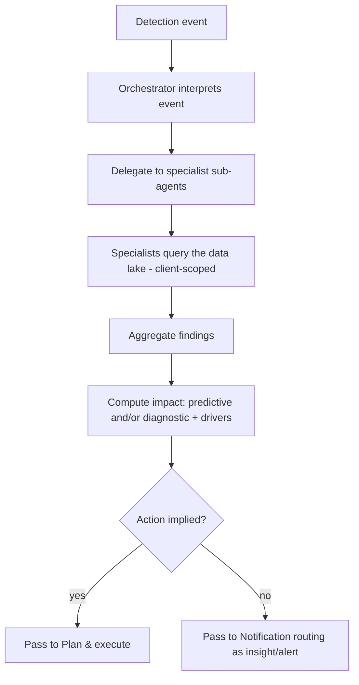

# TXN — AI Analysis & Impact

> **Component:** [[agent-inbox-alerts]] · **Journey sources:** [[ux-entity-performance-insights|Entity Performance Insights]], [[ux-txn-Intelligence-ai-autonomous-anomaly-detection|Anomaly Detection]]
> **Date:** 2026-06-02
> **Status:** Defined
> **Owner:** _TBC_
> **Sources:** [[02-06-2026-component-2-alerts-agent-inbox]], [[01-06-2026-component-1-Agent-Access-Layer]]

---

## 1. What Does This Sub-Component Do?

**Functional purpose:**

This is where the AI earns its place: given a detection event ([[alert-detection]]), it works out **what happened, why, and what it means** — and estimates impact. It runs *on trigger* (a trip, a config change, or a scheduled finding), not continuously, so token cost stays proportional to value. A **main orchestrator** delegates to siloed **specialist sub-agents** that query the data lake, then aggregates their findings into a single explanation.

Two flavours of impact, per the deep-dive: **predictive** ("you're reducing the max transaction limit from £200 to £100 — ~20% of recent transactions would now be declined") and **diagnostic** ("transactions are down 20% because the decline rate rose, because you changed this setting on this date"). Ian Johnson (TXN's CEO) framed the diagnostic, driver-finding version — *"what are the drivers behind the fact that your transaction rate has gone down"* — as the real value. This analysis is the **same information source** the [[co-pilot]] uses for pre-change impact preview; only the delivery differs (Ian's point) — so the logic is shared.

**Entities that interact with it:**

- **Agent** (orchestrator + specialists) — no UI; event-driven
- **Upstream:** [[alert-detection]] events
- **Downstream:** [[plan-and-execute]] (if a fix is implied), [[scheduled-reporting]], [[notification-routing]]

---

## 2. What Needs to Happen?

**Functional requirements:**

- Accept a detection event and run analysis **on trigger** (not continuously).
- Use an **orchestrator + specialist sub-agents** pattern; each specialist queries the data lake for its slice; aggregate.
- Produce **predictive impact** (effect of an intended/just-made change) and **diagnostic impact** (drivers behind an observed change).
- Estimate impact from data (e.g. how many prior transactions a new limit would decline).
- Keep analysis **client-scoped** and **token-bounded**.

**Business rules:**

- **Action or insight** — analysis output must carry an action or a clear insight, never raw data for its own sake.
- **Material value** — surface what the client couldn't trivially get themselves (Ian: don't just re-do what their own AI on the webhook data could).
- **Grounded** — use TXN data/docs, not generic LLM assumptions (high-cost wrong answers).

**Edge cases:**

- Sparse early data → low-confidence analysis; avoid false anomalies.
- Stale data (analysis before a write settles) → impact figures misleading.
- Cross-program benchmarking requested → data-gated (see Risks / parent §10).

---

## 3. Entity Journeys

### 3a. Isolated Journeys

#### Journey 1: Analyse a triggered event

**Entity:** Agent (orchestrator + specialists)

**Input:** A detection event (threshold trip, config change, or scheduled-scan finding).

**Outcome:** A composed analysis — cause, meaning, and estimated impact — ready to surface, plan from, or report.

**Steps:**

**Acceptance criteria:**
- [ ] Analysis runs only on a trigger, not per transaction.
- [ ] Output explains cause + meaning and includes an impact estimate.
- [ ] For a change, predictive impact is quantified (e.g. "~X% of transactions affected").
- [ ] For an observed shift, the analysis names the drivers.
- [ ] Analysis is client-scoped and stays within the cost envelope.
- [ ] Output always carries an action or insight (never raw data alone).

---

## 5. Data Requirements

| What | Direction | Description | Source / Destination |
|------|-----------|------------|---------------------|
| Detection event | In | Trip / change / anomaly with context | [[alert-detection]] |
| Program / transaction data | In | The basis for cause + impact | Data Lake / Core API (via [[agent-access-layer]]) |
| Composed analysis + impact | Out | Cause, meaning, drivers, estimate | → [[plan-and-execute]] / [[scheduled-reporting]] / [[notification-routing]] |

---

## 6. Dependencies

| Depends on | What we need | Blocking? |
|-----------|-------------|----------|
| [[alert-detection]] | The triggering event | **Yes** |
| Data Lake / [[agent-access-layer]] | Read access for analysis | **Yes** |

**What siblings/other components need from this one:**
- [[plan-and-execute]] turns its output into a proposed action.
- [[scheduled-reporting]] reuses the analysis engine on a cadence.
- [[co-pilot]] shares the impact-estimation logic (same source, different delivery).

---

## 7. Risks

**Specific risks:**
- Hallucinated cause/impact if not grounded in TXN data.
- Stale or sparse data producing misleading analysis.
- Token cost creep if scope isn't bounded.

**Controls to build into the journeys:**
- Ground analysis in the data lake; cite the data behind an impact figure.
- Respect consistency boundaries (don't analyse before a write settles).
- Bounded specialist scope; cap depth per analysis.

---

## 8. Priority

_Phasing out of scope. Relative note: the core AI value of the component; shared with the Co-pilot's impact preview, so it has leverage beyond this component._

---

## Sub-Sub-Components

Leaf node — no further decomposition needed.
