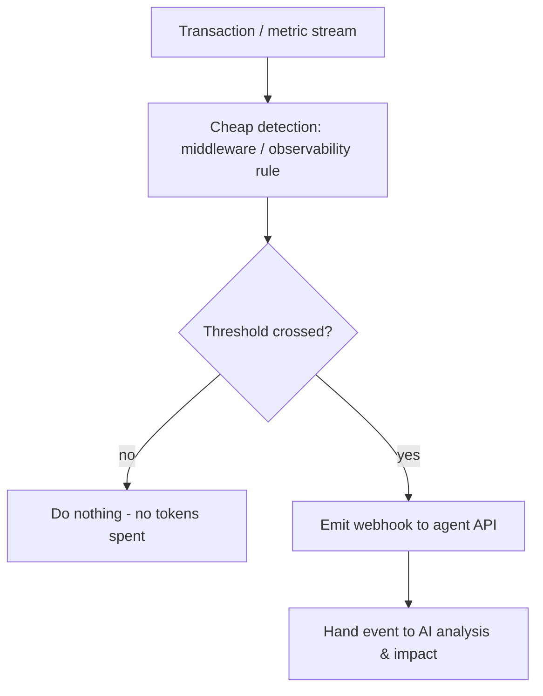
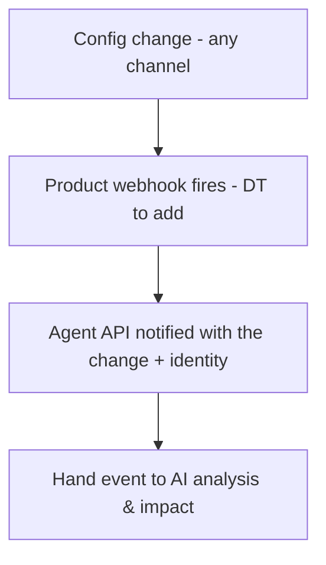
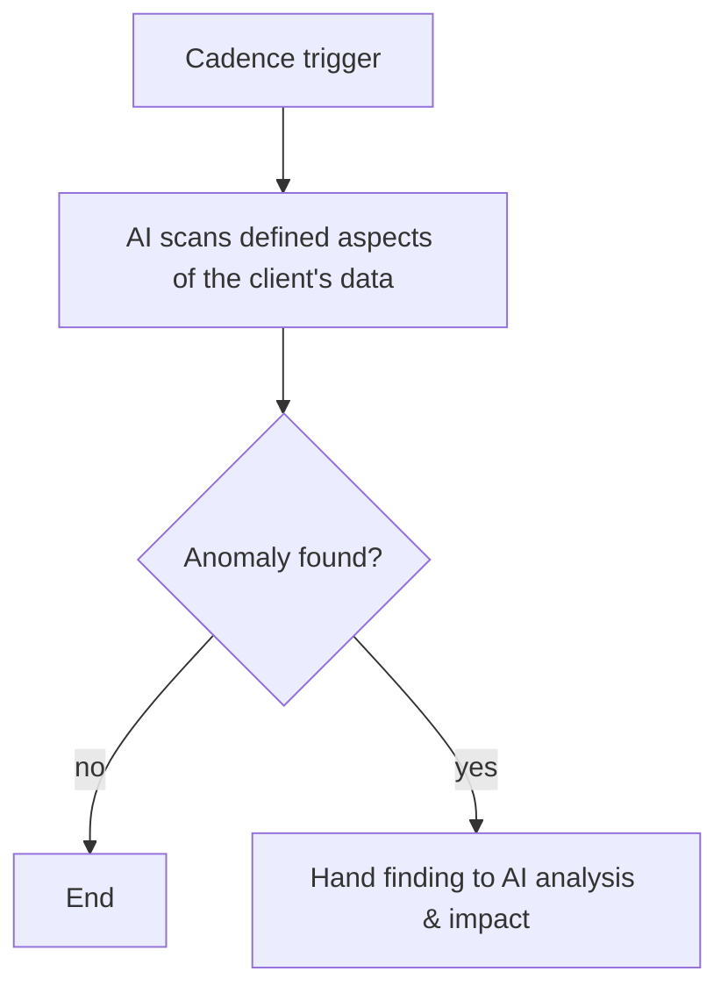
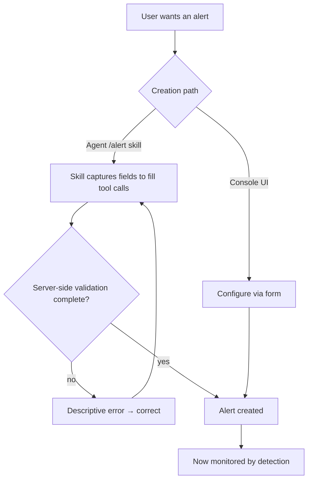

# TXN — Alert Detection

> **Component:** [[agent-inbox-alerts]] · **Journey sources:** [[ux-ai-configurable-operational-alerting|Operational Alerting]], [[ux-txn-Intelligence-ai-autonomous-anomaly-detection|Anomaly Detection]]
> **Date:** 2026-06-02
> **Status:** Defined
> **Owner:** _TBC_
> **Sources:** [[02-06-2026-component-2-alerts-agent-inbox]], [[01-06-2026-component-1-Agent-Access-Layer]]

---

## 1. What Does This Sub-Component Do?

**Functional purpose:**

Alert detection decides **when something is worth the AI's attention** — cheaply — so the expensive AI analysis only runs when it should. It covers the three trigger mechanisms the deep-dive landed on: **change-impact** (a config/setting change happened), **event/threshold** (a user- or system-defined monitor trips, e.g. "declines over 20%"), and **scheduled scan** (a cadence-based anomaly sweep that catches things no single event would). It also owns **how alerts get created** — via the Console UI or via the agent.

The load-bearing constraint is cost: analysing every transaction with AI explodes token spend, so detection is deliberately **cheap** — an off-the-shelf observability tool or lightweight middleware near the transaction request does the threshold maths, and only a trip invokes the AI. Ian Johnson (TXN's CEO) drew the line between **critical/instantaneous** alerts (things TXN feels *obliged* to raise — e.g. "no auth response from your host for 10 minutes") which may need immediate, traditional detection, and **interest-based** monitors a client sets, which are fine on a scheduled cadence.

**Entities that interact with it:**

- **System / observability layer** — performs cheap detection
- **The user** — creates and configures alerts (UI or via agent)
- **Downstream:** hands trips/events to [[ai-analysis-impact]]

---

## 2. What Needs to Happen?

**Functional requirements:**

- Support **user-defined** monitors ("alert me if Amazon transactions drop 20% over 7 days") and a **system-defined** baseline corpus (severe declines, failed card creation, host-auth loss).
- **Cheap detection** — threshold maths in middleware/observability, not per-transaction AI; only a trip invokes the AI.
- React to **config changes** via the product webhook (DT to add) so any change (Console/API/AI) produces an event.
- Run **scheduled scans** on a cadence (e.g. twice daily) for anomalies not surfaced by events.
- Two **creation paths**: Console UI, or an agent `/alert` skill that captures enough to fill the tool calls (server-side validated — incomplete definitions bounce with a descriptive error).

**Business rules:**

- **Critical vs interest** — critical/instantaneous alerts get immediate detection; interest-based monitors can run on a cadence.
- **Bounded** — alert definitions are framed (filters / structured workflow), not free-form, to keep queries built-for-success and cost-controlled.
- **One client's data at a time** — detection is always client-scoped.

**Edge cases:**

- A monitor that would require per-transaction AI → reshape to cheap-detect + AI-on-trip, or decline.
- Incomplete alert definition via the agent → server-side validation returns a descriptive error to correct.
- Critical event when no monitor is set → system-defined corpus still raises it.

---

## 3. Entity Journeys

### 3a. Isolated Journeys

#### Journey 1: Detect a threshold trip

**Entity:** System / observability layer (agent-adjacent; no UI at trip time)

**Input:** Live transaction stream + a configured threshold (user- or system-defined).

**Outcome:** The AI is notified only when the threshold is crossed — never per transaction.

**Steps:**

**Acceptance criteria:**
- [ ] Threshold evaluation does not invoke AI per transaction.
- [ ] Only a trip emits an event to the AI.
- [ ] Both user-defined and system-defined thresholds are supported.
- [ ] Detection is scoped to a single client's data.

#### Journey 2: Detect a configuration change

**Entity:** System

**Input:** A product/config change made via Console, API, or AI.

**Outcome:** Any change, from any channel, produces an event carrying enough context for impact analysis.

**Steps:**

**Acceptance criteria:**
- [ ] A change from any channel (Console/API/AI) produces one event.
- [ ] The event carries the change detail needed to estimate impact.
- [ ] _Depends on DT adding the product webhook (open)._

#### Journey 3: Scheduled anomaly scan

**Entity:** Agent (scheduled)

**Input:** A cadence trigger (e.g. 12:00 and 00:00 daily).

**Outcome:** Anomalies that no event would surface are found and passed for analysis.

**Steps:**

**Acceptance criteria:**
- [ ] Runs on a configurable cadence.
- [ ] Scope is bounded (defined aspects, one client) to control cost.
- [ ] Findings flow to [[ai-analysis-impact]].

#### Journey 4: Create an alert

**Entity:** User (UI) or user + agent

**Input:** The user wants a new monitor.

**Outcome:** A valid alert definition exists and is being monitored.

**Steps:**

**Acceptance criteria:**
- [ ] An alert can be created via the Console UI and via the agent `/alert` skill.
- [ ] The `/alert` skill captures enough to fill the required tool calls.
- [ ] Incomplete definitions are rejected server-side with a descriptive, correctable error.

---

## 5. Data Requirements

| What | Direction | Description | Source / Destination |
|------|-----------|------------|---------------------|
| Transaction / metric stream | In | The data thresholds are evaluated against | Core API / Data Lake |
| Threshold / monitor definitions | In/Stored | User- and system-defined alert rules | Console / agent `/alert` skill |
| Config-change events | In | Product webhook payload | DT product webhook (to add) |
| Trip / change / anomaly events | Out | Triggers for analysis | → [[ai-analysis-impact]] |

---

## 6. Dependencies

| Depends on | What we need | Blocking? |
|-----------|-------------|----------|
| Observability tool / middleware | Cheap threshold/anomaly detection | No — can build lightweight middleware |
| DT product webhook | Config-change events from any channel | No — can poll/scan as interim |
| [[agent-access-layer]] | Tool calls to create alerts (validation) | **Yes** for the create journey |

**What siblings/other components need from this one:**
- [[ai-analysis-impact]] consumes every trip/change/anomaly event.

---

## 7. Risks

**Specific risks:**
- A user defining a monitor that forces per-transaction AI (cost blow-up).
- Missed critical event if detection coverage is incomplete.
- Prompt injection via merchant names/descriptors carried in the event.

**Controls to build into the journeys:**
- Cheap-detect / AI-on-trip pattern enforced; bounded alert-definition framework.
- System-defined critical corpus independent of user setup.
- Server-side validation of agent-created alerts.

---

## 8. Priority

_Phasing out of scope. Relative note: detection is the front of the pipeline — analysis and plan/execute depend on it. The product-webhook dependency is the main external unknown._

---

## Sub-Sub-Components

Leaf node — no further decomposition needed.
