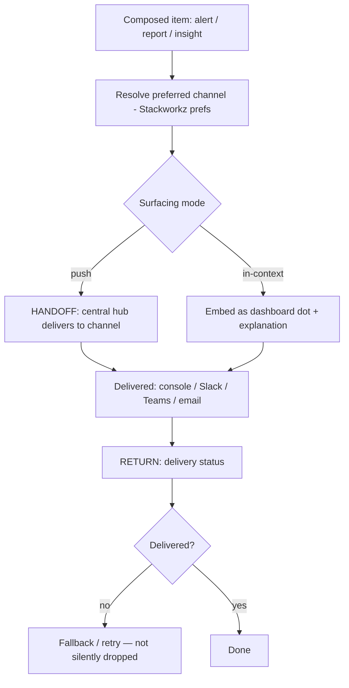

# TXN — Notification Routing

> **Component:** [[agent-inbox-alerts]] · **Journey source:** [[ux-ai-configurable-operational-alerting|Operational Alerting]]
> **Date:** 2026-06-02
> **Status:** Defined
> **Owner:** _TBC_
> **Sources:** [[02-06-2026-component-2-alerts-agent-inbox]]

---

## 1. What Does This Sub-Component Do?

**Functional purpose:**

Notification routing is the last mile — it takes a composed alert, report, or insight and gets it to the user **where they are**. Mike Moores (TXN's CTO) was firm that TXN wants a **central notification hub**: one place where *anything* can raise something for a user — the AI, DT, or the Console — delivered to the user's **preferred channel** (in-console, Slack, Teams, email). The principle is *meet people where they are.*

The ownership split: **Stackworkz owns notification preferences and the actual sending**; this sub-component is the AI side that **composes** what gets surfaced and **hands it to the hub** with the right routing. Beyond push channels, surfacing can also be **in-context** — Brett's idea of an AI recommendation as a "dot" on a dashboard metric, explaining *why* it spiked or dropped. As the deep-dive put it, the job is delivering *"insight packaged at the right time"* — sometimes an alert, sometimes a notification, sometimes an embedded annotation.

**Entities that interact with it:**

- **Agent** — composes and routes the item
- **The central notification hub / Stackworkz delivery** — sends to the channel
- **The user** — receives in their preferred channel or sees it embedded in the UI
- **Other sources** — DT and the Console can also feed the hub

---

## 2. What Needs to Happen?

**Functional requirements:**

- Compose the surfaced item (alert / report / insight) for delivery.
- Resolve the user's **preferred channel** from Stackworkz notification preferences.
- Hand off to the **central hub** for delivery (console / Slack / Teams / email).
- Support **in-context surfacing** — e.g. a dashboard "dot" with an explanation — as an alternative to a push.
- Accept items from **any source** (AI / DT / Console) into the same hub.

**Business rules:**

- **Meet people where they are** — deliver to the chosen channel, not only in-console.
- **Action or silence** — only route items that carry an action or insight.
- **Stackworkz delivers; we compose** — respect the ownership split.

**Edge cases:**

- No channel preference set → sensible default (in-console).
- High-priority item → may surface in multiple places (push + dashboard dot).
- Delivery failure on a channel → fall back / retry; don't silently drop.

---

## 3. Entity Journeys

### 3b. Cross-Component Journeys

#### Journey 1: Route a surfaced item to the user's channel

**Entity:** Agent → central notification hub (Stackworkz delivery)

**Input:** A composed alert, report, or insight from [[ai-analysis-impact]] / [[scheduled-reporting]].

**Handoff point:** Crosses into the **central notification hub / Stackworkz delivery** — state passed: the composed item + resolved channel + priority. Stackworkz performs the actual send.

**Components involved:** Agent Inbox & Alerts → central hub (Stackworkz) → user channel

**Outcome:** The right item reaches the user in their preferred channel (or is embedded in the UI), at the right time.

**Steps:**

**Acceptance criteria:**
- [ ] An item is delivered to the user's preferred channel.
- [ ] The hub accepts items from any source (AI / DT / Console).
- [ ] In-context surfacing (dashboard dot + explanation) is available as an alternative to a push.
- [ ] Delivery failures fall back / retry rather than dropping silently.
- [ ] Only items carrying an action or insight are routed.

---

## 5. Data Requirements

| What | Direction | Description | Source / Destination |
|------|-----------|------------|---------------------|
| Composed item | In | Alert / report / insight to deliver | [[ai-analysis-impact]] / [[scheduled-reporting]] |
| Channel preference | In | The user's preferred channel | Stackworkz notification preferences |
| Delivery payload | Out | Item + channel + priority | → central hub (Stackworkz) |
| Delivery status | In | Success / failure for fallback | Central hub |

---

## 6. Dependencies

| Depends on | What we need | Blocking? |
|-----------|-------------|----------|
| Stackworkz notification system | Preferences + actual delivery to channels | **Yes** (cross-component) |
| Central notification hub | A single intake any source can feed | **Yes** |
| Console dashboard | Surface for in-context "dot" insights | No — push-only fallback |

**What siblings/other components need from this one:**
- [[ai-analysis-impact]] and [[scheduled-reporting]] deliver through here.

---

## 7. Risks

**Specific risks:**
- Alert fatigue if too much is routed (counter with the action-or-silence bar).
- Silent delivery failure — user misses a critical item.
- Inconsistent experience across channels.

**Controls to build into the journeys:**
- Action-or-insight gate before routing.
- Delivery-status check with fallback/retry.
- Honour user channel preferences; sensible default.

---

## 8. Priority

_Phasing out of scope. Relative note: depends on the Stackworkz notification system + the central-hub contract; in-console delivery is a viable first surface while other channels mature._

---

## Sub-Sub-Components

Leaf node — no further decomposition needed.
