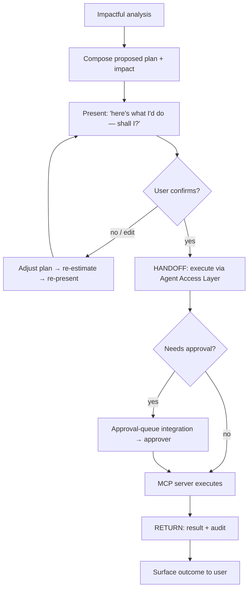

# TXN — Plan & Execute (C2)

> **Component:** [[agent-inbox-alerts]]
> **Date:** 2026-06-02
> **Status:** Defined
> **Owner:** _TBC_
> **Sources:** [[02-06-2026-component-2-alerts-agent-inbox]], [[01-06-2026-component-1-Agent-Access-Layer]]

---

## 1. What Does This Sub-Component Do?

**Functional purpose:**

This is the C2 graduation of the inbox — where an alert stops being *information* and becomes *"here's what I think you should do — shall I do it?"* When [[ai-analysis-impact]] produces an analysis that implies a fix, this sub-component composes a **proposed plan**, presents it with its impact, gets the user's confirmation, and — on a single approval — **executes the change** so the user never has to work out which page or button to use. George (Novosapien) contrasted the *bolt-on* approach (AI annotates an existing alert) with the **AI-first** one this enables: *"here's the analysis, here's what I think we need to do — do you want me to do it? Yes → done."*

It does not execute anything itself; it drives the change through the [[agent-access-layer]] — which means **prompted-trust confirmation**, **approval-queue routing** for product/multi-card changes, and **audit** all apply automatically. This is the same analysis→plan→execute pattern the [[full-agentic-experience]] reuses.

**Entities that interact with it:**

- **The user** — reviews the plan, confirms (or declines)
- **Agent** — composes the plan and executes via the access layer
- **Downstream:** [[agent-access-layer]] ([[mcp-server]], [[approval-queue-integration]], [[audit-attribution]])

---

## 2. What Needs to Happen?

**Functional requirements:**

- Turn an impactful analysis into a **concrete proposed change** ("change setting A to X and setting B to Y").
- Present the plan with its **estimated impact** and get explicit **confirmation** before acting (prompted trust).
- On confirmation, **execute via [[agent-access-layer]]**, honouring permissions and routing high-impact changes through approval.
- Record the full chain via [[audit-attribution]].

**Business rules:**

- **Confirm before act; don't nag after** — never surface "why did you do that?" after a deliberate change.
- **Respect approval** — product/multi-card changes route through the two-person queue.
- **AI-first option** — the plan should let the user accept the recommended action in one step.

**Edge cases:**

- User edits the plan before confirming → re-estimate impact, re-confirm.
- Change requires approval → hand off to the approver (see [[approval-queue-integration]]).
- "Just do it" → still confirm the action itself, then execute.

---

## 3. Entity Journeys

### 3b. Cross-Component Journeys

#### Journey 1: From alert to executed change

**Entity:** User + agent (hybrid)

**Input:** [[ai-analysis-impact]] has produced an analysis that implies a fix.

**Handoff point:** Execution crosses into the [[agent-access-layer]] — the plan is run as tool calls via [[mcp-server]], with [[approval-queue-integration]] interposed for high-impact changes and [[audit-attribution]] recording throughout. State passed: the proposed change + impact + user confirmation. Returned: execution result (or approval-pending).

**Components involved:** Agent Inbox & Alerts → Agent Access Layer → Agent Inbox & Alerts

**Outcome:** The recommended change is applied (or queued for approval) in one click; the user didn't need to know which screen/button.

**Steps:**

**Acceptance criteria:**
- [ ] The plan states the concrete change(s) and the estimated impact.
- [ ] Execution only happens after explicit user confirmation.
- [ ] Product/multi-card changes route through [[approval-queue-integration]].
- [ ] The full chain (analysis → plan → confirm → approve → execute) is audited.
- [ ] The user can accept the recommended action in a single step.

---

## 5. Data Requirements

| What | Direction | Description | Source / Destination |
|------|-----------|------------|---------------------|
| Analysis + impact | In | The basis for the proposed plan | [[ai-analysis-impact]] |
| Proposed change | Out | The concrete setting change(s) | → [[agent-access-layer]] |
| User confirmation | In | Explicit go-ahead (prompted trust) | User |
| Execution result | In/Out | Success / approval-pending | [[agent-access-layer]] → user |

---

## 6. Dependencies

| Depends on | What we need | Blocking? |
|-----------|-------------|----------|
| [[ai-analysis-impact]] | An impactful analysis to plan from | **Yes** |
| [[agent-access-layer]] | Tool execution, approval routing, audit | **Yes** |

**What siblings/other components need from this one:**
- [[full-agentic-experience]] reuses this analysis→plan→execute pattern.

---

## 7. Risks

**Specific risks:**
- Executing without genuine confirmation (trust failure).
- Approval bypass for high-impact changes.
- Plan drift — impact estimate stale by execution time.

**Controls to build into the journeys:**
- Mandatory confirmation step; re-estimate on edit.
- Route through approval queue server-side, not in agent logic.
- Audit the confirmation alongside the execution.

---

## 8. Priority

_Phasing out of scope. Relative note: this is the C2 differentiator (act, don't just inform); fully dependent on the Agent Access Layer, which is now Defined._

---

## Sub-Sub-Components

Leaf node — no further decomposition needed.
