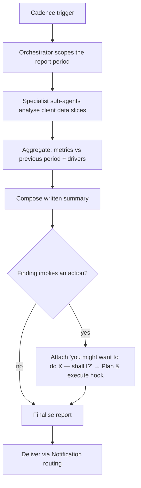

# TXN — Scheduled Reporting

> **Component:** [[agent-inbox-alerts]]
> **Date:** 2026-06-02
> **Status:** Defined
> **Owner:** _TBC_
> **Sources:** [[02-06-2026-component-2-alerts-agent-inbox]]

---

## 1. What Does This Sub-Component Do?

**Functional purpose:**

Scheduled reporting is the **reflective** mode of the inbox — the "reporting" half of the alerting-vs-reporting distinction. Rather than reacting to a point-in-time event, it runs on a **cadence** and produces a written, program-level summary: *what's going on, what changed versus the previous period, and the drivers behind it.* Ian Johnson (TXN's CEO) described the target directly — a card-program owner with a Wednesday exec meeting wants, every Tuesday, a *"perfectly written summary of exactly what's going on... here are the key things you need to be aware of,"* including *why* (e.g. "transaction rate down 20% because decline rate rose 20%, because the max transaction limit was lowered from £400 to £200 on this date"). He cast this as the genuinely **AI-first** experience — not bolting AI onto a legacy alert, but doing the analysis a human analyst would and delivering it ready-to-use.

It reuses the [[ai-analysis-impact]] engine (orchestrator + specialist sub-agents), but on a schedule rather than a trigger, and composes the result into prose delivered via [[notification-routing]]. Where a finding implies an action, it can carry the same *"you might want to do this — shall I?"* hook into [[plan-and-execute]].

**Entities that interact with it:**

- **Agent** (scheduled orchestrator + specialists) — composes the report
- **The user** — sets the cadence; receives and reads the report
- **Downstream:** [[notification-routing]] for delivery; optionally [[plan-and-execute]] for an attached action

---

## 2. What Needs to Happen?

**Functional requirements:**

- Run on a **user-set cadence** (e.g. weekly, every Tuesday).
- Compose a **program-performance summary**: current vs previous period, key metrics, and **the drivers behind changes**.
- Reuse the orchestrator + specialist analysis pattern over the client's data.
- **Deliver** to the user's preferred channel via [[notification-routing]].
- Where a finding implies an action, attach a **"you might want to do X — shall I?"** hook.

**Business rules:**

- **Driver-first** — don't just report the number moved; explain *why*.
- **Action or insight** — the report carries usable insight, not raw dumps.
- **Client-scoped, cost-bounded** — scheduled, so naturally cheaper than per-event AI.

**Edge cases:**

- Sparse data (early client) → lighter report; avoid manufacturing significance.
- A driver itself warrants an action → bridge into [[plan-and-execute]].
- Missed/failed-run handling (retry? notify of delay vs silent drop?) is undecided. _[⚠ open — see [[open-questions]] #14]_

---

## 3. Entity Journeys

### 3a. Isolated Journeys

#### Journey 1: Generate a scheduled program report

**Entity:** Agent (scheduled)

**Input:** A cadence trigger (the user's chosen schedule).

**Outcome:** A written, reflective summary of program performance with drivers, delivered to the user's channel at the right time.

**Steps:**

**Acceptance criteria:**
- [ ] Runs on the user-defined cadence and is delivered ahead of the moment it's tied to.
- [ ] The summary compares the current period to the previous one.
- [ ] It names the drivers behind material changes, not just the numbers.
- [ ] It is delivered to the user's preferred channel.
- [ ] Where relevant, an action hook into [[plan-and-execute]] is attached.

---

## 5. Data Requirements

| What | Direction | Description | Source / Destination |
|------|-----------|------------|---------------------|
| Cadence / schedule | In/Stored | When and how often to run | User config |
| Program data (period + previous) | In | Basis for the comparison + drivers | Data Lake (via [[agent-access-layer]]) |
| Composed report | Out | The written summary (+ optional action) | → [[notification-routing]] |

---

## 6. Dependencies

| Depends on | What we need | Blocking? |
|-----------|-------------|----------|
| [[ai-analysis-impact]] | The analysis engine (reused on a schedule) | **Yes** |
| Data Lake / [[agent-access-layer]] | Period data for the comparison | **Yes** |
| [[notification-routing]] | Delivery to the user's channel | **Yes** |
| [[plan-and-execute]] | Optional attached action | No |

**What siblings/other components need from this one:**
- Feeds [[notification-routing]]; may invoke [[plan-and-execute]].

---

## 7. Risks

**Specific risks:**
- Manufacturing significance from sparse/noisy early data.
- Drivers attributed incorrectly (correlation ≠ cause).
- Report fatigue if cadence/value isn't right.

**Controls to build into the journeys:**
- Confidence-aware language for thin data.
- Ground driver claims in the data behind them.
- User-controlled cadence; action-or-insight bar.

---

## 8. Priority

_Phasing out of scope. Relative note: Ian framed this as the AI-first differentiator; it leans entirely on the shared analysis engine, so it's largely composition + scheduling + delivery._

---

## Sub-Sub-Components

Leaf node — no further decomposition needed.
