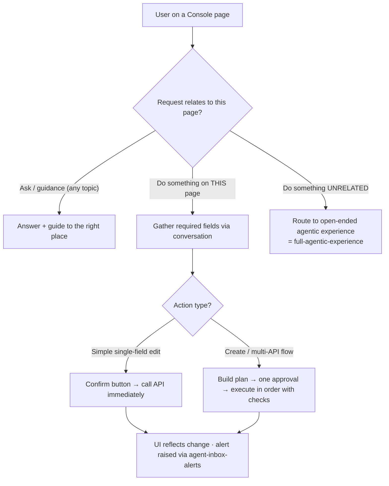

# TXN — Co-pilot

> **Component map:** [[components]] · **Vision:** [[vision]]
> **User journeys:** [[ux-ai-guided-product-onboarding|Guided Onboarding]], [[ux-ai-configuration-validation|Config Validation]], [[ux-ai-assisted-customer-service-resolution|CS Resolution]] — see [[user-journeys]]
> **Date:** 2026-06-04
> **Status:** Defined
> **Owner:** _TBC_
> **Sources:** [[13-05-2026-txn-vision-meeting]], [[01-06-2026-component-1-Agent-Access-Layer]] (co-pilot scope + permissions), [[29-05-2026-stackworkz-meeting]], [[04-06-2026-component-3-co-pilot]] (dedicated deep-dive)

---

## 1. What Does This Component Do?

**Functional purpose:**

The Co-pilot is the **reactive** entry point on TXN's trust spine — Concept 1. The user is in the driving seat, clicking through the Console (or Developer Portal), and the AI rides alongside as an assistant they can turn to: a panel, typically down the right-hand side, that they *open and ask*. It answers questions, explains what's on the screen, recommends actions, previews the impact of a change before it's made, and — with confirmation — can take the action on the user's behalf. It does **not** proactively interrupt (that is [[agent-inbox-alerts]]) and it is **not** the agent-as-interface (that is [[full-agentic-experience]]); it augments a human who is still doing the driving.

The clearest way to place the Co-pilot is as **rungs 2 and 3 of a four-level graduation** the room settled on — a deliberate on-ramp that carries a manual-first user toward agentic working at their own pace:

```
Level 1  Fully manual                 — no AI; user does everything (the Super Ultra screens, built manually for now)
Level 2  Co-pilot · guidance          — sees the page + current config; tells you what to do, you do it     ← Co-pilot
Level 3  Co-pilot · agentic           — you give the info; it fills the back end via API, the UI updates     ← Co-pilot
Level 4  Full agentic experience      — the agent is the interface; renders UI, does the work               → [[full-agentic-experience]]
```

The Co-pilot owns **Levels 2 and 3**. Mike was explicit that the same user will *float* between levels depending on the task and their confidence — comfortable letting the agent run on a low-stakes cardholder change, but wanting review-and-approve on a product. The design must let them move up and down a "loose architecture" (Dorte's framing) rather than locking a user into one lane.

Two behaviours define its value. First, **impact explanation**: the user is not a card expert and doesn't want to be one, so before they change a setting the co-pilot tells them what it means — *"if you make this change, X,000 cards will be affected."* Second, **guided configuration / onboarding**: a card product carries 100+ fields and most users don't know what they do. The co-pilot collapses that into a guided conversation — it recognises the shape of the program ("you're a travel programme; here's what most clients in your shape do") and fills 10–12 back-end properties from a short exchange, with the user *confirming, not configuring*. Mike Moores (TXN's CTO) framed the product step as the highest-value target: *"how can we say, this is what 90% of people do — you're probably going to want to follow this."*

**Where the Co-pilot acts — and where it hands off.** This is the key scoping principle Ian Johnson (TXN's CEO) landed at the close of the deep-dive. The Co-pilot is **page-scoped for *doing***. If you are on the Product page, it helps you with *that* page — answer a question, explain how to do something, or do it for you. **Asking and guidance remain available from anywhere** — Mike's principle that "you shouldn't need to know where to click" survives: ask about cards on the Products page and it guides you to the right place. But if, from the Product page, you ask it to *execute* something unrelated (e.g. "add 10 cardholders to a group"), it does **not** try to reconstruct that from where you are — it **routes you to the open-ended "Claude-type" experience** ([[full-agentic-experience]]) and starts fresh: *"what are you looking to do today?"* The open-ended, ask-anything entry point lives on the **landing / home page**; the per-page co-pilot lives on each screen and inherits that page's context and guard-rails. (This refines the earlier "scoped to everything" framing: guidance is global, **execution of off-context tasks is handed off, not performed in place** — the Word-vs-Excel test Ian used: "we can help you with Word here, but not Excel — you're in the wrong area.")

The Co-pilot carries **page state**: it knows which card / product / screen the user is on, so the natural assumption is that work happens on the entity in context. Where the user needs to pick a target, the co-pilot can **render selectable components** (e.g. the user's card programs as clickable cards) rather than asking for an ID — the click becomes a selection the agent adds to its context.

```
Co-pilot  (Levels 2–3 of the graduation)
├── Conversational Q&A & navigation guidance   (ask anything; guided to the right place; hand off to agentic if off-context)
├── Impact preview                              ("if you change this, X cards affected")
├── Guided configuration                        (program-pattern recognition; field-collapse; confirm-not-configure)
├── Guided onboarding & provisioning            (CRM→technical handoff; admin + user setup; environment gating)
├── Action-on-confirmation                      (plan-then-act; direct API; button confirm; minimise clicks)
└── Process surfacing / trust UI                (bucketed step display; risk-tiered agent depth)
```

**Personas:**

| Persona | How they use this component | What they need from it |
|---------|---------------------------|----------------------|
| **Card Program Operators** (Console) | Open the co-pilot to ask, understand a screen, get a recommendation, preview an impact, or have it perform an action. Spans admin, operations, technical, and **customer service** users — all in one Console. | Plain-language guidance; the AI as their card expert; confidence an action is what they intended; a surfacing depth that suits a CS user, not just a developer |
| **Admin operator** (Console) | The dedicated user created at onboarding — provisions all access, onboards other users (sales, marketing, CS) and sets their permissions, sets up the program | Power to provision everything without needing that access for day-to-day work; a clean CRM→technical handover |
| **Integrators** (Developer Portal) | The co-pilot also renders in the Portal alongside [[developer-support]] — help understanding the product/console while integrating | Context-aware help that doesn't require leaving the page |

---

## 2. What Needs to Happen?

**Functional requirements:**

- User can open a conversational co-pilot in the Console (and Portal) and **ask** questions in natural language about anything in their program — not just the current page — and be **guided** to the right place.
- For **doing**, the co-pilot acts within the **current page's context**. A request to execute something unrelated to the current page **routes the user to the open-ended agentic experience** ([[full-agentic-experience]]) rather than executing in place.
- The **landing / home page** hosts the open-ended "what would you like to do today?" entry point; per-page co-pilots inherit page context and guard-rails.
- Before a change, co-pilot **previews impact** using data-lake/analytical data ("this affects N cards / ~X% of transactions").
- Co-pilot offers **guided configuration**: recognises the program pattern, proposes the standard configuration ("90% of travel clients do this"), and fills grouped back-end fields from a short conversation for the user to confirm.
- Co-pilot can **execute an action on confirmation** via [[agent-access-layer]] — by **calling the API directly** (not a computer-use agent typing into fields); the UI reflects the change afterwards.
- **Confirmation is an explicit button surfaced in the AI UI** ("Would you like me to go ahead and do this for you?"), not a free-text "yes".
- **Minimise confirmation clicks** — bundle a logical operation into a single approval. A multi-API flow (cardholder → account → card) is **one** "here's the plan, happy?" approval, not one click per API.
- **Plan-then-act for creates and multi-API flows**; **act-immediately for simple single-field edits**. The AI flow mirrors the manual flow — wherever the manual flow has a review step (creates, onboarding, product flows), the AI flow has one too.
- For multi-step holistic tasks, when a user is **stuck mid-flow**, the co-pilot asks them to restate the holistic goal, **replays what they have already done** against it, identifies what is wrong or missing, and offers to complete it (do-it-for-you) or explain the remaining steps (you-do-it) — optionally explaining *why* a prior step was wrong to build the user's knowledge.
- Where the user must identify a target entity, the co-pilot can **render selectable components** so the user clicks instead of supplying an ID.



**Business rules and constraints:**

- **No blanket auto-approve.** There is **no user setting that lets the co-pilot "do everything automatically."** Every action requires explicit per-operation confirmation (Ian: the liability of "I didn't realise I clicked that setting" is unacceptable for a financial-services product).
- **Permission parity** — the co-pilot can never let a user do something they couldn't do in the Console; it respects the granular user permission model (see [[agent-access-layer]]).
- **Mirror the manual flow's review steps** — creates and onboarding/product flows already carry a manual review step; the AI must preserve it.
- **API YAML is the source of truth** for required fields. The same YAML that renders the Developer Portal tells the co-pilot what each endpoint requires; the co-pilot stays in sync with API changes through it. Some required fields (e.g. IDs) are auto-populated; core fields are prompted for.
- **Conditional field surfacing** — show mandatory fields first, then optional/conditional ones only when relevant (e.g. turning on address verification reveals its five fields). Validation is loose until an action demands it (the API only enforces "an address must exist somewhere" when a card is ordered).
- **Scoped to TXN's domain** — not a general-purpose assistant.
- **Bounded, not open-ended** — semi-structured (slash commands / predefined workflows) to keep queries built-for-success and cost controlled (shared design principle with [[agent-inbox-alerts]]).

**Edge cases and error states:**

- User asks about something outside their permissions → co-pilot advises they lack permission *early* (before attempting), and where relevant routes to the approval queue.
- User asks to *execute* something unrelated to the current page → hand off to the open-ended agentic experience, do not attempt from the page.
- User is stuck mid-flow having done some steps incorrectly → restate goal, replay completed steps, correct, offer to finish.
- A multi-API create where an earlier call fails (cardholder fails before account/card) → the plan must sequence and check; do not execute downstream steps on failure.
- Action irrelevant to the program type (e.g. an MCC change that doesn't apply) → surfaced as "not applicable here," even if the user has the permission.
- Permission rejection from the Core API → the descriptive error is surfaced/auto-corrected (see [[agent-access-layer]] validation layers).

---

## 3. How Should It Look and Feel?

**Design direction:** A quiet assistant panel, typically the right-hand rail of the Console — present, not intrusive. It feels like asking a knowledgeable colleague, in the user's language, not querying a database. When the agent produces something large (a review, a plan), the **chat stays on the right rail and the heavy content renders in the main reading panel** so the user reviews it in full on the page (Super Ultra's design).

**Reference products:**
- **Claude / ChatGPT side-assistant** — the conversational model; Ian referenced Claude's *"before I do this, do you want me to do that?"* confirmation behaviour as the bar, and its constant "what's happening now" updates as the antidote to the ChatGPT "is it still working?" anxiety.
- **Claude's parallel sub-agent block-out UI** (Brett) — the experiment where the assistant shows clickable blocks for each agent team running in parallel; a live reference for *how much* of the "workforce" to surface, and being A/B tested in the wild.
- **Super Ultra Console designs** — the co-pilot renders inside those screens; impact pop-ups already appear in the prototype; chat-right / review-in-main-panel layout.

**Key UX principles for this component:**
- **Confirm before acting, with a button** — short steps, always "here's what I'll do," and the action is a click, not a typed reply.
- **Speak business, not config** — wrap the 100+-field reality in plain language.
- **Guide, don't gatekeep** — answer about anything; lead the user to the right screen; hand off cleanly when the *doing* belongs elsewhere.
- **Surface the process at the right altitude** — show bucketed steps ("analysing… checking… verifying…") so the user trusts work is happening and being checked, but **not** raw internal errors or field-by-field detail. One middle ground that suits every user from CS to developer (Mike). **Universal, not a per-user slider** — everyone sees the same level (the "AI slider" idea was rejected as needless complexity); land on one level and iterate fast.
- **Minimise interruptions** — one approval per logical operation, not one per task step.

---

## 4. How Are We Going to Solve It?

| Capability | Build / Buy / Access | Provider / Approach | Rationale |
|-----------|---------------------|-------------------|-----------|
| Conversational assistant | Build | Co-pilot agent rendered inside Console/Portal; page state sets exposed tools and page-specific guard-rails | Reuses [[agent-access-layer]] tools; page context keeps tool surface small and the guards specific |
| Impact preview | Build / Access | Query Data Lake + analytical set for the estimate | Most screen data is already present; co-pilot adds the wider analytical view |
| Guided configuration | Build | Pattern recognition over client-category data ("travel → these settings"); field-collapse driven by API YAML | Collapses 100+ config fields into confirm-not-configure |
| Action execution | Access | [[agent-access-layer]] tools via **direct API calls**, prompted-trust button confirmation, plan-then-act for multi-API flows, approval queue | Permission-scoped, server-side validated; direct API is seconds vs a computer-use agent clicking around |
| Trust / verification depth | Build | **Risk-tiered**: low-risk change → a single critic agent marks the work; high-risk change → a planner spawns reviewer/critic teams, findings presented back | Matches verification effort to blast radius; the "agent marking the previous agent's work" pattern Ian asked for |
| Process surfacing | Build | Bucket sub-processes into named categories (analysing / checking / verifying); render as live status | One trust-building view across all user types without over-exposing detail |
| API-spec sync | Access | Consume the API YAML (same spec that renders the Developer Portal) | Required-field knowledge stays current with API changes automatically |

---

## 5. What Data Does It Need?

| Data | Direction | Source / Destination | Notes |
|------|-----------|---------------------|-------|
| On-screen / page context | In | Console (Stackworkz) | Sets state, exposed tools, and page-specific guard-rails |
| User action history (pages visited, buttons clicked, fields changed) | In / Stored | Console session cache | Lets the co-pilot replay what a stuck user has already done against their stated goal |
| Analytical / program data | In | Data Lake + Core API (via [[agent-access-layer]]) | Co-pilot favours the analytical set over re-pulling records |
| Client-category patterns | In | Data Lake (category tags: travel, lending, rewards…) | Powers guided configuration recommendations |
| API YAML spec | In | TXN API spec (renders the Developer Portal) | Source of truth for required vs optional/conditional fields per endpoint |
| CRM / sales handoff data | In | TXN CRM | Seeds onboarding at the sales→technical transition; sets up the admin user |
| Config changes | Out | Core API (via [[agent-access-layer]]) | On confirmation, permission-scoped, audited; direct API call |

---

## 6. Who Can Access It?

| Persona / Role | Access level | Notes |
|---------------|-------------|-------|
| Admin operator | Scoped to admin permissions; can provision all access | Created at onboarding; onboards other users and sets their permissions; holds provisioning rights but not day-to-day access |
| Card Program Operators (ops, technical, CS) | Scoped to their Console permissions | Co-pilot mirrors exactly what the user may do in the Console; surfacing depth tuned for the full range incl. customer service |
| Integrators (Portal) | Portal-scoped | Co-pilot in the Portal context; deeper integration help via [[developer-support]] |

_Inherits the permission model from [[agent-access-layer]]. Environments are **gated** — a client reaches UAT (with credentials) at a set onboarding step, and production only when ready._

---

## 7. How Do We Know It's Working?

- [ ] _Users complete configuration/onboarding via the co-pilot without dropping to manual config_
- [ ] _Impact previews reduce "I didn't realise that would happen" support contacts_
- [ ] _Co-pilot answers resolve in-session without the user hunting for the screen_
- [ ] _Users graduate up the levels over time (Level 2 → 3) rather than staying fully manual_
- [ ] _Process-surfacing reduces "is it broken / is it still working?" abandonment without generating "why was that wrong?" confusion_

---

## 8. Dependencies

**What this component needs:**

| Depends on | What we need | Blocking? |
|-----------|-------------|----------|
| [[agent-access-layer]] | Tools, permission scoping, server-side validation, approval routing | **Yes** |
| Console (Stackworkz) | Page state / on-screen context; render surface (right-hand panel + main review panel); user-action cache | **Yes** |
| [[full-agentic-experience]] | The open-ended "Claude-type" experience that off-context execution requests route into | **Yes** (defines the handoff boundary) |
| API YAML spec | Required-field definitions, kept in sync with API changes | **Yes** |
| Data Lake (DT) | Analytical data + client-category patterns for impact + guided config | Partial — can mock early |
| TXN CRM | Sales→technical onboarding handoff data | No — can mock early |

**What other components need from this one:**
- The impact-explanation logic is shared with [[agent-inbox-alerts]] (same information source, different delivery — Ian's point).
- [[full-agentic-experience]] receives handoffs from the co-pilot for off-context execution and shares the same graduation spine (Co-pilot = L2–3, Full Agentic = L4).
- A co-pilot-initiated change raises an alert through [[agent-inbox-alerts]] like any other change.

---

## 9. Priority

_Phasing out of scope for this exercise — full scope captured. (Noted: the Console co-pilot is on TXN's critical path per Ian/Mike — a design input, not a scope cut.) Next deep-dive after this session: [[full-agentic-experience]], because the two share the graduation spine and the handoff boundary._

---

## 10. Risks

**Abuse vectors:**
- Permission escalation — coaxing the co-pilot to act beyond the user's rights (mitigated by server-side validation in [[agent-access-layer]]).
- Prompt injection via user-controlled fields in context.

**Data risks:**
- Hallucinated card-domain guidance — must be grounded in TXN docs/data, not generic LLM knowledge (high-cost wrong answers).
- Stale analytical data leading to a wrong impact preview.

**Product / design risks:**
- **Over-engineer / under-engineer mismatch** (Ian's "keeps me up at night") — building heavy cross-page execution that's rarely used, while under-building the realistic holistic flow. Mitigated by the page-scoped-execution + hand-off principle and "land on something, iterate fast."
- **Trust erosion from process surfacing** — too little and the user thinks it's broken; too much (or showing 20 parallel "agents") and the user trusts it less, not more (Dorte). Mitigated by bucketed categories at a single universal altitude.

**Naming / brand risk:**
- **"Co-pilot" is a Microsoft trademark** (raised by Dorte). Internally the tool need not be named at all (Ian); the constraint is on external/market use of the term. **Open: decide the external name** (e.g. "TXN [name]") — research the Microsoft restriction before launch collateral.

**Compliance:**
- Audit of co-pilot-initiated actions; PII handling in context (see [[agent-access-layer]] / [[vision]] §8).

**Controls needed:**
- Prompted-trust button confirmation; **no blanket auto-approve**; permission-parity enforcement; plan-then-act with sequenced checks for multi-API flows; page-specific guard-rails; risk-tiered verification; grounding in TXN documentation; bounded-query framework.

---

## Sub-Components

| Sub-Component | Overview | Status | Link |
|--------------|----------|--------|------|
| Conversational Q&A & Navigation | Ask-anything assistant; guides to the right screen; hands off off-context execution to the agentic experience; CS-resolution journey | Defined | [[conversational-qa]] |
| Impact preview | Pre-change "this affects N cards / X% of transactions" | Collecting | _[[sub-components/impact-preview]]_ |
| Guided configuration & validation | Real-time validation + conflict detection + impact analysis before activation; advisory; critical conflicts block | Defined | [[guided-configuration]] |
| Guided onboarding & provisioning | Pattern-recognised config + field-collapse; CRM→technical handoff; admin + user setup and permissions; environment gating (UAT→prod) | Defined | [[guided-onboarding]] |
| Action-on-confirmation | Plan-then-act; direct API calls; button confirmation; minimise clicks | Collecting | _[[sub-components/action-on-confirmation]]_ |
| Process surfacing / trust UI | Bucketed step display; risk-tiered agent depth; universal altitude | Collecting | _[[sub-components/process-surfacing]]_ |
