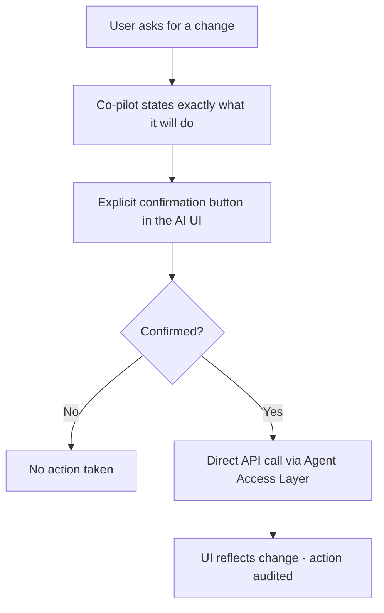
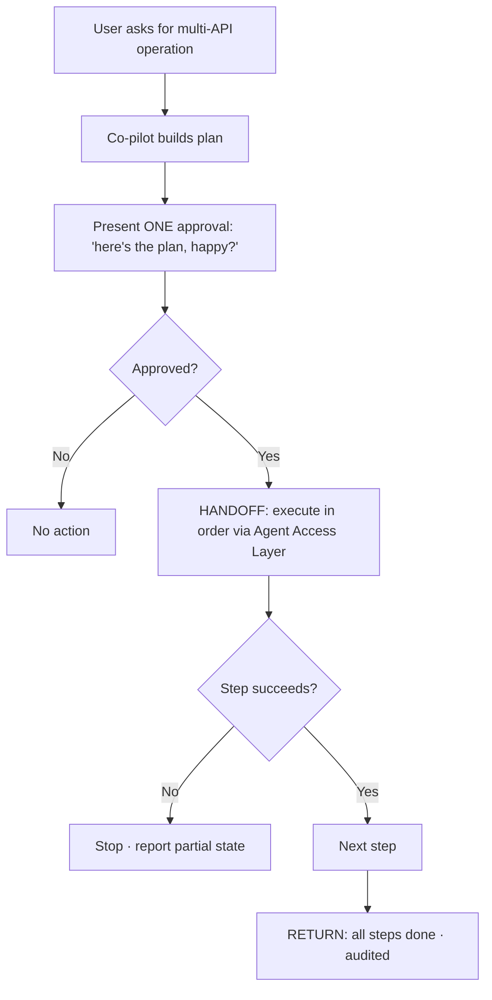

# TXN — Co-pilot: Action-on-Confirmation

> **Component:** [[co-pilot]] · **Vision:** [[vision]]
> **Date:** 2026-06-09
> **Status:** Defined
> **Owner:** _TBC_
> **Sources:** [[04-06-2026-component-3-co-pilot]] (button confirm, no auto-approve, plan-then-act, minimise clicks, direct API), [[01-06-2026-component-1-Agent-Access-Layer]] (execution + approval routing)

---

## 1. What Does This Sub-Component Do?

**Functional purpose:**

Action-on-Confirmation is **how the Co-pilot actually does something** once the user says yes. It is the execution discipline that sits behind every Co-pilot action, and the deep-dive nailed down its rules precisely:

- Confirmation is an **explicit button surfaced in the AI UI** ("Would you like me to go ahead and do this for you?"), never a free-text "yes."
- There is **no blanket "auto-approve everything" setting** — Ian killed it ("I didn't realise I clicked that setting and you've gone and done all these things"). Every action is confirmed.
- **Minimise clicks** — bundle a logical operation into **one** approval, not one click per API call (Mike: don't make me click 12 buttons like Claude does).
- **Direct API calls, not computer-use** — the co-pilot calls the API and the UI reflects the change; it does not visibly type into fields.
- **Plan-then-act for creates / multi-API flows**; **act-immediately for simple single-field edits**.
- Everything routes through [[agent-access-layer]] (permission-scoped, server-validated); product-level / multi-card actions route to the **approval queue**.

**Entities that interact with it:**

- **Card Program Operators** (any Console user) — confirm an action via a button.
- **Co-pilot agent** — builds the plan, presents the confirmation, and executes via [[agent-access-layer]].

---

## 2. What Needs to Happen?

**Functional requirements:**

- The co-pilot **states what it will do** and presents an **explicit confirmation button** before acting.
- A **simple single-field edit** executes immediately on confirmation.
- A **create / multi-API flow** (e.g. cardholder → account → card) is presented as **one plan with one approval**, then executed **in order with checks** — downstream steps do not run if an earlier step fails.
- Execution is a **direct API call** via [[agent-access-layer]]; the UI reflects the result afterward.
- **Product-level / multi-card** actions route to the **approval queue** with the named approver.
- Every executed action is **audited** (attributed to the user; AI-recommendation context where relevant).

**Business rules:**

- **No blanket auto-approve.** There is no setting that lets the co-pilot act without per-operation confirmation.
- **One approval per logical operation**, not per API call.
- **Permission parity** — the co-pilot can only execute what the user could do in the Console.
- The **Core API is the authoritative backstop** — an unpermitted/invalid call is rejected with a self-correcting error.

**Edge cases:**

- Earlier step of a multi-API plan fails → stop; do not execute downstream steps; report partial state.
- User lacks permission → fail early with a descriptive, self-correcting error.
- Action requires sign-off → route to approval queue; the approver becomes the initiator.

---

## 3. Entity Journeys

### 3a. Isolated Journeys

#### Journey 1: Confirm and execute a simple action

**Entity:** Card Program Operator (user) + Co-pilot agent (hybrid)

**Input:** User asks the co-pilot to make a simple single-field change (e.g. "set this product's max transaction value to 500").

**Outcome:** The change is executed on a single button confirmation and the UI reflects it; the action is audited.

**Steps:**

**Acceptance criteria:**

- [ ] Confirmation is a button in the AI UI, not a typed reply.
- [ ] There is no setting that bypasses per-action confirmation.
- [ ] A simple single-field edit executes immediately on confirmation, via a direct API call.
- [ ] The UI reflects the change after execution; the action is audited.

### 3b. Cross-Component Journeys

#### Journey 1: Plan-then-act for a multi-API operation

**Entity:** Card Program Operator + Co-pilot agent

**Input:** User asks for something spanning multiple APIs (e.g. "create a cardholder with this account and a card in EUR").

**Handoff point:** The co-pilot builds a single plan and gets **one approval**, then hands the ordered steps to [[agent-access-layer]] for sequenced execution; product-level/multi-card actions route to the approval queue. Each step's success/failure returns to the co-pilot.

**Components involved:** Co-pilot → [[agent-access-layer]] → Co-pilot

**Outcome:** The multi-step operation completes in order with one approval, or stops cleanly on a failed step.

**Steps:**

**Acceptance criteria:**

- [ ] A multi-API operation is presented as one plan with one approval, not one approval per API.
- [ ] Steps execute in dependency order; a failed step stops downstream execution and reports partial state.
- [ ] Product-level / multi-card actions route to the approval queue with the named approver.
- [ ] Every step is executed via [[agent-access-layer]] and audited.

---

## 4. Look and Feel (Optional)

Inherits Co-pilot design direction ([[co-pilot]] §3). Specifics: the confirmation is a **distinct, single button** within the AI UI; the plan for a multi-step operation is shown as a reviewable summary above one approve button — minimising clicks, never one button per step.

---

## 5. Data Requirements

| What | Direction | Description | Source / Destination |
|------|-----------|------------|---------------------|
| Requested action / intent | In | What the user asked for | User → Co-pilot |
| Plan | Out | The ordered set of steps for a multi-API operation | Co-pilot → user (for approval) |
| Executed action(s) | Out | The API calls made on confirmation | Core API (via [[agent-access-layer]]) |
| Execution result / error | In | Success or self-correcting validation error | [[agent-access-layer]] → Co-pilot |
| Action audit | Stored | What was done, by whom, with what confirmation | Combined audit store |

---

## 6. Dependencies

| Depends on | What we need | Blocking? |
|-----------|-------------|----------|
| [[agent-access-layer]] | Tool execution, permission scoping, approval-queue routing, server-side validation, audit | **Yes** |
| Console (Stackworkz) | The AI-UI surface for the confirmation button + plan review | **Yes** |

**What siblings/other components need from this one:**

- [[guided-onboarding]], [[guided-configuration]], and [[conversational-qa]] all execute through this discipline.

---

## 7. Risks

**Specific risks:**

- **Accidental destructive action** — acting without genuine user intent.
- **Partial multi-API failure** — leaving the system half-changed.
- **Click fatigue** — too many confirmations annoy users and erode the experience.
- **Permission escalation** — coaxing the co-pilot to act beyond the user's rights.

**Controls to build into the journeys:**

- **Explicit per-operation button confirmation**; **no blanket auto-approve**.
- **Sequenced execution with failure-stop** for multi-API plans; report partial state.
- **One approval per logical operation** to keep clicks minimal.
- **Server-side permission validation** (Core API backstop) — never rely on agent context alone.

---

## 8. Priority

**Must-have at launch?** Yes — nothing the co-pilot *does* happens without this; it's the execution discipline for every action.

**Sequencing rationale:** Directly depends on [[agent-access-layer]]'s execution + approval routing; build in lockstep with it.

---

## Sub-Sub-Components

Leaf node — no further decomposition needed.
