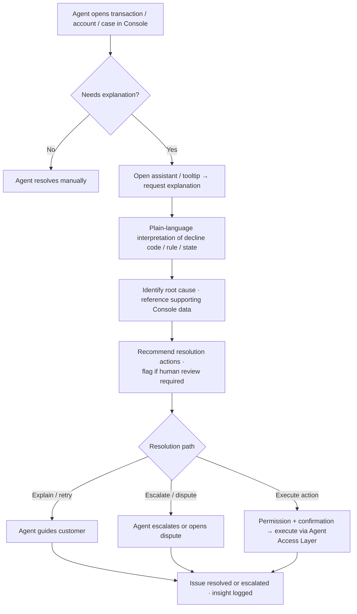
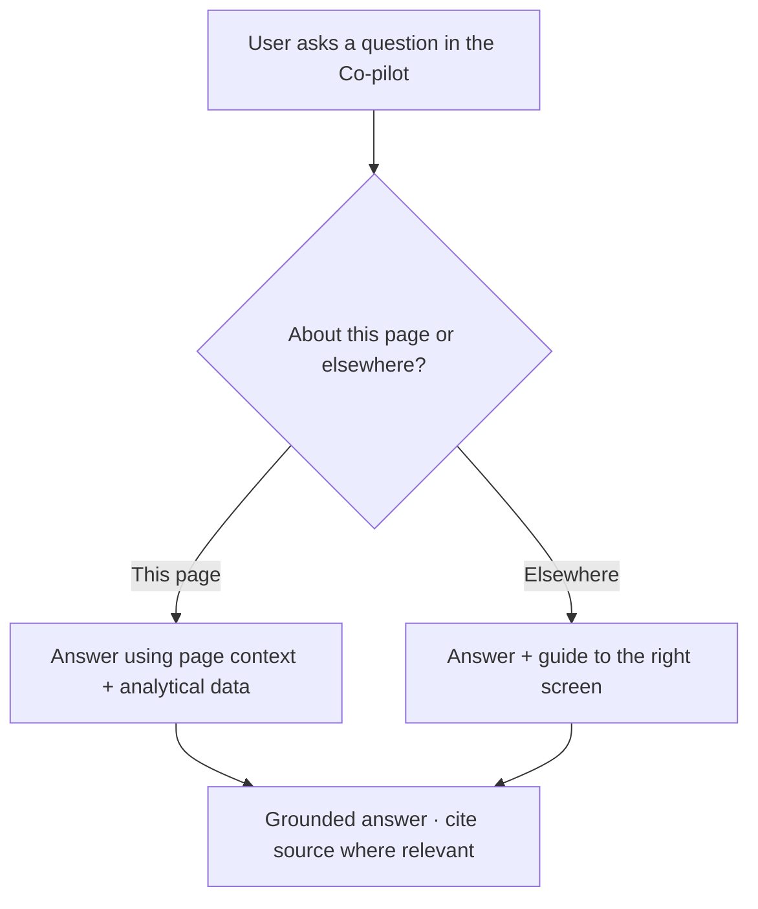
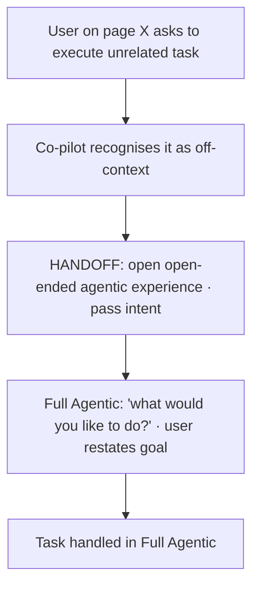

# TXN — Co-pilot: Conversational Q&A & Navigation

> **Component:** [[co-pilot]] · **Journey source:** [[ux-ai-assisted-customer-service-resolution]] · **Vision:** [[vision]]
> **Date:** 2026-06-09
> **Status:** Defined
> **Owner:** _TBC_
> **Sources:** [[ux-ai-assisted-customer-service-resolution]] (behavioural journey), [[04-06-2026-component-3-co-pilot]] (deep-dive: page-scoped execution, hand-off boundary, guidance-anywhere)

---

## 1. What Does This Sub-Component Do?

**Functional purpose:**

Conversational Q&A & Navigation is the Co-pilot's **ask-anything assistant** — the panel a user opens to ask a question in plain language, understand what's on the screen, get pointed to the right place, and (where it's a diagnostic/support task) receive a grounded explanation and a recommended next action. Its defining behaviour is **explain, don't just answer**: it translates technical platform information — decline codes, configuration rules, card/account state — into clear language grounded in the data actually visible in the Console, and recommends the appropriate next step.

The richest journey here is **AI-assisted customer-service resolution**: a CS agent investigating a cardholder issue (a decline, a lifecycle problem, an unexpected restriction) gets the technical reason interpreted, the root cause identified with reference to the supporting Console data, and a recommended resolution path — explain to the customer, retry, escalate for config review, or open a dispute.

Two scoping rules from the deep-dive shape this sub-component:
- **Guidance is available anywhere** — "you shouldn't need to know where to click"; ask about cards on the Products page and it guides you to the right place.
- **Execution is page-scoped** — if you ask it to *do* something unrelated to the current page, it does not reconstruct that from where you are; it **hands off to the open-ended [[full-agentic-experience]]** and starts fresh.

**Entities that interact with it:**

- **Customer Service Agent** (primary for the resolution journey) — investigates cardholder/programme issues; needs technical info translated and a recommended action.
- **Programme Operations Administrator** (secondary) — diagnoses operational issues; asks general questions and gets navigation guidance.
- **Co-pilot agent** — interprets Console data in plain language, identifies root cause, recommends actions, guides navigation, and hands off off-context execution.

---

## 2. What Needs to Happen?

**Functional requirements:**

- User can open a **conversational assistant** (or a contextual tooltip) anywhere in the Console and ask in natural language.
- For a support/diagnostic case, the assistant **interprets technical information** (decline codes, the configuration rule causing a decline, card/account state) into **plain language**.
- The assistant **identifies the root cause** (merchant restriction, spend-limit breach, regional restriction, card lifecycle status) and **references the supporting Console data**.
- The assistant **recommends next actions** (explain to customer, guide a retry, escalate for config review, open a dispute) aligned to operational policy, and **flags when human review is required**.
- The agent can **guide navigation** to the right screen/information from anywhere.
- A request to **execute something unrelated to the current page** is **routed to [[full-agentic-experience]]**, not attempted in place.
- Sensitive actions executed from here require **appropriate permission and explicit confirmation**.

**Business rules:**

- **Explanations must be grounded** in the operational data actually visible in the Console — not generic LLM knowledge.
- **Advisory only** — the assistant must not automatically execute operational changes; the agent retains full control over case-resolution decisions.
- Sensitive operational actions require **permission + confirmation** ([[agent-access-layer]]).
- All AI insights and case summaries are **logged for audit**.
- Guidance is global; **execution is page-scoped** (off-context execution hands off — see [[co-pilot]] §1).

**Edge cases:**

- Incorrect interpretation could mislead the agent → explanations must cite the underlying data/rule so the agent can verify.
- User asks to execute an unrelated task → hand off to [[full-agentic-experience]], don't attempt from the current page.
- Agent acts without validating root cause → recommended actions flag when human review is required; sensitive actions gated by permission + confirmation.

---

## 3. Entity Journeys

### 3a. Isolated Journeys

#### Journey 1: CS agent resolves a cardholder issue with AI assistance

**Entity:** Customer Service Agent (user) + Co-pilot agent (hybrid)

**Input:** A CS agent opens a cardholder account, transaction record, or support case in the Console where a decline or error is visible, and requests assistance.

**Outcome:** The agent understands the root cause of the issue (grounded in the visible data) and follows a recommended next action — resolving routine issues without escalation.

**Steps:**

**Acceptance criteria:**

- [ ] The assistant translates technical decline codes / error messages into plain language.
- [ ] The root-cause analysis references the specific Console data / rule supporting it (so the agent can verify).
- [ ] Explanations are grounded in the data actually visible — no ungrounded guidance.
- [ ] Recommended actions align with operational policy and flag when human review is required.
- [ ] Sensitive actions require appropriate permission and explicit confirmation before execution.
- [ ] The agent retains control of the resolution decision (advisory only).
- [ ] AI insights and case summaries are logged for audit.

#### Journey 2: Ask-anything question & navigation guidance

**Entity:** Console user (any) + Co-pilot agent

**Input:** User asks a natural-language question about their programme — possibly unrelated to the current page.

**Outcome:** The user gets a grounded answer and, where relevant, is guided to the right screen — without needing to know where to click.

**Steps:**

**Acceptance criteria:**

- [ ] The user can ask about anything in their programme from any page (guidance is global).
- [ ] The assistant guides the user to the right place rather than requiring them to know where to click.
- [ ] Answers are grounded in TXN data/docs; a permission-restricted topic is flagged early.

### 3b. Cross-Component Journeys

#### Journey 1: Off-context execution hands off to Full Agentic

**Entity:** Console user + Co-pilot agent

**Input:** While on one page, the user asks the co-pilot to *execute* a task unrelated to that page (e.g. "add 10 cardholders to a group" from the Products page).

**Handoff point:** The Co-pilot does **not** reconstruct the task from the current page. It opens the open-ended "what would you like to do?" experience — [[full-agentic-experience]] — and the user restates the goal there. State passed: the user's intent/utterance; the user expects to continue the task in the agentic surface.

**Components involved:** Co-pilot → [[full-agentic-experience]]

**Outcome:** The unrelated task is handled in the agentic experience; the Co-pilot is not stretched into cross-page execution.

**Steps:**

**Acceptance criteria:**

- [ ] An off-context *execution* request is routed to [[full-agentic-experience]], not attempted from the current page.
- [ ] *Guidance/questions* about other areas are still answered in place (only execution hands off).
- [ ] The handoff carries the user's intent so they don't have to fully repeat themselves.

---

## 4. Look and Feel (Optional)

Inherits Co-pilot design direction ([[co-pilot]] §3). Specifics:

- Appears as a **conversational help panel** or **contextual tooltip**, depending on interaction.
- Explanations link to / highlight the **relevant Console data or rule** behind them.
- Recommended actions are presented as **clear, selectable next steps**, with human-review-required ones visibly marked.

---

## 5. Data Requirements

| What | Direction | Description | Source / Destination |
|------|-----------|------------|---------------------|
| On-screen / case context | In | The transaction, account, card, or case the agent is viewing | Console (Stackworkz) |
| Technical event data | In | Decline codes, error messages, system events | Core API (via [[agent-access-layer]]) |
| Configuration rules | In | The rule(s) causing a decline/restriction | Core API / config |
| Plain-language explanation + root cause | Out | The interpreted reason + supporting reference | Co-pilot → agent |
| Recommended actions | Out | Resolution paths, with human-review flags | Co-pilot → agent |
| User intent (on handoff) | Out | Passed to [[full-agentic-experience]] for off-context execution | Co-pilot → Full Agentic |
| Insights + case summary audit | Stored | What was explained, recommended, decided | Combined audit store |

---

## 6. Dependencies

| Depends on | What we need | Blocking? |
|-----------|-------------|----------|
| [[agent-access-layer]] | Read technical/case data, permission scoping, execute sensitive actions, audit | **Yes** |
| Console (Stackworkz) | Page/case context, render surface (panel + tooltip) | **Yes** |
| [[full-agentic-experience]] | The hand-off target for off-context execution | **Yes** (defines the boundary) |
| TXN documentation / KB | Grounding for explanations | Partial — can mock early |

**What siblings/other components need from this one:**

- This is the Co-pilot's primary conversational entry point; other sub-components (impact-preview, action-on-confirmation) are reached through it.

---

## 7. Risks

**Specific risks:**

- **Incorrect interpretation** → wrong support guidance and lost trust.
- **Ungrounded answers** → hallucinated card-domain guidance (high-cost wrong answers).
- **Acting without validating root cause** → premature/incorrect actions.
- **Over-reach** → attempting cross-page execution the co-pilot shouldn't.

**Controls to build into the journeys:**

- **Ground every explanation** in visible Console data; cite the supporting rule/record so the agent can verify.
- Recommended actions **flag when human review is required**; sensitive actions gated by **permission + confirmation**.
- **Hand off off-context execution** to [[full-agentic-experience]] rather than reconstructing it.
- **Log** insights and case summaries for audit; the human retains the resolution decision.

---

## 8. Priority

**Must-have at launch?** Yes. Conversational Q&A is the Co-pilot's primary entry point, and CS resolution is a high-frequency, high-value journey (translating technical declines for support agents). The off-context hand-off rule is needed as soon as [[full-agentic-experience]] exists.

**Sequencing rationale:** Depends on [[agent-access-layer]] for grounded data + sensitive-action execution, and on the [[full-agentic-experience]] boundary for hand-off. The ask-anything/navigation journey can ship before the full hand-off is wired.

---

## Sub-Sub-Components

Leaf node — no further decomposition needed.
