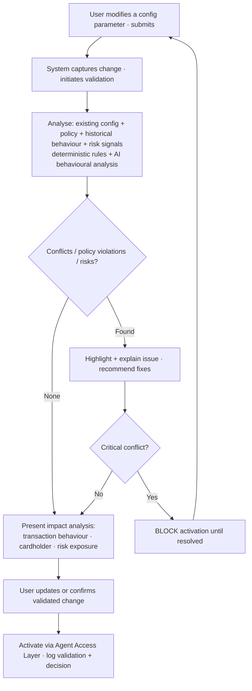
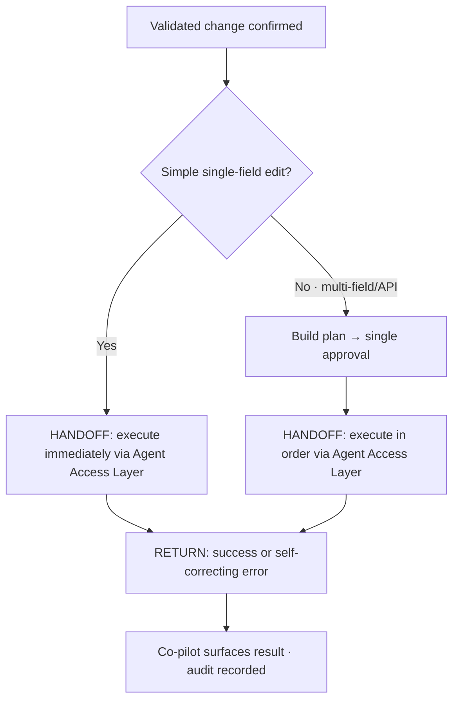

# TXN — Co-pilot: Guided Configuration & Validation

> **Component:** [[co-pilot]] · **Journey source:** [[ux-ai-configuration-validation]] · **Vision:** [[vision]]
> **Date:** 2026-06-09
> **Status:** Defined
> **Owner:** _TBC_
> **Sources:** [[ux-ai-configuration-validation]] (behavioural journey), [[04-06-2026-component-3-co-pilot]] (deep-dive: impact preview, plan-then-act, field-collapse)

---

## 1. What Does This Sub-Component Do?

**Functional purpose:**

Guided Configuration & Validation is the Co-pilot's **safety net for change**. Where [[guided-onboarding]] gets a programme set up from scratch, this sub-component governs *ongoing changes* to a live programme: when a user modifies a configuration parameter (a spend limit, a merchant restriction, a transaction-type permission, a regional control), the co-pilot validates the proposed change **in real time, before activation** — detecting conflicts, policy violations, and operational risks, explaining the expected impact, and recommending fixes. It evaluates each change against the existing programme configuration, platform policy, historical programme behaviour, and operational risk signals, combining **deterministic rule checks** with **AI behavioural analysis**. Critically, the AI is advisory: it never modifies configuration on its own, and **critical conflicts block activation until resolved**.

This is where the Co-pilot's **impact-explanation** value lives at change time ("if you make this change, X cards / Y% of transactions are affected") — closely related to the [[co-pilot]] impact-preview sibling.

**Entities that interact with it:**

- **Programme Operations Administrator** (primary) — modifies programme configuration in the Console.
- **Programme Technical Operator** (secondary) — ensures changes operate correctly without introducing operational issues.
- **Co-pilot agent** — runs deterministic + AI validation, conflict detection, impact analysis, and fix recommendations before the change is activated.

---

## 2. What Needs to Happen?

**Functional requirements:**

- When a user modifies a configuration parameter and submits it, the system **captures the proposed change and runs validation before activation**.
- Validation evaluates the change against: existing programme configuration, platform policy rules, historical programme behaviour, operational risk signals — using **both deterministic rules and AI behavioural analysis**.
- The system **detects and clearly explains** conflicts, policy violations, and operational-risk indicators.
- The system presents an **impact analysis** (potential transaction-behaviour change, cardholder impact, risk-exposure change).
- The system provides **recommended fixes** (adjust thresholds, modify rule combinations, review related parameters).
- The user updates the configuration or confirms the validated change; **critical conflicts block activation until resolved**.

**Business rules:**

- **Validation occurs before activation** — always.
- **Advisory only** — AI must not automatically modify configuration.
- Changes remain subject to **role-based permissions and approval workflows** ([[agent-access-layer]]); product-level / multi-card changes route to the approval queue.
- **Critical conflicts prevent activation** until resolved.
- All validation results and decisions are **logged for audit**.
- **Plan-then-act for multi-field/multi-API changes; act-immediately for simple single-field edits** (component rule — see [[co-pilot]] §2).

**Edge cases:**

- Incorrect validation passes a problematic change → mitigated by combining deterministic rules with AI analysis and the authoritative server-side backstop ([[agent-access-layer]]).
- User tries to ignore a warning → non-critical warnings can be acknowledged; **critical conflicts are blocking**.
- Recommendation doesn't fully resolve a complex scenario → surfaced as guidance, not an automatic fix.

---

## 3. Entity Journeys

### 3a. Isolated Journeys

#### Journey 1: Real-time validation of a configuration change

**Entity:** Programme Operations Administrator (user) + Co-pilot agent (hybrid)

**Input:** User modifies a configuration parameter (e.g. raises a spend limit, adds a merchant restriction) and submits it for validation.

**Outcome:** The change is validated before activation; conflicts/risks/policy violations are surfaced and explained; the user activates a safe change or is blocked until a critical conflict is resolved.

**Steps:**

**Acceptance criteria:**

- [ ] Validation runs **before** activation on every submitted change.
- [ ] Validation applies both deterministic rule checks and AI behavioural analysis.
- [ ] Conflicts, policy violations, and operational-risk indicators are each clearly explained (not just flagged).
- [ ] An impact analysis (transaction behaviour / cardholder / risk exposure) is presented before confirmation.
- [ ] Recommended fixes are offered for detected issues.
- [ ] A **critical conflict blocks activation** until resolved; non-critical warnings can be acknowledged.
- [ ] The AI never modifies configuration automatically — the user confirms activation.
- [ ] Validation results and the user's decision are logged for audit.
- [ ] Role-based permissions and approval workflow still apply to the change.

### 3b. Cross-Component Journeys

#### Journey 1: Activating the validated change

**Entity:** Programme Operations Administrator + Co-pilot agent

**Input:** A change has passed validation (or its non-critical warnings were acknowledged) and the user confirms activation.

**Handoff point:** The validated change + user identity pass to [[agent-access-layer]] for execution under the user's permissions; product-level/multi-card changes route through the approval queue. The Core API is the authoritative backstop — an unpermitted or invalid call returns a self-correcting error.

**Components involved:** Co-pilot → [[agent-access-layer]] → Co-pilot

**Outcome:** The validated change is activated (or queued for approval), permission-scoped and audited.

**Steps:**

**Acceptance criteria:**

- [ ] Simple single-field edits execute immediately on confirmation; multi-field/multi-API changes use plan-then-act with one approval.
- [ ] Execution goes through [[agent-access-layer]]; the Core API rejects any unpermitted/invalid call with a descriptive error.
- [ ] The activation is attributed and audited.

---

## 4. Look and Feel (Optional)

Inherits Co-pilot design direction ([[co-pilot]] §3). Specifics:

- Validation feedback appears **inline at the point of change**, not on a separate screen.
- Critical conflicts are **blocking and visually unmistakable**; impact analysis is presented in plain language ("speak business, not config").
- Recommended fixes are **one-click actionable** where possible.

---

## 5. Data Requirements

| What | Direction | Description | Source / Destination |
|------|-----------|------------|---------------------|
| Proposed configuration change | In | The parameter the user is modifying | User input (Console) |
| Existing programme configuration | In | Current settings to validate against | Core API (via [[agent-access-layer]]) |
| Platform policy rules | In | Constraints the change must not violate | Platform policy / API YAML |
| Historical programme behaviour | In | Behavioural baseline for AI analysis | Data Lake (via [[agent-access-layer]]) |
| Operational risk signals | In | Risk indicators for the change | Data Lake / risk signals |
| Validation results + impact analysis | Out | Conflicts, policy issues, expected impact | Co-pilot → user |
| Recommended fixes | Out | Suggested resolutions | Co-pilot → user |
| Activated change | Out | The applied configuration | Core API (via [[agent-access-layer]]) |
| Validation + decision audit | Stored | What was validated, flagged, decided | Combined audit store |

---

## 6. Dependencies

| Depends on | What we need | Blocking? |
|-----------|-------------|----------|
| [[agent-access-layer]] | Read existing config, execute change, permission scoping, approval routing, server-side validation, audit | **Yes** |
| Data Lake (DT) | Historical behaviour + risk signals for AI analysis + impact | Partial — can mock early |
| API YAML / platform policy | Policy rules + field constraints to validate against | **Yes** |
| Console (Stackworkz) | Inline render surface at the point of change | **Yes** |

**What siblings/other components need from this one:**

- [[guided-onboarding]] reuses this validation + conflict + impact logic at apply time.
- The impact-analysis logic is shared with the Co-pilot **impact-preview** sibling and with [[agent-inbox-alerts]] (same information source, different delivery).

---

## 7. Risks

**Specific risks:**

- **False pass** — validation incorrectly clears a problematic change.
- **Warning fatigue** — users dismiss warnings and proceed unsafely.
- **Misread impact** — user misinterprets the impact analysis.
- **Incomplete fixes** — recommended fixes don't fully address a complex scenario.

**Controls to build into the journeys:**

- Combine deterministic rules with AI analysis; the **Core API is the authoritative backstop** ([[agent-access-layer]]).
- **Critical conflicts are blocking** — cannot be dismissed.
- Present impact in **plain language** with the affected scope quantified.
- Mark recommended fixes as **advisory** where the scenario is complex; never auto-apply.
- **Log** all validation results and decisions.

---

## 8. Priority

**Must-have at launch?** Yes. Configuration change is constant once a programme is live, and validation-before-activation is the guard rail that protects an inexpert user from costly mistakes — the core Co-pilot promise.

**Sequencing rationale:** Tightly coupled to [[guided-onboarding]] (which reuses it at apply time) and to the [[agent-access-layer]] read/execute path — build together. Impact analysis depends on Data Lake data, which can be mocked early.

---

## Sub-Sub-Components

Leaf node — no further decomposition needed.
