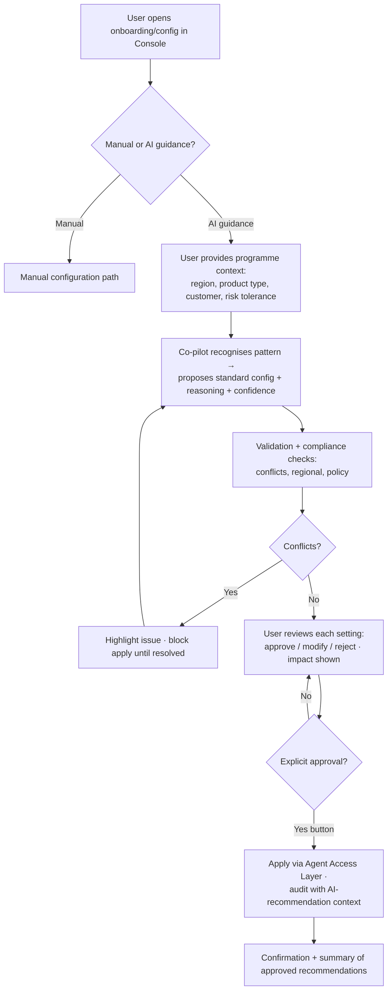
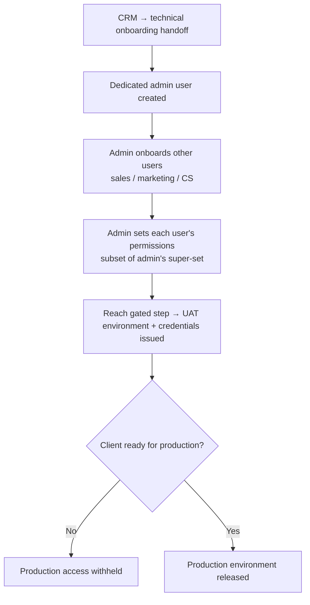
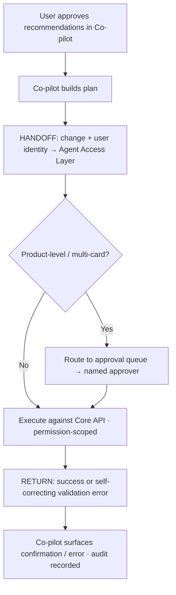

# TXN — Co-pilot: Guided Onboarding & Provisioning

> **Component:** [[co-pilot]] · **Journey source:** [[ux-ai-guided-product-onboarding]] · **Vision:** [[vision]]
> **Date:** 2026-06-09
> **Status:** Defined
> **Owner:** _TBC_
> **Sources:** [[ux-ai-guided-product-onboarding]] (behavioural journey), [[04-06-2026-component-3-co-pilot]] (deep-dive: CRM handoff, admin/user provisioning, environment gating, field-collapse)

---

## 1. What Does This Sub-Component Do?

**Functional purpose:**

Guided Onboarding & Provisioning is the Co-pilot's **front door** — the experience that takes a brand-new client (or a new card product for an existing client) from nothing to a working, configured programme without the user needing to be a card expert. It collapses the ~200-field reality of a card product into a guided conversation: the user describes the *shape* of the programme (region, product type, target customer, risk tolerance) and the co-pilot recognises the pattern, proposes the standard configuration ("you're a travel programme; here's what 90% of clients in your shape do"), explains the reasoning, runs validation and compliance checks, and applies only what the user explicitly approves. Mike Moores (TXN's CTO) named the product-configuration step the **highest-value AI target** in the whole product.

It also covers the **provisioning** that wraps onboarding (from the deep-dive): the CRM→technical handoff that seeds the programme, creation of the dedicated **admin user**, the admin then onboarding other users and setting their permissions, and the **environment gating** that releases UAT (with credentials) at the right step and production only when the client is ready.

**Entities that interact with it:**

- **Programme Operations Administrator** (primary) — onboards a new client / configures a card programme through the Console; the main recipient of AI configuration guidance.
- **Admin operator** — the dedicated user created at onboarding; provisions all access, onboards other users, sets their permissions. Holds provisioning rights without needing that access for day-to-day work.
- **Programme Technical Operator** (secondary) — validates that configuration behaves as expected.
- **Co-pilot agent** — recognises programme pattern, generates explainable recommendations, runs conflict/compliance checks, applies approved config via [[agent-access-layer]].

---

## 2. What Needs to Happen?

**Functional requirements:**

- User can request **AI configuration guidance** at the onboarding/configuration step, or proceed manually — both options are always present.
- Co-pilot captures **programme context** through structured input (region(s), product type/intended usage, target customer profile, risk/fraud sensitivity), explaining the purpose of each field.
- Co-pilot **recognises the programme pattern** and proposes the standard configuration for that shape (product group structures, spend limits/thresholds, merchant & transaction-type controls).
- Each recommendation carries a **plain-language reasoning summary** and a **confidence indicator**, and names the data pattern informing it.
- Co-pilot **collapses grouped fields**: turning on a capability fills 10–12 back-end properties from a short conversation; required fields are driven by the **API YAML**; conditional fields surface only when relevant.
- Before apply, Co-pilot runs **validation + compliance checks** (no conflict with existing rules, aligns with regional requirements, no policy violation).
- User reviews each recommendation and can **approve, modify, or reject** per setting; the **impact** of each change is shown.
- Config is applied **only on explicit approval** (a button), via [[agent-access-layer]], and the action is **audited with the AI-recommendation context**.
- **Provisioning:** a dedicated admin user is created at onboarding; the admin can provision all access and onboard other users with permission subsets; **UAT** environment + credentials release at a set onboarding step, **production** only when ready.

**Business rules:**

- **AI recommendations are advisory and never auto-apply.** Every configuration change requires explicit user approval (also the component-wide "no blanket auto-approve" rule — see [[co-pilot]] §2).
- **Permission parity** — onboarding/config respects the user's Console permissions ([[agent-access-layer]]).
- **API YAML is the source of truth** for required vs optional/conditional fields.
- Onboarding "technically stops" once credentials are issued, then **branches non-linearly** into product creation and other flows ("all of this must be ready before you transact").
- Every recommendation and approval is logged for audit and traceability.

**Edge cases:**

- Incomplete/inaccurate context inputs → co-pilot validates required inputs and explains each field before generating recommendations.
- Configuration conflict or hidden dependency detected → surfaced and **blocks apply** until resolved (see [[guided-configuration]]).
- User tries to access an environment they're not ready for → gated/denied.
- Recommendation not applicable to the programme type → surfaced as "not applicable," even if the user has permission.

---

## 3. Entity Journeys

### 3a. Isolated Journeys

#### Journey 1: Programme Admin configures a programme with AI guidance

**Entity:** Programme Operations Administrator (user) + Co-pilot agent (hybrid)

**Input:** User begins onboarding a new client programme — or configuring a new product — in the Console and chooses to request AI guidance.

**Outcome:** The programme is configured with the AI recommendations the user explicitly approved; every applied change is audited with its recommendation context; the user understands what was changed and why.

**Steps:**

**Acceptance criteria:**

- [ ] A manual option is always available alongside AI guidance.
- [ ] Co-pilot captures programme context via structured fields, each with an explanation of its purpose.
- [ ] Co-pilot proposes a standard configuration matched to the recognised programme pattern.
- [ ] Every recommendation shows a plain-language reasoning summary and a confidence indicator.
- [ ] Turning on a grouped capability populates its set of back-end fields from the short conversation (no field-by-field entry).
- [ ] Required fields are validated against the API YAML; missing core fields are prompted for.
- [ ] Conflict/compliance checks run **before** apply and visibly block apply on a critical conflict.
- [ ] The impact of each change is shown before approval.
- [ ] No configuration is applied without explicit per-change (or per-bundle) button approval.
- [ ] Every applied change is recorded in the audit log with its AI-recommendation context.

#### Journey 2: Admin provisions users & environments

**Entity:** Admin operator (user)

**Input:** A new client transitions from the CRM (sales) into technical onboarding; a dedicated admin user is created.

**Outcome:** The client's team is set up with permission-scoped users and the correct environment access (UAT now, production when ready).

**Steps:**

**Acceptance criteria:**

- [ ] CRM handoff data seeds the technical onboarding.
- [ ] An admin user can provision all access but is not required to hold that access for day-to-day work.
- [ ] The admin can onboard other users and assign each a permission subset.
- [ ] UAT environment + credentials are released only at the defined onboarding step.
- [ ] Production access is gated until the client is marked ready.
- [ ] After credentials are issued, onboarding branches non-linearly (e.g. into product creation) rather than forcing a fixed sequence.

### 3b. Cross-Component Journeys

#### Journey 1: Applying approved configuration

**Entity:** Programme Operations Administrator + Co-pilot agent

**Input:** User has approved a set of configuration recommendations.

**Handoff point:** The approved change(s) + the acting user's identity are passed to [[agent-access-layer]], which executes against the Core API under the user's permissions. Product-level / multi-card changes route through the approval queue; the result (success or a self-correcting validation error) returns to the Co-pilot and is surfaced to the user.

**Components involved:** Co-pilot → [[agent-access-layer]] → Co-pilot

**Outcome:** The configuration is applied (or routed for approval), permission-scoped and audited; the user sees confirmation or a clear, resolvable error.

**Steps:**

**Acceptance criteria:**

- [ ] Apply goes through [[agent-access-layer]] (direct API call), never a parallel path.
- [ ] Product-level / multi-card changes route to the approval queue with the named approver.
- [ ] A permission rejection returns a descriptive error the co-pilot can explain or self-correct.
- [ ] The applied action is attributed to the user (with AI-recommendation context) in the combined audit trail.

---

## 4. Look and Feel (Optional)

Inherits the Co-pilot design direction (right-hand assistant panel; large reviews render in the main panel — see [[co-pilot]] §3). Specifics:

- Recommendations presented as **reviewable cards** with reasoning + confidence, each individually approvable/editable/rejectable.
- The configuration **impact** sits beside each recommendation, not buried.
- Conflicts/compliance issues are **blocking and visually distinct** — the user cannot apply past an unresolved critical conflict.

---

## 5. Data Requirements

| What | Direction | Description | Source / Destination |
|------|-----------|------------|---------------------|
| Programme context | In | Region(s), product type, target customer, risk/fraud tolerance | User input |
| Client-category patterns | In | "Travel/lending/rewards programmes typically configure X" | Data Lake (via [[agent-access-layer]]) |
| Required-field definitions | In | Which fields are mandatory/conditional per endpoint | API YAML |
| AI recommendations + reasoning + confidence | Out | The proposed config, explained | Co-pilot → user |
| Validation / conflict / compliance results | Out | Conflicts, regional/policy issues, impact | [[guided-configuration]] / Core API |
| Approved configuration changes | Out | Applied settings | Core API (via [[agent-access-layer]]) |
| CRM handoff data | In | Seeds technical onboarding, admin user | TXN CRM |
| Recommendation + approval audit | Stored | What was recommended, approved, applied, by whom | Combined audit store ([[agent-access-layer]]) |

---

## 6. Dependencies

| Depends on | What we need | Blocking? |
|-----------|-------------|----------|
| [[agent-access-layer]] | Apply config, permission scoping, approval-queue routing, audit | **Yes** |
| API YAML spec | Required/conditional field definitions | **Yes** |
| Console (Stackworkz) | Render surface, structured-input fields, environment provisioning | **Yes** |
| [[guided-configuration]] (sibling) | Conflict detection + compliance + impact analysis at apply time | **Yes** |
| Data Lake (DT) | Client-category patterns for recommendations | No — can mock early |
| TXN CRM | Sales→technical handoff data | No — can mock early |

**What siblings/other components need from this one:**

- This journey is the primary producer of new programme/product configuration that downstream alerts ([[agent-inbox-alerts]]) and analytics read.

---

## 7. Risks

**Specific risks:**

- **Blind acceptance** — users approve recommendations without reviewing them.
- **Bad context in → bad recommendations out** — incomplete/inaccurate programme context.
- **Silent auto-apply** — configuration changing without explicit approval (unacceptable in a financial product).
- **Hidden conflicts** — a recommendation conflicting with existing rules or regional requirements slips through.
- **Hallucinated card-domain guidance** — recommendations not grounded in TXN data/patterns.

**Controls to build into the journeys:**

- Per-setting explicit **button approval**; show impact + reasoning + confidence at the approval step.
- **Validate required context inputs** and explain each field before generating recommendations.
- **No auto-apply** — advisory only; apply only on explicit approval.
- **Conflict/compliance detection blocks apply** until resolved.
- **Ground recommendations** in TXN documentation + client-category patterns, not generic LLM knowledge.
- **Audit** every recommendation and approval with context.

---

## 8. Priority

**Must-have at launch?** Yes. Onboarding is the front door, and Mike named product configuration the highest-value AI target — it's the first thing a new client experiences and where the "we remove the complexity" promise is proven.

**Sequencing rationale:** Depends on the [[agent-access-layer]] apply path, the API YAML, and the [[guided-configuration]] validation sibling — build alongside them. The provisioning/environment-gating journey can follow the configuration journey.

---

## Sub-Sub-Components

Leaf node — no further decomposition needed.
