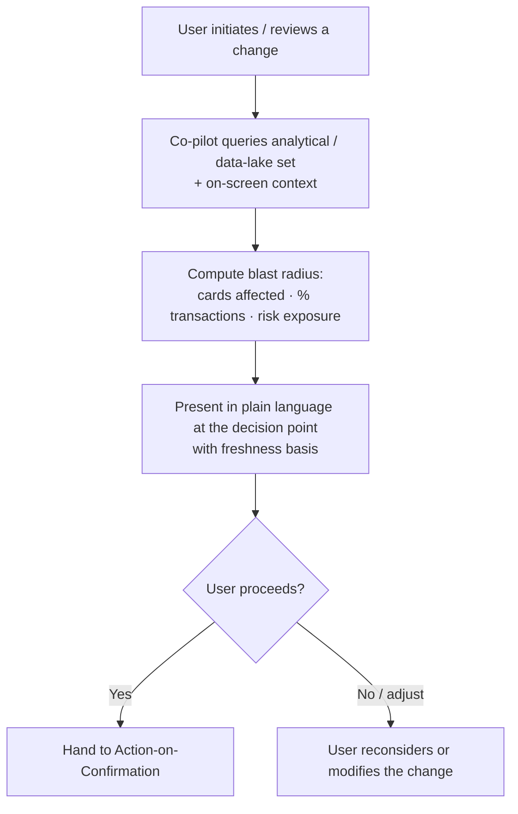

# TXN — Co-pilot: Impact Preview

> **Component:** [[co-pilot]] · **Vision:** [[vision]]
> **Date:** 2026-06-09
> **Status:** Defined
> **Owner:** _TBC_
> **Sources:** [[04-06-2026-component-3-co-pilot]] (impact explanation, analytical-data favouring), [[13-05-2026-txn-vision-meeting]] (Concept 1 — "if you make this change, X,000 cards will be affected")

---

## 1. What Does This Sub-Component Do?

**Functional purpose:**

Impact Preview is the Co-pilot behaviour that answers *"what does this change actually do?"* before the user commits to it. The user is not a card expert and doesn't want to be one, so before a state change the co-pilot translates it into plain business terms — *"if you make this change, ~X,000 cards will be affected"* / *"this touches ~Y% of your transactions"* / "this raises your risk exposure here." It leans on the **wider analytical / data-lake set** and on-screen context rather than re-pulling individual records, and it is the same information source that powers the impact step in [[guided-configuration]] and the change-impact in [[agent-inbox-alerts]] — same source, different delivery (Ian's point).

It is a **read-only, advisory** behaviour: it informs the decision; it never makes the change (that's [[action-on-confirmation]]).

**Entities that interact with it:**

- **Card Program Operators** (any Console user about to make a change) — see the impact before confirming.
- **Co-pilot agent** — computes the estimate from analytical data and renders it in plain language at the decision point.

---

## 2. What Needs to Happen?

**Functional requirements:**

- Before a state change is confirmed, the co-pilot **computes and shows its impact** — the count/share of affected cards, the share of transactions affected, and any risk-exposure change.
- The estimate **favours the analytical / data-lake set** and on-screen context over re-pulling individual records.
- The impact is presented in **plain business language** at the confirmation step (not raw figures buried elsewhere).
- Impact is shown for both **guided** changes (onboarding/config recommendations) and **direct** changes the user initiates.

**Business rules:**

- **Advisory and read-only** — impact preview informs; it never applies a change.
- **Permission-scoped** — only data the user is allowed to see informs the estimate ([[agent-access-layer]]).
- Estimates are framed as **estimates**, with a freshness basis, not as guaranteed exact counts.

**Edge cases:**

- Analytical data is stale → the estimate could mislead; surface a freshness basis (see Risks).
- A change with no measurable blast radius (e.g. a cosmetic setting) → state "no material impact" rather than a spurious number.
- User lacks permission to see the affected scope → estimate is scoped/declined accordingly.

---

## 3. Entity Journeys

### 3a. Isolated Journeys

#### Journey 1: Preview the impact of a change before confirming

**Entity:** Card Program Operator (user) + Co-pilot agent (hybrid)

**Input:** User is about to make a configuration/state change (directly or via a recommendation) and the co-pilot is asked, or proactively offers, to preview its impact.

**Outcome:** The user sees, in plain language, how many cards / what share of transactions the change affects, and decides to proceed or reconsider — with no "I didn't realise that would happen" surprise.

**Steps:**

**Acceptance criteria:**

- [ ] Impact is shown **before** the change is confirmed.
- [ ] The estimate quantifies the affected scope (cards and/or % transactions) and any risk-exposure change.
- [ ] It is expressed in plain business language, not raw config terms.
- [ ] The estimate is computed from the analytical/data-lake set, not by re-pulling individual records where the analytical set suffices.
- [ ] A freshness basis is shown so the user knows how current the estimate is.
- [ ] Impact preview never applies the change (read-only).

---

## 4. Look and Feel (Optional)

Inherits Co-pilot design direction ([[co-pilot]] §3). Specifics: impact appears **adjacent to the change/recommendation** at the decision point (the Super Ultra prototype already shows impact pop-ups), in plain language with a visible "based on data as of …" freshness note.

---

## 5. Data Requirements

| What | Direction | Description | Source / Destination |
|------|-----------|------------|---------------------|
| Proposed change | In | The parameter/state about to change | User / [[guided-configuration]] / [[guided-onboarding]] |
| Analytical / programme data | In | Card counts, transaction distribution, risk indicators | Data Lake + Core API (via [[agent-access-layer]]) |
| On-screen context | In | What's already on the page | Console (Stackworkz) |
| Impact estimate + freshness basis | Out | Plain-language blast-radius summary | Co-pilot → user |

---

## 6. Dependencies

| Depends on | What we need | Blocking? |
|-----------|-------------|----------|
| Data Lake (DT) | Analytical data to compute blast radius | **Yes** (can mock estimates early) |
| [[agent-access-layer]] | Permission-scoped data access | **Yes** |
| Console (Stackworkz) | On-screen context + render surface | **Yes** |

**What siblings/other components need from this one:**

- [[guided-configuration]] and [[guided-onboarding]] consume this at their approval steps.
- [[agent-inbox-alerts]] shares the impact-explanation source (different delivery).

---

## 7. Risks

**Specific risks:**

- **Stale analytical data** → a wrong impact estimate the user trusts.
- **False precision** → an exact-looking number implying more certainty than exists.
- **Permission leakage** → an estimate revealing scope the user shouldn't see.

**Controls to build into the journeys:**

- Show a **freshness basis** ("based on data as of …") on every estimate.
- Frame figures as **estimates** (ranges/approximate counts) rather than guaranteed exact values.
- Compute only over **permission-scoped** data.

---

## 8. Priority

**Must-have at launch?** Yes — it's one of the two behaviours that define the Co-pilot's value (the other being guided configuration) and directly reduces "I didn't realise that would happen" support contacts.

**Sequencing rationale:** Depends on Data Lake analytical data, which can be mocked early; build alongside [[guided-configuration]], which is its primary consumer.

---

## Sub-Sub-Components

Leaf node — no further decomposition needed.
