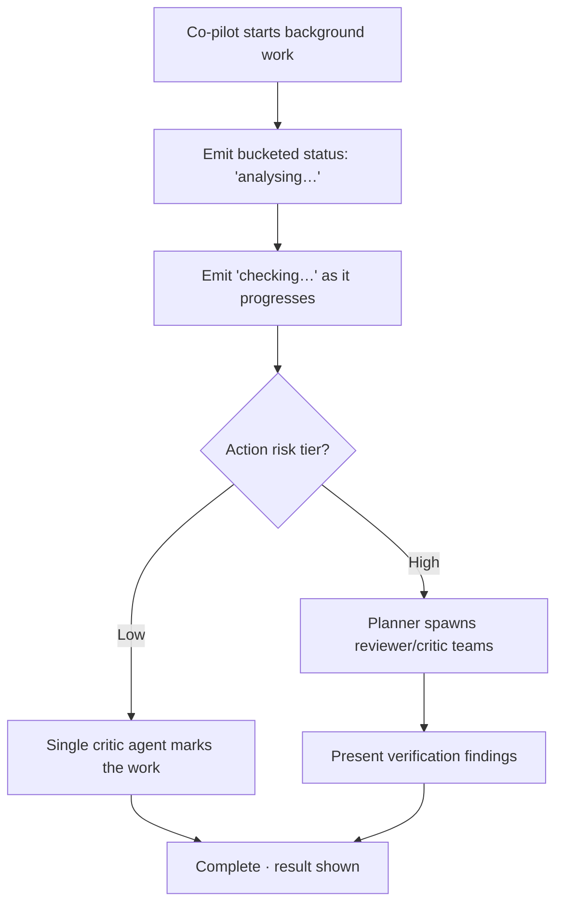

# TXN — Co-pilot: Process Surfacing / Trust UI

> **Component:** [[co-pilot]] · **Vision:** [[vision]]
> **Date:** 2026-06-09
> **Status:** Defined
> **Owner:** _TBC_
> **Sources:** [[04-06-2026-component-3-co-pilot]] (process surfacing, bucketed categories, risk-tiered verification, slider rejected)

---

## 1. What Does This Sub-Component Do?

**Functional purpose:**

Process Surfacing is the Co-pilot's **trust UI** — how it shows the user that work is happening and being checked, without overwhelming them. The deep-dive spent real time on the dial between "say nothing and pop up at the end" (which triggers the ChatGPT "is it still working?" anxiety) and "show every agent and internal error" (which erodes trust and alienates non-technical users like customer service). The landing position:

- **Surface bucketed *categories* of activity** — "analysing… checking… verifying…" — rather than raw per-agent detail or internal errors.
- **One universal altitude** — everyone sees the same level; the proposed per-user "AI slider" (0–4) was **rejected** as needless complexity. Land on one level and iterate.
- **Risk-tiered verification depth** — a low-risk change gets a single critic agent marking the work; a high-risk change gets a planner spawning reviewer/critic teams whose findings are presented back ("another agent marking the previous agent's work").
- Suitable for the **full range of Console users** at once — from a developer who'd like the detail to a CS agent who just needs to know it's being checked.

Reference: Claude's parallel sub-agent "block-out" UI (clickable blocks per agent team) is the live experiment for *how much* of the workforce to surface.

**Entities that interact with it:**

- **Card Program Operators** (any user) — see the status while the co-pilot works.
- **Co-pilot agent / orchestrator** — emits bucketed status; spawns risk-tiered verification.

---

## 2. What Needs to Happen?

**Functional requirements:**

- While the co-pilot is working, it **surfaces progress as named categories** ("analysing", "checking", "verifying") — never a bare spinner.
- It does **not** expose raw internal errors or field-by-field detail.
- The surfacing level is **universal** — the same for every user (no per-user slider).
- Verification depth is **risk-tiered**: low-risk change → a single critic agent; high-risk change → a planner + reviewer/critic teams, with findings presented back.
- The view reads sensibly for **all user types** simultaneously (CS through developer).

**Business rules:**

- **One altitude for everyone** — surfacing level is a product decision, not a user setting.
- **Group, don't enumerate** — categories, not per-agent firehose.
- Verification effort **scales with blast radius**, not applied uniformly (simple actions skip the heavy check).

**Edge cases:**

- Work takes long → keep emitting category updates so the user never wonders if it stalled.
- An internal step errors → surface it as a category state ("re-checking"), not the raw error.
- A high-risk action's verification finds a problem → present the finding, don't silently proceed.

---

## 3. Entity Journeys

### 3a. Isolated Journeys

#### Journey 1: Surface work-in-progress while the co-pilot acts

**Entity:** Co-pilot agent/orchestrator → Card Program Operator (user) (hybrid)

**Input:** The co-pilot begins a task that runs background work (analysis, validation, execution, verification).

**Outcome:** The user sees a calm, bucketed sense of what's happening and that the work is being checked — trusting it without being overwhelmed.

**Steps:**

**Acceptance criteria:**

- [ ] Progress is shown as named categories (e.g. analysing / checking / verifying), never a bare spinner.
- [ ] Raw internal errors and field-by-field detail are **not** surfaced.
- [ ] The surfacing level is the same for every user (no per-user slider).
- [ ] Low-risk actions get a single verification pass; high-risk actions get a reviewer/critic team whose findings are presented.
- [ ] The view is legible to both a CS agent and a developer without changing levels.

---

## 4. Look and Feel (Optional)

Inherits Co-pilot design direction ([[co-pilot]] §3). Specifics: status renders as a small set of **named category chips/steps** that advance as work proceeds; optionally expandable (à la Claude's block-out UI) but defaulting to the grouped view. Tone is reassuring, not technical.

---

## 5. Data Requirements

| What | Direction | Description | Source / Destination |
|------|-----------|------------|---------------------|
| Sub-process / agent status | In | Which step/category is currently running | Co-pilot orchestrator |
| Action risk tier | In | Low vs high blast radius (drives verification depth) | Co-pilot / [[action-on-confirmation]] |
| Verification findings | Out | Results of the critic/reviewer pass for high-risk actions | Co-pilot → user |
| Bucketed status display | Out | The category chips/steps the user sees | Co-pilot → user |

---

## 6. Dependencies

| Depends on | What we need | Blocking? |
|-----------|-------------|----------|
| Co-pilot orchestrator / agent runtime | Sub-process status to bucket; ability to spawn verification agents | **Yes** |
| [[action-on-confirmation]] (sibling) | The risk tier of the action being performed | **Yes** |
| Console (Stackworkz) | Render surface for the status display | **Yes** |

**What siblings/other components need from this one:**

- Every Co-pilot journey that runs background work uses this to keep the user informed; the same altitude principle is shared with [[full-agentic-experience]].

---

## 7. Risks

**Specific risks:**

- **Too little** → user thinks it's broken ("is it still working?") and abandons.
- **Too much** → showing 20 parallel agents erodes trust rather than building it (Dorte's point), and alienates non-technical users.
- **Wrong altitude** → the exact level is acknowledged as a "won't know until we test in the wild" question.

**Controls to build into the journeys:**

- **Bucketed categories at one universal altitude**; no raw agent/error detail.
- **Risk-tiered** verification so depth matches blast radius.
- Treat the altitude as **tunable** — land on one level, instrument it, iterate fast.

---

## 8. Priority

**Must-have at launch?** Yes for the baseline (bucketed status so work never looks stalled). The exact altitude is a tuning question to validate in the wild.

**Sequencing rationale:** Depends on the agent runtime emitting sub-process status and on [[action-on-confirmation]]'s risk tiering; build once the orchestration exists. Shares its altitude principle with [[full-agentic-experience]].

---

## Sub-Sub-Components

Leaf node — no further decomposition needed.
