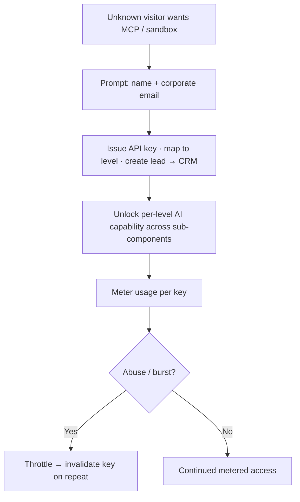

# TXN — Developer Support: Access Gating & Lead-Gen

> **Component:** [[developer-support]] · **Vision:** [[vision]]
> **Date:** 2026-06-10
> **Status:** Defined
> **Owner:** _TBC_
> **Sources:** [[09-06-2026-developer-support]] (four-level access, API-key issuance, rate-limiting, lead capture)

---

## 1. What Does This Sub-Component Do?

**Functional purpose:**

Access Gating is the **cross-cutting control** that decides *how much AI each visitor gets* and *captures them as a lead* on the way. It's the mechanism behind Ian's **four levels** — and the answer to the recurring tension across the whole deep-dive: *"this is free; how do we give a best-in-class evaluation without bad actors / competitors swamping a surface with no revenue line?"*

```
Level 1  Unknown visitor   — public docs only; minimal/metered co-pilot; no MCP/sandbox
Level 2  Signed up         — gave name + corporate email → API key → MCP L1 + limited sandbox
Level 3  Prospect          — recognised, in evaluation → broader MCP/sandbox + support triage
Level 4  Client            — contracted → full developer AI experience + support
```

The **API key is the linchpin**: a developer who wants the [[docs-mcp-server]] or sandbox must get a key, and getting one requires a name + corporate email — which simultaneously **creates a lead** and gives TXN the handle to **rate-limit per key** and **invalidate on abuse**. George's flow: *"show MCP everywhere; to use it you need an API key; you can get one without paying — name, email, lead generated; then we rate-limit that key."* (Ian's caveat: it's raw lead *information*, not a qualified sales lead — but AI can work it up.) Every other Developer Support sub-component reads its level/entitlement from here.

**Entities that interact with it:**

- **Unknown visitor → signed-up developer** — provides email, receives a key.
- **TXN sales / CRM** (downstream) — receives the captured lead.
- **All other Developer Support sub-components** — consume the key + level to scope their behaviour.

---

## 2. What Needs to Happen?

**Functional requirements:**

- Issue an **API key** on capture of a **name + corporate email**; create a **lead** at the same time.
- Map each key to an **access level** (signed-up / prospect / client) and **unlock AI capability per level** (which surfaces, L1 vs L2 MCP, sandbox extent, support triage).
- **Rate-limit per key**; on burst/abuse, throttle then **invalidate** the key.
- Let the portal/website **show** the higher-level AI journeys (e.g. the MCP) **without** letting an unidentified visitor run them.
- Be the **single source of entitlement** the other sub-components check.

**Business rules:**

- **Staged generosity** — give a great evaluation, but unlock as identity/trust grows; the **cost model** drives where each gate sits.
- **Corporate email** preferred (the Marqueta lesson: personal-email signups that never convert) — but don't make the gate so tight it blocks genuine startups (a balance to tune).
- **Free, but metered** — no AI capability for fully-unknown users beyond public docs.

**Edge cases:**

- **Sign-up/login is not yet designed in the MVP** (docs are currently fully public) — introducing it is a flagged dependency.
- **Public sandbox API-key model is unknown (DT)** — whether the sandbox itself needs a per-user key *changes whether/when sign-up is required*.
- A startup without a corporate email → policy decision (allow with tighter limits vs block).

---

## 3. Entity Journeys

### 3a. Isolated Journeys

#### Journey 1: Identify → key → metered access (+ lead)

**Entity:** Unknown visitor (user) → signed-up developer; system + CRM

**Input:** An unknown visitor wants to use the MCP / sandbox (a Level-2+ capability).

**Outcome:** They get an API key scoped to their level, can use the metered AI surfaces, and TXN has captured a lead — with abuse controllable.

**Steps:**



**Acceptance criteria:**

- [ ] AI capability beyond public docs requires identification (an API key).
- [ ] Providing name + corporate email issues a key and creates a lead.
- [ ] The key maps to a level that determines which surfaces / capabilities are available (e.g. MCP L1 vs L2).
- [ ] Usage is rate-limited per key; abuse is throttled then the key invalidated.
- [ ] The portal can showcase higher-level journeys (e.g. MCP) without letting an unidentified visitor run them.
- [ ] Other sub-components ([[docs-mcp-server]], [[portal-co-pilot]], [[sandbox-assist]], [[support-triage]]) read entitlement from here.

---

## 4. Look and Feel (Optional)

A low-friction "**get an API key**" prompt at the point a higher-level capability is requested (name + corporate email), framed as *unlocking* the experience rather than a paywall — and visible "here's what the MCP journey looks like" showcases for evaluators who haven't yet signed up.

---

## 5. Data Requirements

| What | Direction | Description | Source / Destination |
|------|-----------|------------|---------------------|
| Name + corporate email | In / Stored | Identity captured at sign-up | User input |
| API key + level | Stored | Entitlement record | Internal store |
| Per-key usage / rate | Stored | For metering + abuse detection | Internal store |
| Lead | Out | The captured prospect | TXN CRM / sales |

---

## 6. Dependencies

| Depends on | What we need | Blocking? |
|-----------|-------------|----------|
| Public sandbox API-key model (DT) | Whether the sandbox needs a per-user key — gates the sign-up design | **Yes** (design-blocking) |
| Sign-up / login design | Not yet scoped in MVP — needed to capture identity + gate | **Yes** |
| CRM / lead destination | Where captured leads land | No — can stub |
| Cost model | Per-level cost-per-1000-calls to set the gates | No — informs, not blocks |

**What siblings/other components need from this one:**
- **All** Developer Support sub-components depend on this for the key + level (it's the entitlement source).

---

## 7. Risks

**Specific risks:**

- **Free-surface abuse** — the core reason this exists; competitors/bad actors with no revenue line.
- **Over-gating** — too tight, and you kill the best-in-class evaluation experience.
- **Email-quality** — personal-email signups that never convert (and the inverse: blocking genuine startups).

**Controls to build into the journeys:**

- **Per-key rate limits + invalidation**; staged unlocks tied to the cost model.
- **Corporate-email preference** with a tunable policy for edge cases.
- Showcase value **before** gating to keep evaluation compelling.

---

## 8. Priority

**Must-have at launch?** Yes — it's the cost/abuse control **and** the lead-capture that make a free AI surface viable; nothing above public docs is safe without it.

**Sequencing rationale:** **Blocked** on two open items — the DT public-sandbox API-key model and the sign-up/login design (not in the MVP yet). Resolving those unblocks the MCP/sandbox surfaces.

---

## Sub-Sub-Components

Leaf node — no further decomposition needed.
