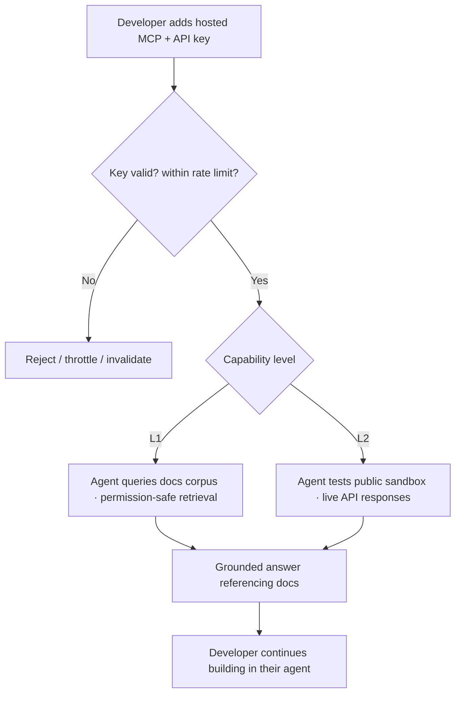

# TXN — Developer Support: Docs MCP Server (hosted)

> **Component:** [[developer-support]] · **Journey source:** [[ux-txn-intelligence-enhanced-documentation-discovery|Documentation Discovery]] · **Vision:** [[vision]]
> **Date:** 2026-06-10
> **Status:** Defined
> **Owner:** _TBC_
> **Sources:** [[09-06-2026-developer-support]] (hosted MCP, L1/L2, the strategic bet)

---

## 1. What Does This Sub-Component Do?

**Functional purpose:**

The Docs MCP Server is the **strategic surface** of Developer Support — a **TXN-hosted Model Context Protocol server** a developer plugs straight into their own agent (Claude, Claude Code, ChatGPT). It exists because of how developers actually work today: George — *"if a platform has an MCP server I'll just plug into that; I won't even look at the documentation."* Rather than make a developer copy answers out of a portal chatbot into their coding agent (*"I'd be smacking my head against the desk"*), TXN brings its documentation **into the developer's agent**.

It has **two levels of capability**:
- **Level 1** — the developer's agent **queries the documentation** (the common case; often no write actions, so the key is mostly identity + metering).
- **Level 2** — the agent can **test the public sandbox** through the MCP (issue API calls, get live responses) — a step up, with marginally more cost.

**Hosted, not local** was the decision: most developers use Claude in the browser (local MCP isn't available there), and *"a hosted MCP server is just a way better experience — put in an API key and it's done."* Access is **API-key gated** (see [[access-gating]]), which is also what makes the free surface affordable and abuse-controllable. This is where TXN **deliberately invests over the portal co-pilot**, on the belief that developers increasingly arrive this way.

**Entities that interact with it:**

- **Integrator's own AI agent** (Claude / Claude Code) — the actual MCP client; the developer supplies the LLM, TXN supplies the server.
- **Developer** (signed-up → client) — connects the server with an API key scoped to their level.

---

## 2. What Needs to Happen?

**Functional requirements:**

- A **hosted MCP server** exposes the TXN documentation corpus as tools the developer's agent can call.
- **Level 1:** the agent can **query the docs** (retrieval over the same corpus the portal co-pilot uses).
- **Level 2:** the agent can **test the public sandbox** — issue API calls and receive live responses through the MCP.
- Access requires an **API key**; capability is **scoped to the key's level** (L1 vs L2), and usage is **rate-limited per key** (abuse → key invalidated) — all enforced via [[access-gating]].
- Retrieval is **permission-safe and authorised-source-only** (no raw-dataset access; references the documentation it draws on).
- The portal/website should be able to **show what the MCP journey looks like** (examples) without letting an unidentified visitor actually run it.

**Business rules:**

- **Hosted is the model** (local MCP deprioritised — poor fit for browser users).
- **Metered by level + key** — the free surface is protected by per-key rate limits.
- **Authorised sources only** — same grounding discipline as the co-pilot; never leak internal/other-tenant content.

**Edge cases:**

- Unidentified visitor tries to use the MCP → blocked; must obtain a key (lead) first.
- Burst abuse (e.g. 1,000 req/s) → throttle, then invalidate the key on repeat.
- Sandbox not yet available / API-key model unknown (DT) → L2 gated until resolved (see §6/deps).

---

## 3. Entity Journeys

### 3a. Isolated Journeys

#### Journey 1: Developer connects the hosted MCP and works from their own agent

**Entity:** Developer + their own AI agent (hybrid)

**Input:** A signed-up developer has an API key; they add the TXN hosted MCP server to Claude / Claude Code.

**Outcome:** The developer's agent answers questions from TXN's live docs (L1) and, if entitled, tests the sandbox (L2) — without the developer leaving their coding environment.

**Steps:**

**Acceptance criteria:**

- [ ] A developer can connect the hosted MCP server with an API key and use it inside their own agent.
- [ ] L1 returns documentation answers grounded in authorised TXN sources, with references.
- [ ] L2 (when entitled) executes public-sandbox calls and returns live responses.
- [ ] Capability is scoped to the key's level; L2 is withheld below the required level.
- [ ] Usage is rate-limited per key; repeated abuse invalidates the key.
- [ ] An unidentified visitor cannot use the MCP (must obtain a key first).

---

## 4. Look and Feel (Optional)

Minimal UI of its own — the experience is **inside the developer's agent**. The portal provides **setup instructions** and a **showcase** of what the MCP journey looks like (so evaluators see the value before they're entitled to run it).

---

## 5. Data Requirements

| What | Direction | Description | Source / Destination |
|------|-----------|------------|---------------------|
| API key + level | In | Identifies the caller and entitlement | [[access-gating]] |
| Documentation corpus | In | The docs the agent queries (L1) | Umbraco CMS / knowledge base |
| Sandbox calls + responses | In/Out | L2 test traffic | DT public sandbox |
| Per-key usage | Stored | For rate-limiting + abuse detection | [[access-gating]] |

---

## 6. Dependencies

| Depends on | What we need | Blocking? |
|-----------|-------------|----------|
| [[access-gating]] | API-key issuance, level mapping, rate-limit/abuse control | **Yes** |
| Docs corpus (Umbraco) | The content the MCP serves | **Yes** |
| Public sandbox (DT) | The sandbox L2 tests against; **API-key model TBD** | **Yes** for L2 |
| [[agent-access-layer]] | The MCP exposure pattern (shared thinking with the external A2A edge) | No — pattern reuse |

**What siblings/other components need from this one:**
- Shares the docs corpus with [[portal-co-pilot]]; both ground answers in the same authorised sources.

---

## 7. Risks

**Specific risks:**

- **Free-surface abuse** — competitors/bad actors hammering the MCP with no revenue line.
- **Documentation drift** — the MCP answers only as accurate as the docs (a Core API change unreflected in the YAML answers wrongly, silently).
- **Over-exposure** — leaking content beyond the caller's level / tenant.

**Controls to build into the journeys:**

- **Per-key rate limits + invalidation** on abuse; level-scoped capability.
- **Authorised-source, permission-safe retrieval**; reference the docs drawn on.
- Keep the corpus current via the self-healing/knowledge loop in [[internal-ops-agents]].

---

## 8. Priority

**Must-have at launch?** Yes — it's the strategic surface and, per Ian's GTM sequence, the portal is the first thing to hit the market. L1 is the early target; L2 follows the sandbox API-key resolution.

**Sequencing rationale:** Depends on [[access-gating]] (keys) and the docs corpus; L2 is gated on the DT sandbox model. Build L1 first.

---

## Sub-Sub-Components

Leaf node — no further decomposition needed.
