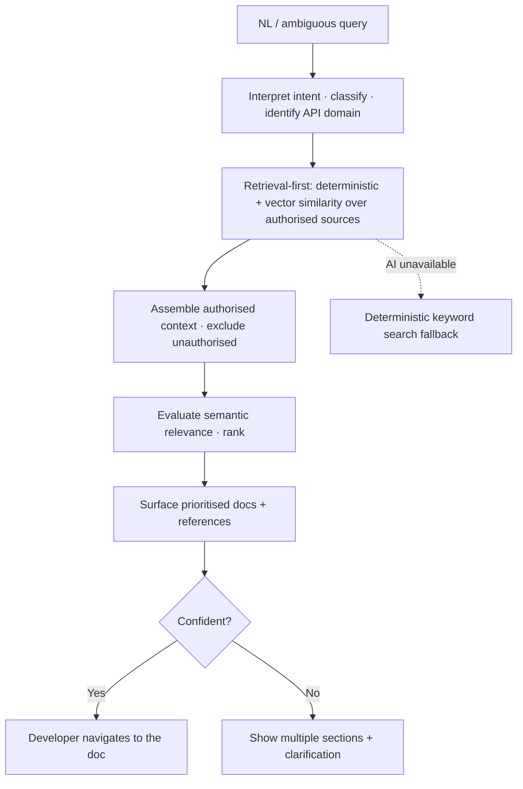
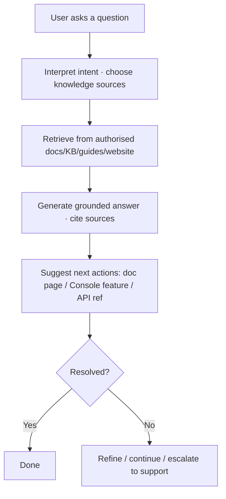

# TXN — Developer Support: Portal Co-pilot

> **Component:** [[developer-support]] · **Journey sources:** [[ux-txn-intelligence-enhanced-documentation-discovery|Documentation Discovery]], [[ux-ai-user-stories-and-requirements|User Stories & Requirements]] · **Vision:** [[vision]]
> **Date:** 2026-06-10
> **Status:** Defined
> **Owner:** _TBC_
> **Sources:** [[09-06-2026-developer-support]] (deliberately-light co-pilot), [[ux-txn-intelligence-enhanced-documentation-discovery]] (semantic discovery), [[ux-ai-user-stories-and-requirements]] (conversational guidance)

---

## 1. What Does This Sub-Component Do?

**Functional purpose:**

The Portal Co-pilot is the **baseline conversational AI** in the Developer Portal (and, for read-only guidance, the corporate website and Console) — *"chat with the documentation."* It does two related jobs:

1. **Semantic documentation discovery** ([[ux-txn-intelligence-enhanced-documentation-discovery]]) — interpret a developer's natural-language or ambiguous query ("customer paid twice", "why did my payment decline") and surface the right docs by **meaning, not keyword**: retrieval-first over a vector index, contextual ranking, with **deterministic navigation always available as a fallback**.
2. **Conversational guidance** ([[ux-ai-user-stories-and-requirements]]) — answer "how does X work / where's the doc / how do I integrate Y" questions, grounded in authorised sources, **referencing** them and **suggesting next actions** (a doc page, a Console feature, an API ref).

It is **deliberately light**: Ian's explicit steer is to invest in the [[docs-mcp-server]] over the portal chatbot, on the belief that developers increasingly arrive via their own agent. The co-pilot is the solid baseline for those who do use the portal directly — not the headline. It can also **surface existing support-ticket answers** so resolved questions aren't re-raised.

**Entities that interact with it:**

- **External developer** (unknown → client) — asks questions; metered by level.
- **Prospective client** (corporate website) — read-only evaluation questions.
- **Co-pilot agent** — interprets intent, retrieves from authorised sources, ranks, answers with references.

---

## 2. What Needs to Happen?

**Functional requirements:**

- Accept **natural-language questions**; interpret intent (NL interpretation, intent classification, relevant API-domain identification); prompt for clarification when ambiguous.
- **Retrieve from authorised sources only** (docs, API reference, integration guides, error-code docs, KB articles, website content) using **deterministic retrieval + vector similarity**; exclude unauthorised/irrelevant content.
- **Rank by semantic relevance** and re-prioritise documentation accordingly (e.g. surface refund docs for "duplicate payment", decline codes for "payment failed").
- **Answer grounded** in the retrieved content, **reference the sources**, and **suggest next actions / links**.
- **Surface known-ticket answers** where one exists.
- **Deterministic navigation remains fully functional** if AI is unavailable — the portal works without AI.
- Metered/limited by the visitor's **access level**.

**Business rules:**

- **Grounded only** — responses must reference authorised TXN documentation; no open-domain answers; no operational instructions that conflict with the platform.
- **Public-safe** — never leak internal specifics or other-tenant data to prospects/unknowns.
- **Light by design** — best-in-class baseline, but not over-built (invest in MCP).

**Edge cases:**

- **AI unavailable** → fall back to deterministic keyword search + metadata ranking.
- **Ambiguous query** → surface multiple relevant sections + clarification suggestions.
- **No matching docs** → general search results + invite refinement; if still unanswerable, escalate (feeds the [[internal-ops-agents]] knowledge loop).

---

## 3. Entity Journeys

### 3a. Isolated Journeys

#### Journey 1: Semantic documentation discovery

**Entity:** External developer (user) + co-pilot agent (hybrid)

**Input:** Developer enters a natural-language / ambiguous query in the portal search or AI interface.

**Outcome:** The developer lands on the right documentation without manual browsing — even for an indirect query.

**Steps:**

**Acceptance criteria:**

- [ ] An ambiguous NL query surfaces relevant docs by meaning (e.g. "customer paid twice" → refund docs).
- [ ] Retrieval is restricted to authorised sources; unauthorised content is excluded.
- [ ] Responses reference the documentation they draw on.
- [ ] If AI is unavailable, deterministic keyword search + metadata ranking still work.
- [ ] An ambiguous query still yields meaningful suggestions (multiple sections + clarification).

#### Journey 2: Conversational guidance with next actions

**Entity:** Developer / prospective client (user) + co-pilot agent

**Input:** User asks a "how does X work / where do I find Y / how do I integrate Z" question in the portal, website, or Console.

**Outcome:** A clear, grounded answer with references and suggested next steps; routine questions resolved without a support request.

**Steps:**

**Acceptance criteria:**

- [ ] Answers are grounded in and reference authorised TXN sources.
- [ ] The assistant suggests concrete next actions with links/references.
- [ ] Known-ticket answers are surfaced when one exists.
- [ ] Unresolved queries offer an escalation path (→ [[support-triage]]).
- [ ] No internal/other-tenant information leaks to a prospect/unknown.

---

## 4. Look and Feel (Optional)

A clean in-portal chat / contextual search field; answers in-place with **source references** and **clickable next-step links**; visibly **non-bureaucratic escalation** when unsure. Tone: fast, scoped, current — Stripe-style docs assistant as the baseline bar.

---

## 5. Data Requirements

| What | Direction | Description | Source / Destination |
|------|-----------|------------|---------------------|
| NL query | In | The developer's question | User input |
| Docs / KB corpus + vector index | In | Authorised content for retrieval | Umbraco CMS + vector index |
| Known support-ticket answers | In | Reuse resolved answers | Support system / [[internal-ops-agents]] |
| Grounded answer + source refs | Out | The response | Co-pilot → user |
| Access level | In | Meters/limits what's answered | [[access-gating]] |

---

## 6. Dependencies

| Depends on | What we need | Blocking? |
|-----------|-------------|----------|
| Docs corpus + vector index (Umbraco) | Authorised content + embeddings for semantic retrieval | **Yes** |
| Deterministic portal navigation | The non-AI fallback | **Yes** |
| [[access-gating]] | Level-based metering | **Yes** |
| [[internal-ops-agents]] | The self-healing KB + known-ticket answers it draws on | No — improves over time |

**What siblings/other components need from this one:**
- Shares the docs corpus with [[docs-mcp-server]]; unresolved queries feed [[support-triage]] / the [[internal-ops-agents]] knowledge loop.

---

## 7. Risks

**Specific risks:**

- **Ungrounded / hallucinated answers** — reputationally fatal for an API platform (Ian: wrong guidance is worse than none).
- **Documentation drift** — answers lag the live API.
- **Over-investment** — building the co-pilot out beyond its (deliberately light) role.

**Controls to build into the journeys:**

- **Retrieval-first, authorised-source-only, cite references**; no open-domain answers.
- **Deterministic fallback** always available.
- Keep it light; route depth to the [[docs-mcp-server]] and escalation to [[support-triage]].

---

## 8. Priority

**Must-have at launch?** Yes as a **baseline** — but deliberately scoped; the investment weight is on [[docs-mcp-server]].

**Sequencing rationale:** Depends on the docs corpus + a vector index and [[access-gating]]; ships alongside the portal.

---

## Sub-Sub-Components

Leaf node — no further decomposition needed.
