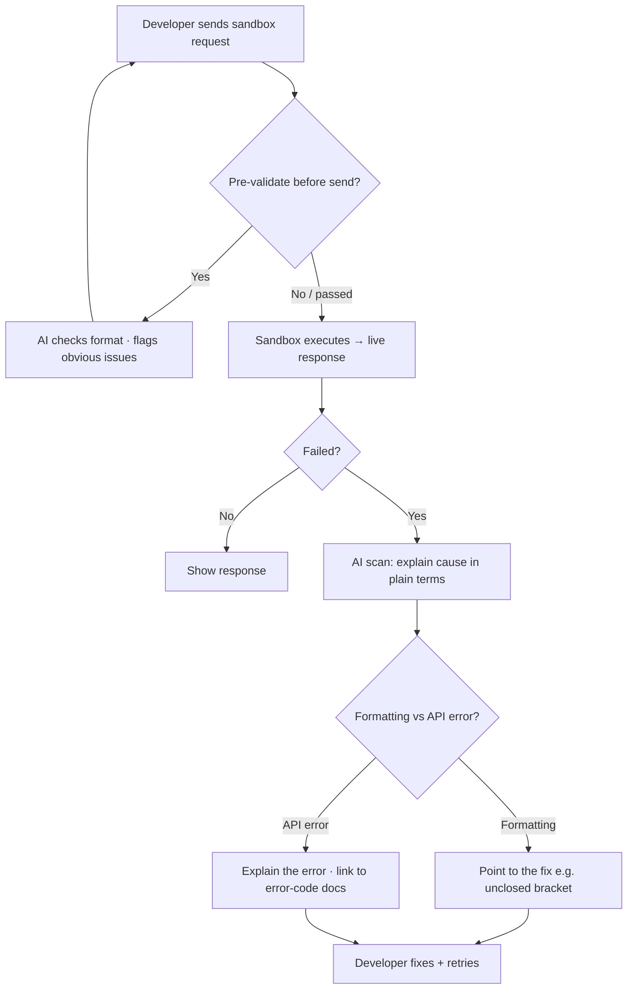

# TXN — Developer Support: Sandbox Assist

> **Component:** [[developer-support]] · **Vision:** [[vision]]
> **Date:** 2026-06-10
> **Status:** Defined
> **Owner:** _TBC_
> **Sources:** [[09-06-2026-developer-support]] (try-it-now error explanation, pre-validation)

---

## 1. What Does This Sub-Component Do?

**Functional purpose:**

Sandbox Assist is the light AI layer over the portal's **"try it now"** feature — the public sandbox where a developer tests TXN APIs against live responses. The sandbox already does a lot of the formatting and shows what to enter, but a request can still fail on something trivial. George's example: a failed call gets a **quick AI scan** — *"you've got a trailing comma somewhere, or unclosed curly brackets"* — and an optional **pre-validation** before the request is even sent. The aim (Mike): let people quickly test, but also let them paste **custom requests** (toggles locked-down to start, with copy/paste free-form for production-like calls), with AI smoothing the format friction.

**Entities that interact with it:**

- **Developer / evaluator** testing API calls in the public sandbox.
- **Sandbox-assist agent** — explains failures and optionally pre-validates.

---

## 2. What Needs to Happen?

**Functional requirements:**

- When a sandbox request **fails**, perform a quick **AI scan** and explain the cause in plain terms (malformed JSON, trailing comma, unclosed bracket, missing/invalid field).
- Offer optional **pre-validation** of a request **before sending** (catch obvious problems early).
- Support both **guided input** (locked-down toggles) and **free-form** copy/paste of custom requests (so developers can reproduce production-like calls).
- Return the sandbox's **live responses** as normal; the assist layer adds explanation, it doesn't replace the sandbox.

**Business rules:**

- **Grounded in the actual error + API spec** — explanations must reflect the real failure, not a guess.
- **Optional / non-blocking** — assist helps; it doesn't gate the sandbox.
- **Metered** — like other AI surfaces, subject to the visitor's level / rate limits ([[access-gating]]).

**Edge cases:**

- Sandbox grounds / API-key model still unknown (DT) → the assist scope adjusts once known (see deps).
- A failure that isn't a formatting issue (e.g. a genuine 4xx from the API) → explain the API error, optionally link to the relevant decline/error-code docs (via [[portal-co-pilot]]).

---

## 3. Entity Journeys

### 3a. Isolated Journeys

#### Journey 1: Explain a failed sandbox request

**Entity:** Developer (user) + sandbox-assist agent (hybrid)

**Input:** A developer sends a request via "try it now" and it fails.

**Outcome:** The developer understands *why* it failed and fixes it quickly, without raising a ticket.

**Steps:**

**Acceptance criteria:**

- [ ] A failed sandbox request returns a plain-language explanation of the cause.
- [ ] Formatting issues (trailing comma, unclosed bracket, missing field) are identified specifically.
- [ ] Optional pre-validation can flag obvious issues before sending.
- [ ] Free-form / copy-paste custom requests are supported alongside guided toggles.
- [ ] The sandbox's live response behaviour is unchanged; assist is additive.
- [ ] Explanations reflect the actual error/spec (not a guess).

---

## 4. Look and Feel (Optional)

Inline with the "try it now" panel — a small, contextual explanation appearing on failure (and optionally on pre-send), with a one-line fix suggestion and an optional link into the relevant error-code docs.

---

## 5. Data Requirements

| What | Direction | Description | Source / Destination |
|------|-----------|------------|---------------------|
| Sandbox request | In | The developer's call (guided or free-form) | User input |
| Sandbox response / error | In | Live result from the sandbox | DT public sandbox |
| API spec | In | To validate fields/format | YAML spec |
| Explanation / fix suggestion | Out | The assist output | Agent → developer |

---

## 6. Dependencies

| Depends on | What we need | Blocking? |
|-----------|-------------|----------|
| Public sandbox (DT) | The "try it now" surface + live responses; **grounds/API-key model TBD** | **Yes** |
| YAML spec | Field/format validation reference | **Yes** |
| [[portal-co-pilot]] | Links into error-code/decline docs for non-format failures | No |
| [[access-gating]] | Metering / rate limits | No |

**What siblings/other components need from this one:**
- Reduces failed-call friction, lowering support volume into [[support-triage]].

---

## 7. Risks

**Specific risks:**

- **Wrong explanation** misleads the developer (must reflect the real error).
- **Cost** of invoking AI on every failed call on a free surface.

**Controls to build into the journeys:**

- Ground explanations in the **actual error + spec**; prefer deterministic format checks where possible.
- **Meter** via [[access-gating]]; keep the scan cheap.

---

## 8. Priority

**Must-have at launch?** Nice early win, not foundational — depends on the DT sandbox grounds being known.

**Sequencing rationale:** Gated on the public sandbox model (DT); can ship once the sandbox is testable. Cheap to add given the co-pilot's doc grounding.

---

## Sub-Sub-Components

Leaf node — no further decomposition needed.
