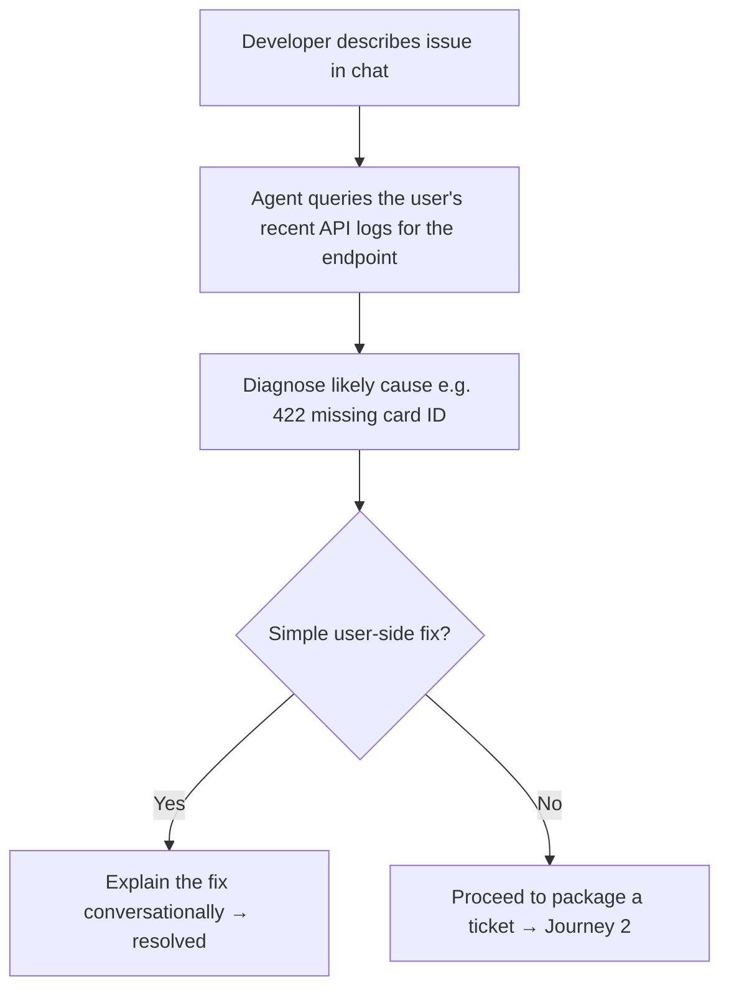
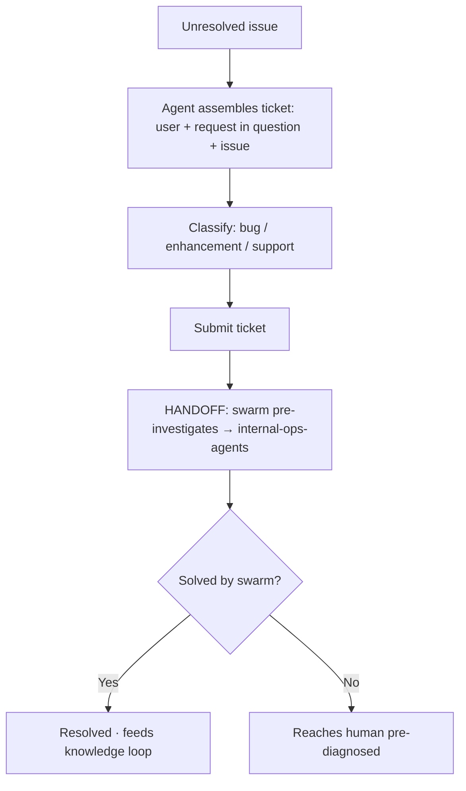

# TXN — Developer Support: Support Triage & Ticket Packaging

> **Component:** [[developer-support]] · **Vision:** [[vision]]
> **Date:** 2026-06-10
> **Status:** Defined
> **Owner:** _TBC_
> **Sources:** [[09-06-2026-developer-support]] (logged-in error diagnosis, ticket packaging, swarm pre-triage)

---

## 1. What Does This Sub-Component Do?

**Functional purpose:**

Support Triage is the portal's **support entry point** — and the deep-dive was clear that its *brain* (resolution + the knowledge loop) lives in [[internal-ops-agents]]; the portal does the **first-line triage and packaging**. A **logged-in** developer describes an issue in a plain chat interface ("I keep hitting errors with this endpoint"); the agent — because it knows the user — **queries their recent API request logs** for that endpoint, diagnoses the likely cause, and replies conversationally: *"you're getting a 422 — looks like you haven't passed the card ID for this; go back and have a look."* That's first-point triage.

Crucially, it's also the **way a ticket gets raised**. Instead of a lazy "this isn't working, please help" message (George: *"I'd be your worst nightmare"*), the agent asks what the issue is, **queries the developer's recent activity**, and packages a **well-formed ticket** = user + the request in question + the actual issue. After submission, a **swarm of agents pre-investigates** so that by the time it reaches a human (Mike's team), it's either solved or heavily diagnosed. For API-only clients with no Console, the portal is the **only** place to raise a ticket.

There was a tiered idea — **Tier 1** AI text assistant (this), **Tier 2** voice agent — with voice **parked** (Ian skeptical of overkill; ~18–30p/min; George 50/50).

**Entities that interact with it:**

- **Logged-in developer** (prospect / client) — describes the issue.
- **Triage agent** — diagnoses from the user's logs, packages the ticket.
- **Swarm agents** — pre-investigate post-submission.
- **Downstream:** [[internal-ops-agents]] (resolution + knowledge loop) and a human (Mike's team).

---

## 2. What Needs to Happen?

**Functional requirements:**

- A **logged-in chat interface** (text) where the developer describes an issue.
- The agent **queries the developer's recent API request logs** for the relevant endpoint and **diagnoses** the likely cause (e.g. "422 — missing card ID"), replying conversationally — **first-line resolution** where possible.
- If unresolved, the agent **packages a well-formed ticket**: user + the request in question + the issue (no lazy "it's broken").
- **No forced triage choice** — the agent classifies (bug / enhancement / support) and routes; the developer doesn't pick a queue.
- After submission, a **swarm pre-investigates** before a human sees it.
- Available as the **ticket-raising mechanism** for API-only clients (no Console).
- _Tier 2 voice support is parked_ for later evaluation.

**Business rules:**

- **Logged in only** — diagnosis needs to know the user and read *their* logs (scoped via [[agent-access-layer]]).
- **Sensitive actions need approval** — the triage agent advises and packages; it doesn't execute privileged operations without permission.
- **Resolution lives in [[internal-ops-agents]]** — this sub-component is the entry point + packaging.

**Edge cases:**

- Developer gives a vague description → the agent still extracts context from logs to make the ticket actionable.
- The issue is a genuine API/platform bug → classified and routed accordingly (not bounced back as user error).
- No relevant logs found → ask clarifying questions before packaging.

---

## 3. Entity Journeys

### 3a. Isolated Journeys

#### Journey 1: Diagnose-and-resolve at first line

**Entity:** Logged-in developer (user) + triage agent (hybrid)

**Input:** A logged-in developer describes an error they're hitting on an endpoint.

**Outcome:** The agent diagnoses it from the developer's own logs and, where it's a simple mistake, resolves it without a ticket.

**Steps:**

**Acceptance criteria:**

- [ ] The agent reads the *logged-in user's* recent API request logs for the endpoint in question.
- [ ] It returns a specific diagnosis referencing the actual request/error (e.g. the missing field).
- [ ] Simple user-side mistakes are resolved conversationally without raising a ticket.

#### Journey 2: Package a well-formed ticket + swarm pre-triage

**Entity:** Triage agent + swarm (agent) → human

**Input:** An issue that first-line diagnosis couldn't resolve.

**Outcome:** A structured ticket (user + request + issue), classified and pre-investigated, reaches a human only when it genuinely needs one.

**Steps:**

**Acceptance criteria:**

- [ ] A raised ticket contains the user, the specific request(s) in question, and the issue — not a bare "it's broken".
- [ ] Classification (bug/enhancement/support) and routing happen without the developer choosing a queue.
- [ ] A swarm pre-investigates before a human is involved.
- [ ] Resolution and knowledge capture occur in [[internal-ops-agents]] (handoff).
- [ ] API-only clients (no Console) can raise tickets here.

### 3b. Cross-Component Journeys

#### Journey 1: Handoff to Internal Ops for resolution + learning

**Entity:** Triage agent → [[internal-ops-agents]]

**Input:** A packaged, classified ticket.

**Handoff point:** The well-formed ticket (user + request + issue + classification) passes to [[internal-ops-agents]], where the swarm/resolution and the knowledge loop run; a validated resolution feeds back into the docs so the next identical question is answered automatically.

**Components involved:** Developer Support → [[internal-ops-agents]]

**Outcome:** The ticket is resolved and the answer captured back into the knowledge base.

**Acceptance criteria:**

- [ ] The handoff carries enough context for resolution without re-asking the developer.
- [ ] A resolved answer feeds the [[internal-ops-agents]] knowledge engine (closing the loop).

---

## 4. Look and Feel (Optional)

A plain, logged-in **chat interface** (not a heavy "Claude" experience) — describe the issue, get a diagnosis, optionally raise a ticket. Honest about escalation ("I'll package this for the team"). _Voice (Tier 2) parked._

---

## 5. Data Requirements

| What | Direction | Description | Source / Destination |
|------|-----------|------------|---------------------|
| User identity | In | Who's logged in (to read their logs) | [[access-gating]] / auth |
| Developer's API request logs | In | The recent calls for the endpoint | Core API logs (via [[agent-access-layer]]) |
| Issue description | In | What the developer reports | User input |
| Packaged ticket | Out | user + request + issue + classification | → [[internal-ops-agents]] |

---

## 6. Dependencies

| Depends on | What we need | Blocking? |
|-----------|-------------|----------|
| [[agent-access-layer]] | Read the user's API logs; permission scoping; audit | **Yes** |
| [[access-gating]] | Logged-in identity + level | **Yes** |
| [[internal-ops-agents]] | Swarm resolution + the knowledge loop (downstream) | **Yes** (handoff) |
| Support/ticket system | Where packaged tickets land | **Yes** |

**What siblings/other components need from this one:**
- Feeds [[internal-ops-agents]] well-formed tickets (the upstream of its knowledge loop).
- Catches escalations from [[portal-co-pilot]] and [[sandbox-assist]].

---

## 7. Risks

**Specific risks:**

- **Wrong diagnosis** misleads the developer (must reference the actual log/error).
- **Privilege** — reading a user's logs / acting must be permission-scoped and audited.
- **Cost** of triage on a free prospect surface (Ian: we're not paid to support prospects).

**Controls to build into the journeys:**

- Diagnosis **grounded in the user's actual logs**; cite the request/error.
- **Permission-scoped, audited** log access via [[agent-access-layer]].
- AI triage to **reduce human load**, especially for unpaid prospects; meter via [[access-gating]].

---

## 8. Priority

**Must-have at launch?** The **text** triage + ticket packaging is high value (it cuts human load and produces actionable tickets, and is the only ticket path for API-only clients). The **swarm** pre-triage and **voice** can follow.

**Sequencing rationale:** Depends on [[agent-access-layer]] (logs) and [[access-gating]] (logged-in identity), and hands off to [[internal-ops-agents]] — build alongside the Internal Ops knowledge loop.

---

## Sub-Sub-Components

Leaf node — no further decomposition needed.
