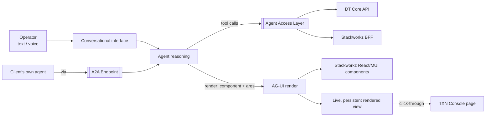

# TXN — Full Agentic Experience

> **Component map:** [[components]] · **Vision:** [[vision]]
> **Date:** 2026-06-02
> **Status:** Collecting
> **Owner:** _TBC_
> **Sources:** [[29-05-2026-stackworkz-meeting]] (AG-UI design, ~00:16–00:25), [[13-05-2026-txn-vision-meeting]] (trust Concept 3 / A2A)

---

## 1. What Does This Component Do?

**Functional purpose:**

The Full Agentic Experience is the **agent-as-interface** end of TXN's trust spine — the destination of Concepts 2→3 in the [[vision]]. Where the [[co-pilot]] augments a user who is still clicking buttons, this component is for the user who says *"I don't want to click any buttons — I want to speak to my computer and it does everything for me."* The agent is no longer a panel beside the product; it **is** the product surface.

The user interacts through a chat surface (text or voice) — conceptually "TXN's Claude." They ask for something in natural language ("show me my 10 recent card transactions", "compile me a dashboard for this card program"), and the agent **renders real, interactive UI in real time** in response. Critically, it does not return a screenshot or a PDF — it renders the *same* React / Material UI components the rest of the Console is built from, with identical look, feel, and behaviour. The rendered output is clickable and live: a transactions view can be clicked into and can navigate the user to the corresponding Console page.

The mechanism (proposed): the agent emits a **tool call whose arguments describe a component to render**, the front end receives that payload and renders the component — the payload carries arguments, not code. Underneath, the agent queries data exactly the way the front end would (e.g. user ID + date range → the same API call), so the rendered result is consistent with what the user would see by navigating manually.

Because the agent has access to the tool surface ([[agent-access-layer]]), the data APIs, and a component library, the experience is **portable** — it manifests in the Console as its primary entry point, but in principle the same agent could surface anywhere (even a desktop outlet), since it carries its own access to capabilities and data. External / client-owned agents reach the same capabilities through the [[a2a-endpoint]] (a sibling component) rather than this experience directly.

```
Full Agentic Experience
├── Conversational interface      (text / voice chat — "TXN's Claude")
├── Generative UI rendering       (AG-UI: tool call + args → live React/MUI component)
└── Session persistence           (saved, revisitable rendered views)
```

**Personas:**

| Persona | How they use this component | What they need from it |
|---------|---------------------------|----------------------|
| **Card Program Operators** (Console) | The "speak to my computer" user — drives the entire program through conversation rather than navigation; asks for views, dashboards, and actions and gets live UI back | Trust that the rendered view is real and current; the ability to act, not just look; continuity (come back tomorrow, the dashboard is still there) |

_External / client-owned agents are served by the [[a2a-endpoint]] component, not this one._

---

## 2. What Needs to Happen?

**Functional requirements:**

- User can request a view, dashboard, or data in natural language and receive a **live, rendered component** in the chat surface (not a static image).
- The agent renders by issuing a **tool call with arguments** that the front end maps to a real component — reusing the Console's existing component library.
- Rendered components are **interactive**: clickable, and able to deep-link the user into the corresponding Console page.
- Rendered views **persist**: a user can return later, see a previously generated dashboard, and open it again as a fully rendered page.
- The agent **composes parametrised views** on request ("compile me a dashboard" + parameters), assembling from available components and data.
- The same capabilities are reachable by an external agent via the [[a2a-endpoint]], scoped to the acting user's permissions.

**Business rules and constraints:**

- The agent acts only within the acting user's permissions (enforced by [[agent-access-layer]]); any sign-off-required action routes through the Console approval queue.
- Rendered output must be **consistent with the Console** — same data path, same component, so the agentic view never diverges from the "click-through" view.

**Edge cases and error states:**

- **Open-ended generation** — Stackworkz (Corneil) flagged the hard case: unlike a coding agent that "starts from nothing and knows where it's going," here the agent "starts with all the data but doesn't know where it's going." Bounding what the agent may compose, and how, is an open design problem.
- _Stale / inconsistent data between a persisted view and live state — not yet discussed._

---

## 3. How Should It Look and Feel?

**Design direction:** A conversational, generative surface — "literally as if it was Claude," but TXN's. Text or voice in; live, branded, interactive UI out. The rendered components must be visually and behaviourally indistinguishable from the rest of the Console.

**Reference products:**

- **Claude / ChatGPT (artifacts / generative UI)** — the conversational-render model and the persistence of generated artifacts across sessions.
- **Claude Code** — referenced as the mental model for "agent-as-interface," with the caveat that a coding agent starts from a blank slate whereas this agent starts from a full dataset and must be steered toward an output.

**Key UX principles for this component:**

- **Render real components, not pictures** — reuse the Console's component library so the agentic view looks, feels, and acts identical.
- **Persistent, not throwaway** — generated views are revisitable, not one-shot.
- **Continuous with the Console** — clicking a rendered component can carry the user into the equivalent Console page; the two surfaces are one product.

---

## 4. How Are We Going to Solve It?

| Capability | Build / Buy / Access | Provider / Approach | Rationale |
|-----------|---------------------|-------------------|-----------|
| Agent ↔ UI rendering protocol | Access / Build on | **AG-UI** (`agui`) library | Standardises agent↔UI interaction; strong fit for generative/rendered UI. Mechanism is a tool call with arguments dispatched to the front end, which renders the component. |
| Component library to render | Reuse | Stackworkz's React + **Material UI** components (designed by Super Ultra) | Don't rebuild the UI — render the same components the Console ships. The agent gets a skill/handle to that library. |
| Data for rendered views | Access | DT Core API + Stackworkz BFF API (via [[agent-access-layer]]) | Agent queries data the same way the front end does, so output matches the click-through experience. |

---

## 5. What Data Does It Need?

| Data | Direction | Source / Destination | Notes |
|------|-----------|---------------------|-------|
| Program / card / transaction data | In (consumes) | DT Core API + Stackworkz BFF, via [[agent-access-layer]] tools | Queried the same way the front end queries it (e.g. user ID + date range) |
| Component-render payloads | Out (produces) | Agent → front end | Tool call carrying **arguments** (not code) describing the component to render |
| Persisted rendered views / session state | Stored | _Store TBC_ | Required for revisitable dashboards — where this lives is an open question |

---

## 6. Who Can Access It?

| Persona / Role | Access level | Notes |
|---------------|-------------|-------|
| Card Program Operators | Gated to the user's Console permissions | Scoped via [[agent-access-layer]]; actions requiring sign-off route through approval queue |
| Client's own agents | Permission parity with the human they represent | Served by the [[a2a-endpoint]] component |

_Detailed access rules not discussed in this call — inherits the permission model from [[agent-access-layer]]._

---

## 7. How Do We Know It's Working?

_Not discussed in this call. Candidate metrics to validate with TXN:_

- [ ] _Share of operator tasks completed via conversation vs. manual navigation_
- [ ] _Rendered views are accepted/used (not discarded) by users_
- [ ] _Agentic view matches the click-through view (no data divergence)_

---

## 8. Dependencies

**What this component needs:**

| Depends on | What we need | Blocking? |
|-----------|-------------|----------|
| [[agent-access-layer]] | The tool surface, MCP exposure, and permission scoping the agent acts through | **Yes** |
| Stackworkz component library | Real React/MUI components to render (and a way to address them) | No — can mock with fakes / raw MUI for a POC |
| DT Core API + Stackworkz BFF | Data to query for rendered views | Partial — POC can fake data |
| AG-UI library | The agent↔UI rendering protocol | No — adopt the library |

**What other components need from this one:**

- This experience and the [[a2a-endpoint]] are siblings: both let an agent drive TXN, one as TXN's own in-Console interface, the other as the inbound door for the client's own agents. They share the [[agent-access-layer]] tool surface.

---

## 9. Priority

_Phasing/sequencing is deliberately out of scope for this exercise — we are capturing the full agentic scope, not an MVP cut._

**Complexity note:** This was called **the most complicated** of the AI work (Ruan Sunkel, Stackworkz) and is **not represented in the current designs** — relevant to effort, not to whether it's in scope. It is in scope.

---

## 10. Risks

**Abuse vectors:**
- Prompt injection steering what the agent renders or which tools it calls (inherits [[vision]] §8); permission-escalation / approval-queue bypass via the agentic surface.
- A2A abuse — a client's own agent sending misleading framing to escalate scope.

**Data risks:**
- Persisted view shows stale state vs. live data; agentic view diverging from the click-through view.

**Compliance:**
- _Inherits vision-level compliance; component-specific requirements not yet discussed._

**Controls needed:**
- Bound the agent's composition space (open problem flagged by Stackworkz); permission scoping via [[agent-access-layer]]; approval-queue routing for actions; consistency checks between persisted and live state.

---

## Sub-Components

| Sub-Component | Overview | Status | Link |
|--------------|----------|--------|------|
| Conversational interface | Text / voice chat surface — the "TXN's Claude" entry point in the Console | Collecting | _[[sub-components/conversational-interface]]_ |
| Generative UI rendering | AG-UI pipeline: tool call + arguments → live React/MUI component, reusing the Console library | Collecting | _[[sub-components/generative-ui-rendering]]_ |
| Session persistence | Saved, revisitable rendered views (dashboards persist and re-open as rendered pages) | Collecting | _[[sub-components/session-persistence]]_ |

---

## Diagrams


