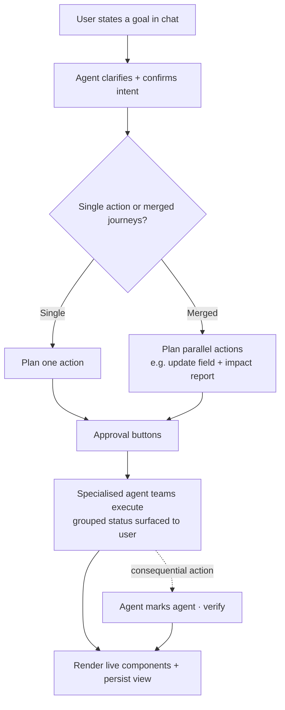
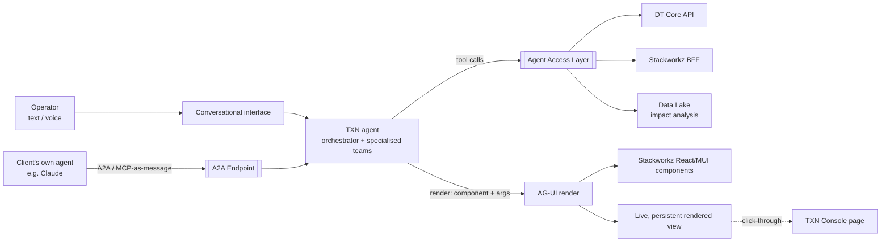

# TXN — Full Agentic Experience

> **Component map:** [[components]] · **Vision:** [[vision]]
> **Date:** 2026-06-05
> **Status:** Defined
> **Owner:** _TBC_
> **Sources:** [[29-05-2026-stackworkz-meeting]] (AG-UI design, ~00:16–00:25), [[13-05-2026-txn-vision-meeting]] (trust Concept 3 / A2A), [[05-06-2026-component-4-full-agentic-experience]] (dedicated deep-dive)

---

## 1. What Does This Component Do?

**Functional purpose:**

The Full Agentic Experience is the **agent-as-interface** end of TXN's trust spine — the destination of Concepts 2→3 in the [[vision]], and **Level 4** of the manual→agentic graduation introduced in [[co-pilot]]. Where the [[co-pilot]] augments a user who is still clicking buttons (Levels 2–3), this component is for the user who says *"I don't want to click any buttons — I want to speak to my computer and it does everything for me."* The agent is no longer a panel beside the product; it **is** the product surface. Ian Johnson (TXN's CEO) framed the destination plainly: *"I don't even have to go onto the console… it's great that you're telling me what to do, but I don't want to do it — I want you to do it for me."*

The user interacts through a chat surface (text or voice) — conceptually "TXN's Claude." They ask for something in natural language ("show me my 10 recent card transactions", "compile me a dashboard for this card program"), and the agent **renders real, interactive UI in real time** in response. Critically, it does not return a screenshot or a PDF — it renders the *same* React / Material UI components the rest of the Console is built from, with identical look, feel, and behaviour. The rendered output is clickable and live: a transactions view can be clicked into and can navigate the user to the corresponding Console page. A user could, at the limit, **run the entire program from the agent and never visit the Console** — every graph, setting, or change reachable through conversation.

**Simple on top, multi-agent underneath.** George Westbrook drew the key distinction between *what is actually happening* and *what the user thinks is happening*. To the user it looks like "I ask, the agent does it" — a single, calm assistant. Behind the screen there may be **ten specialised agent teams working in parallel**, and the user neither sees nor needs to see that. A deliberate principle: this is **not a jack-of-all-trades single agent** — one agent with a hundred capabilities "dilutes it down." It is **specialised agents and teams, called at the point they are needed**, each validating the others' work. The same point made in the [[co-pilot]] session recurs here: surface that work is happening ("still working… here's what's going on") but **grouped into categories** of activity, not raw per-agent detail (Ian) — perception sits "somewhere between level one and level two."

**Where it shines — composing journeys you can't combine in the Console.** The differentiator the room landed on is that the agent can **merge multiple user journeys into one goal**. In the Console, changing a setting and getting an impact report are two separate, sequential actions across different pages; the Console is "not the place to do really complex tasks" (Ian). Here the user states one intent — *"change the maximum transaction value from 200 to 100, and tell me the impact of that change"* — and the agent runs the pieces concurrently (one call updates the field with the right controls, another analyses the data lake for impact), **builds a plan, gets it approved, and executes**. The room for user error "drops dramatically" because the user states the goal and clicks a few approval buttons rather than navigating a multi-page sequence.

**Built on the same foundations as everything else.** This is explicitly not a separate stack: same [[agent-access-layer]] tool surface, the same Console component library, and the same agent / agent-team machinery that powers [[agent-inbox-alerts]]. It is the [[co-pilot]]'s hand-off target — when a Console user asks for something too complex or off-context for the page, they are taken into this experience (the boundary defined from the [[co-pilot]] side).

The mechanism for rendering (proposed): the agent emits a **tool call whose arguments describe a component to render**, the front end receives that payload and renders the component — the payload carries arguments, not code. Underneath, the agent queries data exactly the way the front end would (e.g. user ID + date range → the same API call), so the rendered result is consistent with what the user would see by navigating manually.

Because the agent has access to the tool surface ([[agent-access-layer]]), the data APIs, and a component library, the experience is **portable** — it manifests in the Console as its primary entry point, but in principle the same agent could surface anywhere. **External / client-owned agents** reach the same capabilities through the [[a2a-endpoint]] (the external edge of [[agent-access-layer]]) — and the deep-dive resolved *how*: TXN exposes the **agent**, not raw tools (see §4).

```
Full Agentic Experience  (Level 4 of the graduation)
├── Conversational interface      (text / voice chat — "TXN's Claude")
├── Generative UI rendering       (AG-UI: tool call + args → live React/MUI component)
├── Agent orchestration & planning (specialised agent teams; cross-journey plan→approve→execute; bucketed process surfacing)
└── Session persistence           (saved, revisitable rendered views)
```

**Personas:**

| Persona | How they use this component | What they need from it |
|---------|---------------------------|----------------------|
| **Card Program Operators** (Console) | The "speak to my computer" user — drives the entire program through conversation rather than navigation; asks for views, dashboards, and combined actions and gets live UI back | Trust that the rendered view is real and current; the ability to act, not just look; combined-journey outcomes the Console can't give; continuity (come back tomorrow, the dashboard is still there) |

_External / client-owned agents are served by the [[a2a-endpoint]] (the external edge of [[agent-access-layer]]), not this surface — but via the same "expose the agent" mechanism resolved here._

---

## 2. What Needs to Happen?

**Functional requirements:**

- User can request a view, dashboard, or data in natural language and receive a **live, rendered component** in the chat surface (not a static image).
- The agent renders by issuing a **tool call with arguments** that the front end maps to a real component — reusing the Console's existing component library.
- Rendered components are **interactive**: clickable, and able to deep-link the user into the corresponding Console page.
- Rendered views **persist**: a user can return later, see a previously generated dashboard, and open it again as a fully rendered page.
- The agent **composes parametrised views** on request ("compile me a dashboard" + parameters), assembling from available components and data.
- The agent can **merge multiple user journeys into a single goal** (e.g. change a setting + produce an impact report), running the parts concurrently, **building a plan, getting approval, then executing in order**.
- The agent supports **scheduled / recurring actions** ("give me a report every Monday of transactions grouped by declined/accepted in these amount buckets") — the "co-work"-style experience.
- The user is **kept informed of progress** via grouped/categorised status updates while background work runs — never a bare spinner.
- The same capabilities are reachable by an external agent via the [[a2a-endpoint]], scoped to the acting user's permissions.

**Business rules and constraints:**

- The agent acts only within the acting user's permissions (enforced by [[agent-access-layer]]); any sign-off-required action routes through the Console approval queue.
- **It can only do what an API exists for** — no capability without a backing API endpoint (Ian's first guard rail).
- **Deliberately bounded** — the agent must *not* be able to do "anything and everything"; guard rails are explicit design work, built up and loosened over time as confidence grows. Some things are withheld because they don't exist, others because TXN chooses not to expose them yet.
- **Verification scales with risk** — "another agent marking the previous agent's work" to eliminate AI error, applied to consequential actions, *not* to everything (simple changes skip it).
- Rendered output must be **consistent with the Console** — same data path, same component, so the agentic view never diverges from the "click-through" view.
- **Every check-and-balance that applies in the Console or against the API applies here too** — "there can't be any routing that breaks that" (Ian).

**Edge cases and error states:**

- **Open-ended generation** — Stackworkz (Corneil) flagged the hard case: unlike a coding agent that "starts from nothing and knows where it's going," here the agent "starts with all the data but doesn't know where it's going." Bounding what the agent may compose, and how, is an open design problem.
- A merged-journey plan where one step fails (e.g. the update succeeds but the impact analysis errors) → the plan must sequence and report partial completion, not silently drop a step.
- An action the user requests that has no backing API → refused early with an explanation, not attempted.
- _Stale / inconsistent data between a persisted view and live state — not yet discussed._



---

## 3. How Should It Look and Feel?

**Design direction:** A conversational, generative surface — "literally as if it was Claude," but TXN's. Text or voice in; live, branded, interactive UI out. The rendered components must be visually and behaviourally indistinguishable from the rest of the Console. While background work runs, the surface keeps the user company with **grouped, plain-language progress** ("analysing… checking…"), never a bare spinner and never raw per-agent firehose.

**Reference products:**

- **Claude / ChatGPT (artifacts / generative UI)** — the conversational-render model and the persistence of generated artifacts across sessions.
- **Claude Code** — the mental model for "agent-as-interface" and multi-agent orchestration, with the caveat that a coding agent starts from a blank slate whereas this agent starts from a full dataset and must be steered toward an output.
- **Co-work (scheduled / fire-and-forget tasks)** — the reference for recurring reports and "go away and do this" tasks the user doesn't wait on.
- **Agentic e-commerce / travel booking in Claude** (Ian's analogy) — Booking.com-style flows rendered and completed *inside* Claude; "something similar, of a TXN flavour" is the target for the external-agent path.

**Key UX principles for this component:**

- **Render real components, not pictures** — reuse the Console's component library so the agentic view looks, feels, and acts identical.
- **Persistent, not throwaway** — generated views are revisitable, not one-shot.
- **Continuous with the Console** — clicking a rendered component can carry the user into the equivalent Console page; the two surfaces are one product.
- **Simple face, orchestrated core** — never expose the multi-agent machinery; show grouped progress categories, not agent-by-agent detail.

---

## 4. How Are We Going to Solve It?

| Capability | Build / Buy / Access | Provider / Approach | Rationale |
|-----------|---------------------|-------------------|-----------|
| Agent ↔ UI rendering protocol | Access / Build on | **AG-UI** (`agui`) library | Standardises agent↔UI interaction; strong fit for generative/rendered UI. Mechanism is a tool call with arguments dispatched to the front end, which renders the component. |
| Component library to render | Reuse | Stackworkz's React + **Material UI** components (designed by Super Ultra) | Don't rebuild the UI — render the same components the Console ships. The agent gets a skill/handle to that library. |
| Agent architecture | Build | **Specialised multi-agent system** — orchestrator + specialised agents/teams invoked on demand; same machinery as [[agent-inbox-alerts]] | A single mega-agent dilutes quality; specialised teams validate each other and keep capabilities sharp. |
| External-agent access | Build | **Expose the agent, not the tools.** Client agent (e.g. Claude) → **A2A** → TXN agent (carrying skills, approval layers, ways-of-working) → executes MCP tools → replies. Fallback: wrap the agent as an MCP tool, where Claude's payload is passed as a *user message* to the TXN agent. | Raw MCP tool exposure isn't safe/smart enough for a financial product (no impact awareness, no approval layers). The external face of this lives in the [[a2a-endpoint]] edge of [[agent-access-layer]]. A2A path depends on providers enabling A2A. |
| Verification | Build | Risk-tiered "agent marks agent" — consequential actions get a checking pass; simple actions don't | Eliminates AI error on high-blast-radius actions without slowing trivial ones. |
| Data for rendered views | Access | DT Core API + Stackworkz BFF API (via [[agent-access-layer]]) | Agent queries data the same way the front end does, so output matches the click-through experience. |
| Build & test approach | Build | **Mock-API-first**: from API YAML + example payloads → mock API → MCP server → agent. Validate with **~100-run simulation testing** (flag e.g. "executed a tool at turn 3 without asking"); swap mock components/APIs for real as they land. | Full Agentic is the **least-blocked** component (mainly API-dependent); can start before Stackworkz/DT finish. Uses the parked Simulation & Evaluation harness. |

---

## 5. What Data Does It Need?

| Data | Direction | Source / Destination | Notes |
|------|-----------|---------------------|-------|
| Program / card / transaction data | In (consumes) | DT Core API + Stackworkz BFF, via [[agent-access-layer]] tools | Queried the same way the front end queries it (e.g. user ID + date range) |
| Component-render payloads | Out (produces) | Agent → front end | Tool call carrying **arguments** (not code) describing the component to render |
| Impact / analytical data | In (consumes) | Data Lake (DT), via [[agent-access-layer]] | For merged-journey impact reports; a future dependency (no transaction data at launch) |
| Persisted rendered views / session state | Stored | _Store TBC_ | Required for revisitable dashboards — where this lives is an open question |
| Schedule definitions | Stored | _Store TBC_ | For recurring/co-work tasks ("every Monday…") |

---

## 6. Who Can Access It?

| Persona / Role | Access level | Notes |
|---------------|-------------|-------|
| Card Program Operators | Gated to the user's Console permissions | Scoped via [[agent-access-layer]]; actions requiring sign-off route through approval queue; only capabilities with a backing API are reachable |
| Client's own agents | Permission parity with the human they represent | Served by the [[a2a-endpoint]] via the "expose the agent" mechanism; same guard rails, approval, and audit apply |

_Inherits the permission model from [[agent-access-layer]]. Ian's non-negotiable: guard rails must be **strong and auditable** — know who the actor is, what they're permitted to do, and stop early if they're not._

---

## 7. How Do We Know It's Working?

- [ ] _Share of operator tasks completed via conversation vs. manual navigation_
- [ ] _Rendered views are accepted/used (not discarded) by users_
- [ ] _Agentic view matches the click-through view (no data divergence)_
- [ ] _Merged-journey requests complete end-to-end with correct sequencing_
- [ ] _Simulation pass rate: across ~100 simulated user journeys, the agent never executes a tool without required permission/confirmation, and stays within guard rails_

---

## 8. Dependencies

**What this component needs:**

| Depends on | What we need | Blocking? |
|-----------|-------------|----------|
| [[agent-access-layer]] | The tool surface, MCP exposure, and permission scoping the agent acts through | **Yes** |
| Stackworkz component library | Real React/MUI components to render (and a way to address them) | No — can mock with fakes / raw MUI for a POC |
| DT Core API + Stackworkz BFF | Data to query for rendered views | Partial — POC can fake data via mock API (YAML + payloads) |
| AG-UI library | The agent↔UI rendering protocol | No — adopt the library |
| [[a2a-endpoint]] | Shared "expose the agent" mechanism for external client agents (the external edge of [[agent-access-layer]]) | No — co-design |
| Simulation & Evaluation harness | ~100-run journey simulations to validate guard rails before launch | No — but it's how we de-risk this component (currently parked in [[components]]) |
| Data Lake (DT) | Impact/analytical data for merged-journey reports | No — future phase; nothing to analyse at launch |

**What other components need from this one:**

- This experience and the [[a2a-endpoint]] (the external edge of [[agent-access-layer]]) are two faces of one idea: TXN's own in-Console agent interface, and the inbound door for the client's own agents. They share the [[agent-access-layer]] tool surface **and** the "expose the agent, not the tools" mechanism resolved in this session.
- [[co-pilot]] hands off to this experience for complex / off-context tasks (the boundary defined from the co-pilot side).
- Shares the agent/agent-team machinery with [[agent-inbox-alerts]].

---

## 9. Priority

_Phasing/sequencing is deliberately out of scope for this exercise — we are capturing the full agentic scope, not an MVP cut. Two delivery-relevant notes from the deep-dive, recorded for [[architecture]] / planning:_

- **Least-blocked, buildable now.** George: Full Agentic is the easiest to make early progress on because it's mainly API-dependent — with the API YAML + example payloads it can be built against a mock API today (Mike has ~80 endpoints, ~80–90% untested but structurally stable).
- **Marketing / sales prototype.** Ian: a sufficiently good mock-up of the agentic experience could be used on the corporate website and in the sales process to "show, don't tell" — potentially the *first* thing shown to the market, ahead of full build. The GTM sequence Ian set: win business (portal/docs) → onboard → operate (Console + agentic) → analyse (data lake, later).

**Complexity note:** This was called **the most complicated** of the AI work (Ruan Sunkel, Stackworkz) and is **not represented in the current designs** — relevant to effort, not to whether it's in scope. It is in scope.

---

## 10. Risks

**Abuse vectors:**
- Prompt injection steering what the agent renders or which tools it calls (inherits [[vision]] §8); permission-escalation / approval-queue bypass via the agentic surface.
- A2A abuse — a client's own agent sending misleading framing to escalate scope.

**Data risks:**
- Persisted view shows stale state vs. live data; agentic view diverging from the click-through view.

**Design / delivery risks:**
- **Guard rails are the central risk** (Ian's repeated emphasis) — an under-bounded agent in a financial-services product is unacceptable. Must be strong, auditable, permission-aware, and fail early.
- **Open-ended composition** — the agent starts with all the data and no fixed destination; bounding what it may compose is unsolved.
- **A2A provider enablement** — the preferred external-agent path depends on providers (e.g. Anthropic) supporting A2A connections; the MCP-as-user-message fallback must carry the experience until then.

**Compliance:**
- _Inherits vision-level compliance; component-specific requirements not yet discussed._

**Controls needed:**
- Bound the agent's composition space (open problem flagged by Stackworkz); API-must-exist gating; permission scoping via [[agent-access-layer]]; approval-queue routing for actions; risk-tiered "agent marks agent" verification; consistency checks between persisted and live state; pre-launch simulation validation of guard rails.

---

## Sub-Components

| Sub-Component | Overview | Status | Link |
|--------------|----------|--------|------|
| Conversational interface | Text / voice chat surface — the "TXN's Claude" entry point; simple face over the multi-agent core | Defined | [[conversational-interface]] |
| Generative UI rendering | AG-UI pipeline: tool call + arguments → live React/MUI component, reusing the Console library; render-to-select; click-through consistency | Defined | [[generative-ui-rendering]] |
| Agent orchestration & planning | Specialised agent teams; cross-journey plan→approve→execute; risk-tiered verification; API-must-exist guard rails | Defined | [[agent-orchestration]] |
| Session persistence | Saved, revisitable (live-refreshed) rendered views + scheduled/recurring task definitions; store TBC | Defined | [[session-persistence]] |

---

## Diagrams


