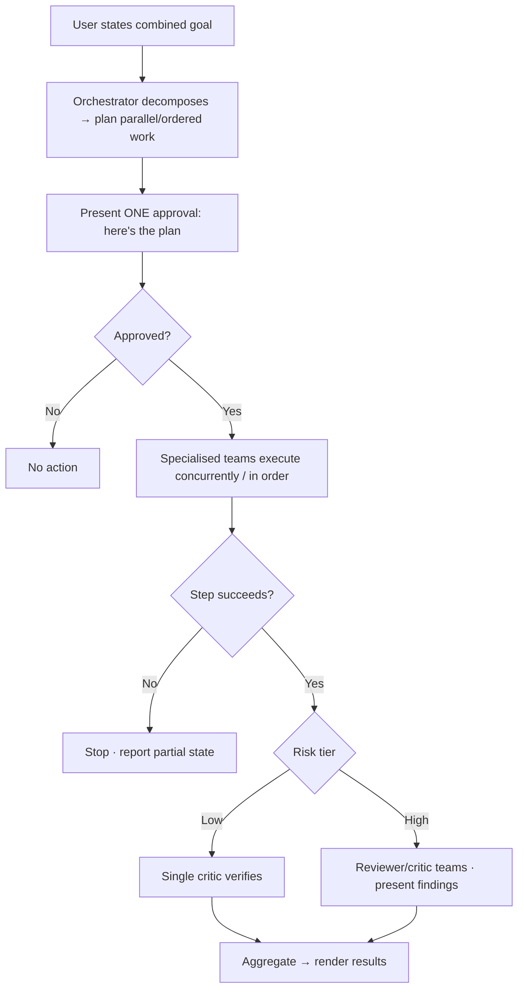

# TXN — Full Agentic: Agent Orchestration & Planning

> **Component:** [[full-agentic-experience]] · **Vision:** [[vision]]
> **Date:** 2026-06-10
> **Status:** Defined
> **Owner:** _TBC_
> **Sources:** [[05-06-2026-component-4-full-agentic-experience]] (specialised multi-agent core, cross-journey planning, risk-tiered verification, guard rails)

---

## 1. What Does This Sub-Component Do?

**Functional purpose:**

Agent Orchestration is the **multi-agent core** behind the simple face — *what's actually happening* versus *what the user thinks is happening* (George's distinction). The user perceives "I ask, it does it"; behind the screen there may be **ten specialised agent teams working in parallel**. The deliberate principle: **not a jack-of-all-trades single agent** (one agent with a hundred capabilities "dilutes it"), but **specialised agents/teams called at the point they are needed**, each validating the others' work.

Its headline capability is **composing journeys you can't combine in the Console** — merging multiple user journeys into one goal. The example: *"change the maximum transaction value from 200 to 100, **and** tell me the impact of that change"* — one team updates the field (with controls), another analyses the data lake for impact, concurrently. The flow is **plan → approve → execute**: gather intent, **build a plan**, get **one approval**, then execute (in order, with checks). Verification is **risk-tiered** — a low-risk change gets a single critic agent; a high-risk change gets a planner spawning reviewer/critic teams ("another agent marking the previous agent's work") whose findings are presented back. It surfaces **bucketed status** while working.

It runs on the **same machinery as [[agent-inbox-alerts]]**, acts only through [[agent-access-layer]] (permission-scoped; approval queue for product/multi-card), and is bound by guard rails: **only what an API exists for**, and **deliberately bounded** (not "anything and everything"). It is built and de-risked **mock-API-first** and validated with **simulation** (the harness in [[internal-ops-agents]]).

**Entities that interact with it:**

- **Orchestrator agent** — plans, delegates to specialised teams, aggregates.
- **Specialised agent teams** — execute and verify slices of the work.
- **User** — states the goal, approves the plan.

---

## 2. What Needs to Happen?

**Functional requirements:**

- Use **specialised agents/teams invoked on demand** — not one monolithic agent.
- **Merge multiple user journeys** into a single goal and run the parts **concurrently** where independent.
- **Plan → approve → execute**: build a plan, get **one approval**, execute in dependency order with checks (a failed step stops downstream and reports partial state).
- **Risk-tiered verification**: low-risk → a single critic pass; high-risk → reviewer/critic teams with findings presented.
- Emit **bucketed status** for [[conversational-interface]] to surface.
- Act only through [[agent-access-layer]]; route product-level / multi-card actions to the **approval queue**.

**Business rules:**

- **Specialised, not monolithic** — keeps capability sharp; teams validate each other.
- **Only what an API exists for** — no capability without a backing endpoint.
- **Deliberately bounded** — guard rails are explicit design work, loosened over time as confidence grows.
- **Verification scales with blast radius** — not applied uniformly.
- Every check-and-balance that applies in the Console/API applies here too.

**Edge cases:**

- A merged-journey step fails → sequence + checks; stop downstream, report partial state.
- A requested action has no backing API → refuse early with explanation.
- A consequential action → the risk-tiered verification pass must run before completion.

---

## 3. Entity Journeys

### 3a. Isolated Journeys

#### Journey 1: Plan and execute a merged-journey goal

**Entity:** Orchestrator + specialised teams + user (hybrid)

**Input:** The user states a goal that combines journeys (e.g. change a setting + produce an impact report).

**Outcome:** The combined goal completes with one approval, the consequential parts verified, and results rendered back — something the Console can't do in one move.

**Steps:**

**Acceptance criteria:**

- [ ] Multi-step / merged-journey goals are planned and approved in one step (not per-API).
- [ ] Independent parts run concurrently; dependent steps run in order with failure-stop + partial-state reporting.
- [ ] Specialised teams (not one mega-agent) handle distinct slices.
- [ ] Consequential actions get a risk-tiered verification pass before completion.
- [ ] Only actions with a backing API are attempted; out-of-bounds requests are refused.
- [ ] Bucketed status is emitted throughout.

### 3b. Cross-Component Journeys

#### Journey 1: Execute through the Access Layer

**Entity:** Orchestrator → [[agent-access-layer]]

**Input:** An approved plan with executable steps.

**Handoff point:** Each step executes via [[agent-access-layer]] under the user's permissions; product-level / multi-card actions route to the approval queue; results/errors return for aggregation.

**Components involved:** Full Agentic → [[agent-access-layer]] → Full Agentic

**Outcome:** The plan executes permission-scoped and audited; results render back.

**Acceptance criteria:**

- [ ] Execution is permission-scoped via [[agent-access-layer]]; the Core API rejects unpermitted calls with self-correcting errors.
- [ ] Product-level / multi-card actions route through the approval queue.
- [ ] Every action is audited.

---

## 4. Look and Feel (Optional)

No direct UI — surfaces through [[conversational-interface]] as bucketed status and through [[generative-ui-rendering]] as results. The "simple face, orchestrated core" principle governs how much is shown.

---

## 5. Data Requirements

| What | Direction | Description | Source / Destination |
|------|-----------|------------|---------------------|
| User goal / intent | In | The (possibly merged) request | [[conversational-interface]] |
| Plan | Out | Ordered/parallel steps for approval | Orchestrator → user |
| Tool calls + results | In/Out | Execution via tools | [[agent-access-layer]] |
| Impact / analytical data | In | For merged-journey impact analysis | Data Lake (via [[agent-access-layer]]) |
| Verification findings | Out | Risk-tiered critic/reviewer output | Agent → user |

---

## 6. Dependencies

| Depends on | What we need | Blocking? |
|-----------|-------------|----------|
| [[agent-access-layer]] | Tools, permission scoping, approval routing, audit | **Yes** |
| [[agent-inbox-alerts]] | Shared agent/agent-team machinery | No — shared |
| Simulation harness ([[internal-ops-agents]]) | ~100-run journey simulations to validate guard rails | No — de-risks this |
| Data Lake (DT) | Impact/analytical data for merged journeys | No — later phase |

**What siblings/other components need from this one:**
- It is the brain behind [[conversational-interface]] and the producer of what [[generative-ui-rendering]] renders.

---

## 7. Risks

**Specific risks:**
- **Guard rails** — an under-bounded agent in a financial product (the central risk).
- **Open-ended composition** — bounding what it may assemble/do.
- **AI error** on consequential actions.

**Controls to build into the journeys:**
- **API-must-exist gating**; permission scoping; **risk-tiered "agent marks agent" verification**; approval-queue routing; **pre-launch simulation** of guard rails.

---

## 8. Priority

**Must-have at launch?** Yes — it's the brain; the experience is nothing without it.

**Sequencing rationale:** Least-blocked (mainly API-dependent); buildable against a mock API + simulation now, ahead of the real components.

---

## Sub-Sub-Components

Leaf node — no further decomposition needed.
