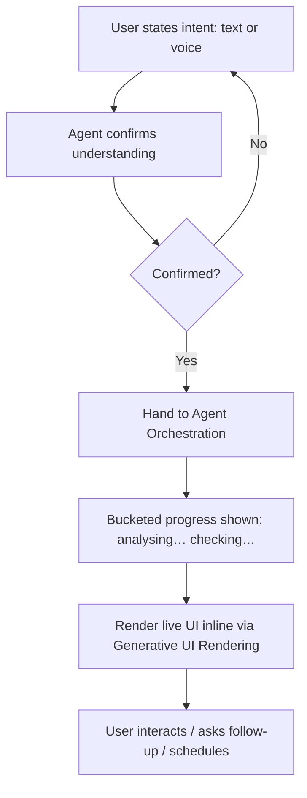

# TXN — Full Agentic: Conversational Interface

> **Component:** [[full-agentic-experience]] · **Vision:** [[vision]]
> **Date:** 2026-06-10
> **Status:** Defined
> **Owner:** _TBC_
> **Sources:** [[05-06-2026-component-4-full-agentic-experience]] (the "TXN's Claude" surface), [[29-05-2026-stackworkz-meeting]]

---

## 1. What Does This Sub-Component Do?

**Functional purpose:**

The Conversational Interface is the **front door** of the Full Agentic Experience — the chat surface, **text or voice**, that is conceptually *"TXN's Claude."* It is the single entry point for the user who *"doesn't want to click any buttons — I want to speak to my computer and it does everything for me."* The user states intent in natural language; the agent confirms what it understood, does the work (through [[agent-orchestration]]), and renders live UI back into the surface (through [[generative-ui-rendering]]). It is also where the **co-work-style scheduled requests** are issued ("give me a report every Monday…").

It is the **"simple face"** over the multi-agent core: from here the experience looks like one calm assistant, regardless of how many specialised agent teams run behind it. It keeps the user company with **bucketed progress** (the same altitude principle as the [[co-pilot]] process-surfacing sub-component), never a bare spinner.

**Entities that interact with it:**

- **Card Program Operator** — the "speak to my computer" user, driving the whole program through conversation.
- **Conversational agent** — accepts input, confirms intent, streams progress, hosts the rendered output.

---

## 2. What Needs to Happen?

**Functional requirements:**

- Accept **natural-language input** as **text or voice**.
- **Confirm intent** before acting — *"this is what I understood you want; shall I?"* (Claude-style).
- **Host the rendered UI inline** (the components produced by [[generative-ui-rendering]]) and keep them in the conversation.
- Surface **bucketed progress** while background work runs (analysing / checking / verifying) — never a raw firehose, never a bare spinner.
- Accept **scheduled / recurring requests** (the co-work mode) and hand them to [[session-persistence]].
- Keep the **multi-agent machinery hidden** — the user perceives one assistant.

**Business rules:**

- **Confirm before acting** — consequential actions are gated by approval (via [[agent-orchestration]] / [[agent-access-layer]]).
- **One altitude of surfacing** for everyone (shared principle with [[co-pilot]]).
- Scoped to the acting user's permissions.

**Edge cases:**

- **Intent misread** → the confirmation step catches it before any action.
- **Long-running work** → continuous bucketed updates so the user never wonders if it stalled.
- **Voice** → cost/latency considerations (text-to-speech, transcription) — voice is an experience option, not required for v1.

---

## 3. Entity Journeys

### 3a. Isolated Journeys

#### Journey 1: State a goal and get a live response

**Entity:** Card Program Operator (user) + conversational agent (hybrid)

**Input:** The user types or speaks a request ("compile me a dashboard for this card program").

**Outcome:** The agent confirms intent, does the work, and renders live UI in the chat — the user never left the conversation.

**Steps:**

**Acceptance criteria:**

- [ ] The user can interact by text or voice.
- [ ] The agent confirms intent before performing a consequential action.
- [ ] Rendered UI appears inline in the conversation.
- [ ] Progress is shown as bucketed categories, never a bare spinner.
- [ ] A scheduled/recurring request can be issued and is handed to [[session-persistence]].
- [ ] The multi-agent machinery is not exposed to the user.

---

## 4. Look and Feel (Optional)

*"Literally as if it was Claude," but TXN's* — a conversational, generative surface; live branded UI rendered inline; reassuring bucketed status. Text first; voice as an option (with its own cost/latency trade-offs).

---

## 5. Data Requirements

| What | Direction | Description | Source / Destination |
|------|-----------|------------|---------------------|
| NL input (text/voice) | In | The user's request | User input |
| Intent confirmation | In/Out | "Is this what you meant?" | Agent ↔ user |
| Progress status | Out | Bucketed category updates | [[agent-orchestration]] → user |
| Rendered components | Out | Live UI hosted in the chat | [[generative-ui-rendering]] |

---

## 6. Dependencies

| Depends on | What we need | Blocking? |
|-----------|-------------|----------|
| [[agent-orchestration]] | The brain that does the work behind the chat | **Yes** |
| [[generative-ui-rendering]] | The live UI rendered into the surface | **Yes** |
| [[agent-access-layer]] | Permission scoping; approval routing | **Yes** |
| Voice stack (TTS / transcription) | If/when voice is offered | No — text-first |

**What siblings/other components need from this one:**
- It is the entry point every other Full Agentic sub-component is reached through.

---

## 7. Risks

**Specific risks:**
- **Intent misinterpretation** acting on the wrong goal.
- **Voice cost/latency** if offered early.

**Controls to build into the journeys:**
- **Confirm-before-act**; bucketed progress; permission scoping.

---

## 8. Priority

**Must-have at launch?** Yes — it's the entry point to the whole experience (text first; voice later).

**Sequencing rationale:** Thin over [[agent-orchestration]] + [[generative-ui-rendering]]; build alongside them.

---

## Sub-Sub-Components

Leaf node — no further decomposition needed.
