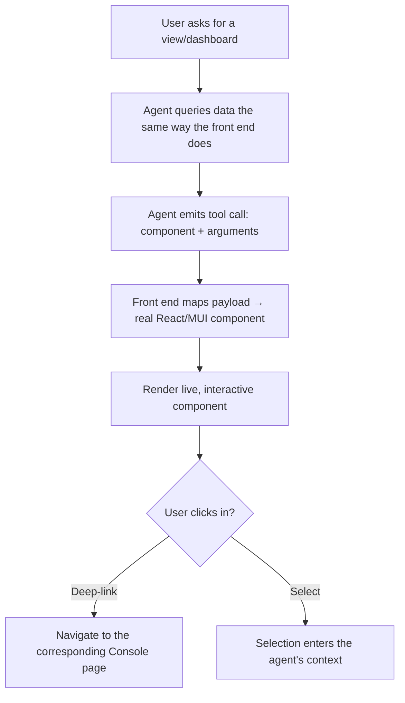

# TXN — Full Agentic: Generative UI Rendering

> **Component:** [[full-agentic-experience]] · **Vision:** [[vision]]
> **Date:** 2026-06-10
> **Status:** Defined
> **Owner:** _TBC_
> **Sources:** [[29-05-2026-stackworkz-meeting]] (AG-UI design ~00:16–00:25), [[05-06-2026-component-4-full-agentic-experience]] (generative UI, render-to-select)

---

## 1. What Does This Sub-Component Do?

**Functional purpose:**

Generative UI Rendering is the mechanism that makes the agent the *interface* rather than a chatbot. When the user asks for a view ("show me my 10 recent card transactions", "compile me a dashboard"), the agent **renders real, interactive UI in real time** — not a screenshot or a PDF, but the **same React / Material UI components the rest of the Console is built from**, with identical look, feel, and behaviour. The proposed mechanism (the **AG-UI** library): the agent emits a **tool call whose arguments describe a component to render**; the front end receives that payload and renders the component — the payload carries **arguments, not code**. Underneath, the agent queries data **the same way the front end would** (e.g. user ID + date range → the same API call), so the rendered result is **consistent with the click-through view**.

The output is **live and clickable**: a transactions view can be clicked into and can **deep-link the user into the corresponding Console page**. It can also **render selectable components** — e.g. the user's card programs as clickable cards — so the user picks by clicking instead of supplying an ID, and the click becomes a selection the agent adds to its context.

The hard, open problem (Corneil, Stackworkz): unlike a coding agent that "starts from nothing and knows where it's going," this agent **"starts with all the data but doesn't know where it's going"** — so **bounding what it may compose** is core design work. This was called the **most complicated** piece of the AI work (Ruan, Stackworkz).

**Entities that interact with it:**

- **Agent** — emits the render payload (component + arguments).
- **User** — interacts with the live rendered UI.

---

## 2. What Needs to Happen?

**Functional requirements:**

- The agent renders by issuing a **tool call with arguments** that the front end maps to a **real component** from the Console's existing library (Stackworkz / Super Ultra), not a picture.
- Rendered components are **interactive**: clickable, and able to **deep-link** into the corresponding Console page.
- The agent can **render selectable components** (e.g. card programs) so the user clicks rather than typing an ID; the selection enters the agent's context.
- The agent **queries data the same way the front end does**, so the rendered output is **consistent** with the click-through view.
- The space of what the agent may compose is **bounded** (guard rails for open-ended generation).

**Business rules:**

- **Render real components, not images** — reuse the Console library; visually/behaviourally identical.
- **Consistency with the Console** — same data path, same component; the agentic view never diverges from the click-through view.
- Payloads carry **arguments, not executable code**.

**Edge cases:**

- **Open-ended composition** — the agent has all the data and no fixed destination → bound what it can assemble.
- **Stale/inconsistent data** between a (persisted) view and live state — flag freshness (see [[session-persistence]]).
- Component not in the library → fall back / request the nearest available component.

---

## 3. Entity Journeys

### 3a. Isolated Journeys

#### Journey 1: Render a live view from a natural-language request

**Entity:** Agent + user (hybrid)

**Input:** The user asks for a view or dashboard in the conversational interface.

**Outcome:** A live, interactive component appears, consistent with what the user would see by navigating the Console manually.

**Steps:**

**Acceptance criteria:**

- [ ] The agent renders real Console components (not screenshots/PDFs), visually and behaviourally identical to the Console.
- [ ] The render payload carries arguments, not code.
- [ ] Rendered components are interactive and can deep-link into the corresponding Console page.
- [ ] The agent can render selectable components; a click becomes a selection in context.
- [ ] The rendered output matches the click-through view (same data path).
- [ ] The agent's composition space is bounded (no unbounded generation).

---

## 4. Look and Feel (Optional)

Indistinguishable from the rest of the Console — the whole point is that a generated view looks and behaves like a navigated one. Borrows the Stackworkz/Super Ultra component library, lightly adapted to fit the chat surface.

---

## 5. Data Requirements

| What | Direction | Description | Source / Destination |
|------|-----------|------------|---------------------|
| Program / card / transaction data | In | Queried the way the front end queries it | DT Core API + Stackworkz BFF (via [[agent-access-layer]]) |
| Component-render payload | Out | Tool call carrying component + arguments | Agent → front end |
| Component library handle | In | Address the real components to render | Stackworkz / Super Ultra library |
| User selections | In | Clicks on rendered selectable components | Front end → agent context |

---

## 6. Dependencies

| Depends on | What we need | Blocking? |
|-----------|-------------|----------|
| AG-UI library | The agent↔UI rendering protocol | No — adopt the library |
| Stackworkz component library | Real React/MUI components to render | No — can mock with raw MUI for a POC |
| [[agent-access-layer]] | Permission-scoped data the same way the FE queries it | **Yes** |
| DT Core API + Stackworkz BFF | The data behind rendered views | Partial — POC can fake data |

**What siblings/other components need from this one:**
- [[conversational-interface]] hosts what this renders; [[session-persistence]] re-renders persisted views via this pipeline.

---

## 7. Risks

**Specific risks:**
- **Open-ended composition** — unbounded generation (the flagged hard problem).
- **Divergence** — the agentic view drifting from the click-through view.
- **Stale data** in a rendered/persisted view.

**Controls to build into the journeys:**
- **Bound the composition space**; render from the **same data path** as the FE; **freshness** indicators on persisted views.

---

## 8. Priority

**Must-have at launch?** Yes — it's the defining capability of the component (and the most complex). 

**Sequencing rationale:** Buildable early against a mock API + raw MUI; swap in the real Stackworkz components when ready.

---

## Sub-Sub-Components

Leaf node — no further decomposition needed.
