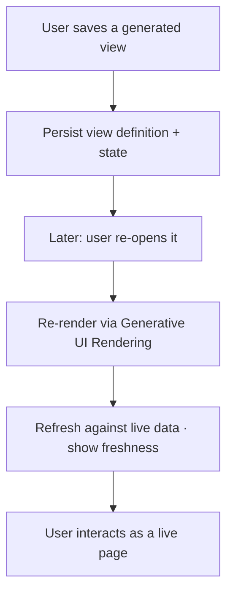
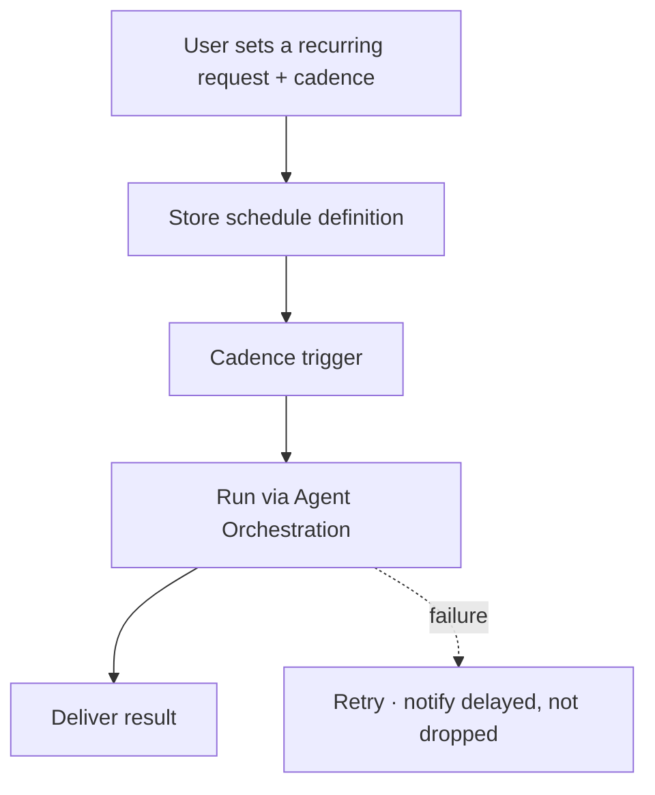

# TXN — Full Agentic: Session Persistence

> **Component:** [[full-agentic-experience]] · **Vision:** [[vision]]
> **Date:** 2026-06-10
> **Status:** Defined
> **Owner:** _TBC_
> **Sources:** [[05-06-2026-component-4-full-agentic-experience]] (persistent views, scheduled tasks), [[29-05-2026-stackworkz-meeting]]

---

## 1. What Does This Sub-Component Do?

**Functional purpose:**

Session Persistence makes the agentic experience **continuous, not throwaway**. A view the agent generates — a dashboard, a transactions panel — **persists**, and the user can come back later and **re-open it as a fully rendered page**, refreshed against live data. It also holds the **scheduled / recurring task definitions** from the co-work mode ("give me a report every Monday of transactions grouped by declined/accepted…"). The promise is simple: *come back tomorrow, the dashboard is still there.*

It re-renders persisted views through the same [[generative-ui-rendering]] pipeline (so a saved view is a real component, not a snapshot), and a recurring task re-runs through [[agent-orchestration]] on its cadence. **Where the persisted state and schedules live is an open question** (store TBC).

**Entities that interact with it:**

- **User** — saves a view, revisits it, sets a cadence.
- **Agent** — persists, re-renders, and runs scheduled tasks.

---

## 2. What Needs to Happen?

**Functional requirements:**

- **Persist a rendered view** so the user can re-open it later as a fully rendered (not static) page.
- **Refresh** a re-opened view against **live data**, with a **freshness** indication.
- Store **scheduled / recurring task definitions** (cadence, parameters) and **run them on schedule**, delivering the result.
- Tie persisted views and schedules to the **user** and their permissions.

**Business rules:**

- **Persistent, not one-shot** — generated views are revisitable.
- **Live on re-open** — a re-opened view reflects current state (or clearly marks staleness).
- Scoped to the user's permissions on every re-run.

**Edge cases:**

- **Stale persisted view vs live state** — a saved dashboard showing old numbers (flag/refresh on open).
- A scheduled run fails → retry; tell the user it's delayed, don't silently drop it (shared discipline with [[scheduled-reporting]]).
- A persisted view references data the user no longer has permission for → re-scope on re-open.

---

## 3. Entity Journeys

### 3a. Isolated Journeys

#### Journey 1: Save and revisit a rendered view

**Entity:** User + agent (hybrid)

**Input:** The user has a generated dashboard they want to keep.

**Outcome:** They return later and re-open it as a live rendered page, refreshed against current data.

**Steps:**

**Acceptance criteria:**

- [ ] A generated view can be saved and re-opened later as a fully rendered page (not a snapshot).
- [ ] A re-opened view refreshes against live data and indicates freshness.
- [ ] Persisted views are scoped to the user's current permissions on re-open.

#### Journey 2: Define and run a recurring task

**Entity:** User + scheduled agent (hybrid)

**Input:** The user asks for a recurring output ("every Monday…").

**Outcome:** The task runs on its cadence and delivers, without the user re-asking.

**Steps:**

**Acceptance criteria:**

- [ ] A recurring task definition (cadence + parameters) is stored and runs on schedule.
- [ ] Results are delivered each run; a failed run is retried and surfaced (not silently dropped).
- [ ] Each run is permission-scoped.

---

## 4. Look and Feel (Optional)

A simple "saved views" / "scheduled tasks" notion within the agentic surface — re-opening a view feels like opening a live page, not viewing history.

---

## 5. Data Requirements

| What | Direction | Description | Source / Destination |
|------|-----------|------------|---------------------|
| Persisted view definition + state | Stored | Enough to re-render the view | _Store TBC_ |
| Schedule definition | Stored | Cadence + parameters for a recurring task | _Store TBC_ |
| Live data (on re-open / run) | In | To refresh the view / produce the run | via [[agent-access-layer]] |
| Delivered result | Out | The refreshed view / scheduled output | User / channel |

---

## 6. Dependencies

| Depends on | What we need | Blocking? |
|-----------|-------------|----------|
| Persistence store | Where views + schedules live (**open question**) | **Yes** |
| [[generative-ui-rendering]] | To re-render a persisted view as a live component | **Yes** |
| [[agent-orchestration]] | To run a scheduled task | **Yes** |
| [[agent-access-layer]] | Permission-scoped data on re-open/run | **Yes** |

**What siblings/other components need from this one:**
- Overlaps the [[scheduled-reporting]] sub-component of [[agent-inbox-alerts]] (recurring outputs) — coordinate so they share the scheduling/delivery pattern rather than duplicate it.

---

## 7. Risks

**Specific risks:**
- **Stale persisted view** diverging from live state.
- **Storage** of rendered state — where and how (unresolved).

**Controls to build into the journeys:**
- **Refresh-on-open + freshness indicators**; re-scope permissions on re-open; retry + notify on scheduled-run failure.

---

## 8. Priority

**Must-have at launch?** Valuable but secondary to the live experience; the persistence **store is an open question** to resolve first.

**Sequencing rationale:** Builds on [[generative-ui-rendering]] + [[agent-orchestration]]; gated on the store decision. Coordinate with [[scheduled-reporting]].

---

## Sub-Sub-Components

Leaf node — no further decomposition needed.
