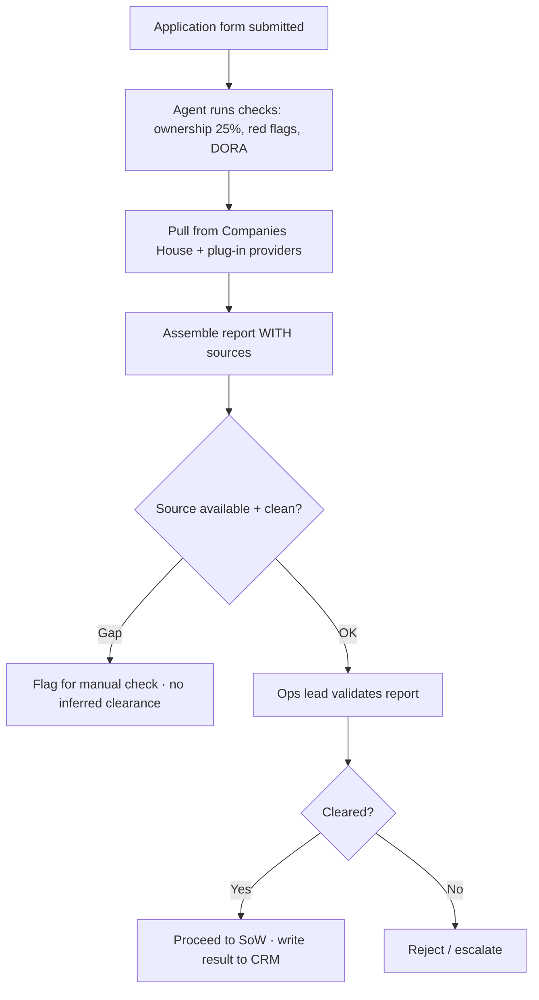
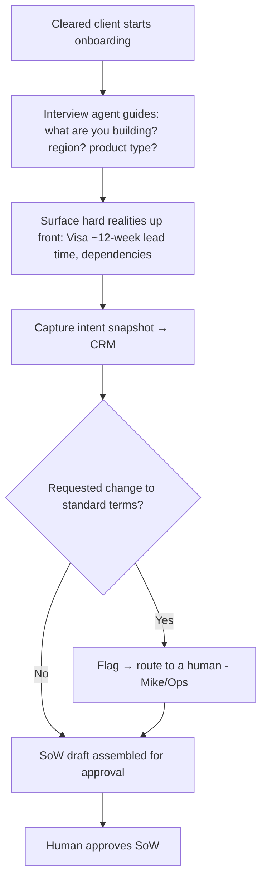
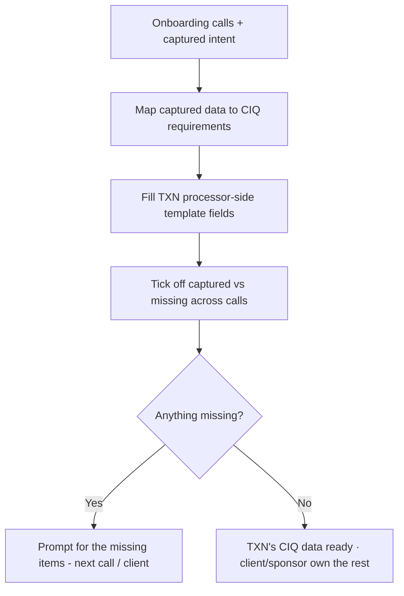
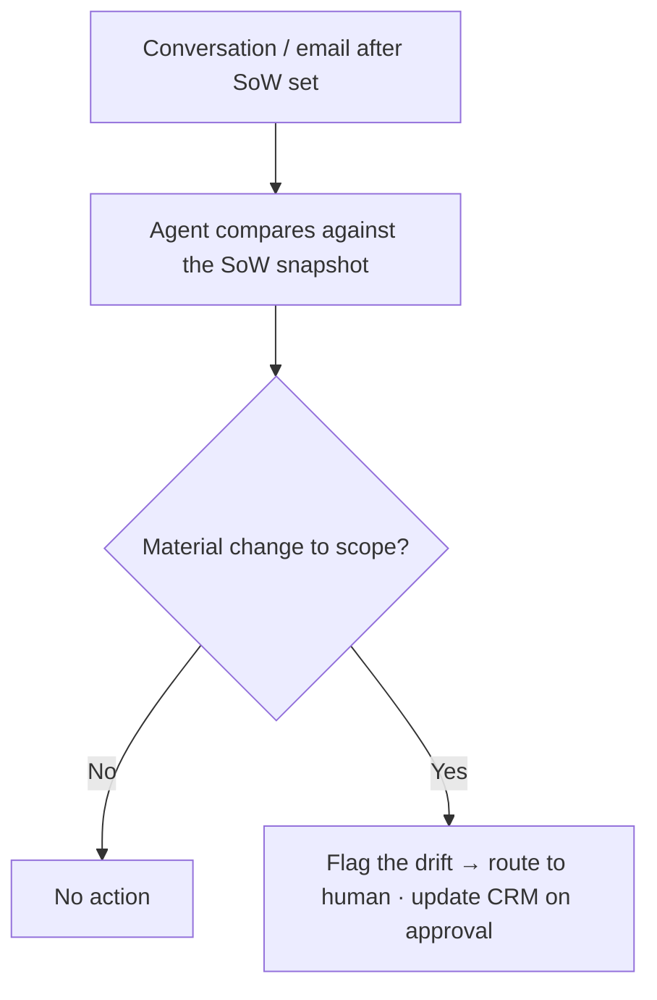

# TXN — Internal Ops: Customer Onboarding

> **Component:** [[internal-ops-agents]] · **Vision:** [[vision]]
> **Date:** 2026-06-10
> **Status:** Defined
> **Owner:** _TBC_
> **Sources:** [[10-06-2026-developer-support-and-internal-ops]] (onboarding workstream, due diligence, SoW/CIQ, CRM-as-record)

---

## 1. What Does This Sub-Component Do?

**Functional purpose:**

Customer Onboarding is the agentic pipeline that takes a client **from the moment they commit to being live** — and it's the **first internal-ops build target** (Ian: park go-to-market; start here; keep the scope thin). It exists to defend the core thesis: **internal headcount, especially Customer Success Managers, must not scale linearly with clients.** Today the work is manual and labour-intensive — due-diligence checks, statements of work, kick-off calls, CIQ form-filling, project plans — and Ian's blunt aim is to *"eradicate the need for human intervention"* in everything except approving and being on the calls.

The pipeline runs in stages:

```
Customer Onboarding
├── Due diligence      application form → research (Companies House, DORA, 25% ownership, red flags) → sourced report → human validate
├── SoW + intent       onboarding-interview agent captures what the client is building (a snapshot) + surfaces real timelines
├── Scheme project     raise the scheme project; triparty if unregulated; scope with the scheme; BIN phase
├── CIQ assembly       capture + tick off what Visa needs; TXN provides its processor-side data via a template
├── Project plan       realistic dates anchored on real lead times (Visa ~12 weeks)
└── SoW-drift watch    a change agreed off-record that affects the SoW is auto-flagged
```

Two principles run through all of it. **No human bottleneck:** assume a specific person (especially Mike) is *not* required on a call — whoever is on it answers almost any question via AI; if the AI can't, that's a documentation gap to fix, not a reason to fetch "another Mike." **CRM is the source of truth:** everything captured lands in **Freshsales** (the system of record — see [[architecture]]); the Console receives the data it needs *sent* to it, rather than context being split across systems or trapped in flat documents.

**Entities that interact with it:**

- **Client** (onboarding) — submits the application form; is guided by the onboarding-interview agent; provides CIQ inputs.
- **Operations lead (Dorte)** — owns the gates (due diligence, legal/contract); approves; defines what's required.
- **Customer Success Manager** — the role this keeps flat against client growth; approves drafts, relates to the client, isn't the administrator.
- **TXN CTO (Mike)** — ideally not required on calls; only genuine exceptions routed to him.
- **Internal agents** — due-diligence research, interview, CIQ assembly, drift detection — all human-approved.

> **Note — candidate for further decomposition.** Each stage (due diligence, SoW, scheme/CIQ, project plan) is close to a buildable unit of its own; see Sub-Sub-Components. The journeys below are defined at this level so the stage docs can be specced next.

---

## 2. What Needs to Happen?

**Functional requirements:**

- **Due diligence** triggered by the **application form**: research ownership (25% threshold), negative press / red flags, DORA-driven checks via **Companies House** + plug-in data providers; produce a **report with sources** for human validation (light-to-detailed by customer).
- **SoW + intent capture** via an **onboarding-interview agent**: capture what the client is building as a **snapshot** (keeps them accountable — "customers want more, deliver less"), surface the hard realities up front (Visa ~12-week lead time), and **flag any requested change to standard terms** to a human.
- **Scheme project** — raise it for implementation; handle the **triparty** case (an unregulated customer needs a third-party scheme member); scope with the scheme; manage the **BIN phase**.
- **CIQ assembly** — know what goes into the Visa **CIQ**; **tick off what's been captured vs still missing** across the calls; provide the **processor-side data TXN is responsible for** from a **template** (fixed settings + the few changeable fields). TXN does **not** complete the whole CIQ.
- **Project plan** — realistic dates anchored on real lead times.
- **SoW-drift detection** — a change agreed in any conversation (even one Mike wasn't on) that affects the SoW is **automatically identified and flagged**.
- Everything writes to the **CRM** as the source of truth; only the data the Console needs is sent on.

**Business rules:**

- **Human approves; AI does the work** — reports, SoWs, CIQ data are drafted by AI and approved by a human; never auto-submitted.
- **No human bottleneck** — onboarding proceeds without a specific named person; exceptions are captured (by the notetaker) and routed.
- **CRM is the single source of truth**; flat documents are avoided.
- **Trends, not one-offs** — clients build differently; don't generalise one client's pattern.
- Due-diligence clearances are **sourced and never fabricated**.

**Edge cases:**

- Client builds in the platform without sharing intent → TXN knows *what* but not *why*; the interview/SoW exists to capture intent so TXN can guide them.
- A due-diligence data source is unavailable → flag for manual check; do not infer a clearance.
- A change is agreed in a call nobody logged → drift detection + notetaker capture catch it.
- CIQ ambiguity over who owns what → TXN provides its data only; the rest is client/sponsor.

---

## 3. Entity Journeys

### 3a. Isolated Journeys

#### Journey 1: Due diligence from the application form

**Entity:** Internal DD agent + Operations lead (hybrid)

**Input:** A prospective client submits the application form.

**Outcome:** A sourced due-diligence report is ready for human validation, and the customer is cleared (or flagged) to proceed to SoW.

**Steps:**



**Acceptance criteria:**

- [ ] Submission of the application form triggers the due-diligence checks.
- [ ] The report covers ownership (25% threshold), red flags / negative press, and DORA-relevant checks.
- [ ] Every finding cites its source; an unavailable source is flagged for manual check, never inferred.
- [ ] A human validates before the customer proceeds.
- [ ] The outcome is written to the CRM.

#### Journey 2: Capture intent &amp; SoW via the onboarding-interview agent

**Entity:** Client + onboarding-interview agent (hybrid)

**Input:** A cleared client begins onboarding.

**Outcome:** The client's intended build is captured as a snapshot in the CRM, real timelines are set, and any standard-term change is flagged.

**Steps:**



**Acceptance criteria:**

- [ ] The client is guided by an interview, not a bare form.
- [ ] Real timelines/dependencies (e.g. Visa 12 weeks) are surfaced up front.
- [ ] The intended build is captured as a snapshot in the CRM (basis for accountability + drift detection).
- [ ] A requested change to standard terms is flagged and routed to a human.
- [ ] The SoW is human-approved before it stands.

#### Journey 3: CIQ assembly (capture &amp; tick-off)

**Entity:** CIQ agent + Operations lead (hybrid)

**Input:** SoW agreed; onboarding calls in progress.

**Outcome:** TXN's processor-side CIQ data is assembled from a template, and the team can see what's captured vs still missing for Visa.

**Steps:**



**Acceptance criteria:**

- [ ] The agent tracks what the Visa CIQ needs and shows captured vs missing.
- [ ] TXN's processor-side fields are populated from a template (fixed settings + the changeable few).
- [ ] TXN provides its data only — it does not complete or own the whole CIQ document.
- [ ] Missing items are surfaced for the next call / the client.

#### Journey 4: SoW-drift detection

**Entity:** Drift-watch agent → human

**Input:** Any onboarding conversation/email after the SoW is set.

**Outcome:** A change that affects the SoW is flagged automatically, so TXN never builds the wrong thing.

**Steps:**



**Acceptance criteria:**

- [ ] A change agreed in any logged interaction (incl. ones Mike wasn't on) is compared against the SoW snapshot.
- [ ] A material scope change is flagged and routed for human confirmation.
- [ ] On confirmation, the SoW snapshot in the CRM is updated.

### 3b. Cross-Component Journeys

#### Journey 1: CRM as source of truth → Console gets what it needs

**Entity:** Onboarding agents → CRM → Console

**Input:** Onboarding data captured across the stages.

**Handoff point:** All client context is written to **Freshsales** (the source of truth); only the subset the Console needs to set up the client is **sent** to it (not written directly). The card scheme receives the CIQ data for the BIN/setup.

**Components involved:** Internal Ops → CRM (Freshsales) → Console / Core API ([[agent-access-layer]]); → Visa (CIQ)

**Outcome:** One coherent client record; the Console and schemes get exactly the data they need without splitting context.

**Acceptance criteria:**

- [ ] Client context lives in the CRM; the Console receives a sent subset, not a direct write.
- [ ] No data item is split such that a human must flick between systems to answer a question.
- [ ] CIQ data flows to the scheme; TXN's portion is attributable and auditable.

---

## 4. Look and Feel (Optional)

For **clients**: a guided **conversational onboarding** that feels supportive, not a form — surfacing what's needed and the real timelines. For **TXN staff**: clean **review queues** (DD report + sources, SoW draft, CIQ captured-vs-missing) accessed through the agentic experience + Teams (not Console admin UI — see [[architecture]]). A **shared form view** can show, per field, provenance (AI / client / TXN) and status (under review / approved); client-entered fields are treated as approved/locked.

---

## 5. Data Requirements

| What | Direction | Description | Source / Destination |
|------|-----------|------------|---------------------|
| Application form | In | Triggers due diligence | Client submission |
| Due-diligence sources | In | Ownership, red flags, DORA | Companies House + plug-in providers |
| Intent / SoW snapshot | In / Stored | What the client is building | Interview agent → CRM |
| CIQ data items | In / Out | TXN processor-side template + client inputs | CRM → Visa CIQ |
| Conversation / email record | In | Basis for drift detection + capture | Meetings ([[meeting-capture-analysis]]) + email |
| Project plan + lead times | Stored | Realistic dates (Visa ~12 weeks) | CRM |
| Client record (system of record) | Stored | All client context | Freshsales CRM |

---

## 6. Dependencies

| Depends on | What we need | Blocking? |
|-----------|-------------|----------|
| **Freshsales CRM** | The system of record + API to read/write client context | **Yes** |
| [[meeting-capture-analysis]] (sibling) | Notetaker + meeting analysis that feeds intent/SoW + drift | **Yes** |
| Companies House + DD data providers | Sources for due-diligence checks | No — incremental |
| Card scheme (Visa) | CIQ structure, BIN phase, lead times | No — known externally |
| [[agent-access-layer]] | Tools + audit; the sent-subset into the Console | **Yes** |
| [[developer-support]] | Technical onboarding (the other half — credentials/environments) | No — parallel track |

**What siblings/other components need from this one:**
- It produces the structured client record the rest of TXN operates from; technical onboarding ([[developer-support]]) runs alongside it.

---

## 7. Risks

**Specific risks:**

- **SoW drift** — an off-record change leaving TXN building the wrong thing.
- **CIQ responsibility confusion** — over-reaching into the client/sponsor's part of the document.
- **Due-diligence accuracy / DORA compliance** — a wrong or unsourced clearance.
- **Unrealistic dates** — committing to timelines that ignore real lead times.
- **Human bottleneck creeping back** — onboarding stalling because a specific person is needed.

**Controls to build into the journeys:**

- **Drift detection** + the SoW snapshot; **CIQ scope limited** to TXN's data; **sourced DD** with manual fallback (never fabricate); surface **real lead times** in the interview; **no-named-person** dependency with exception capture; human-approval gates on every output.

---

## 8. Priority

**Must-have at launch?** Yes — Ian named it the **first internal-ops build target** (the first thing after a client commits), and it directly defends the "headcount doesn't scale with clients" thesis.

**Sequencing rationale:** Depends on the Freshsales CRM integration and the [[meeting-capture-analysis]] sibling; due diligence + the interview/SoW capture are the earliest slices. Reconciliation and full process-automation are later.

---

## Sub-Sub-Components

_This sub-component is large enough to decompose further — each stage is close to an independently buildable unit. Candidates (to spec next):_

| Sub-Sub-Component | Overview | Status | Link |
|------------------|----------|--------|------|
| Due diligence | Application-form-triggered, sourced checks → validated report | Defined | [[due-diligence]] |
| SoW &amp; intent capture | Onboarding-interview agent; intent snapshot; drift detection | Defined | [[sow-intent-capture]] |
| Scheme &amp; CIQ | Scheme project, triparty/BIN, CIQ data assembly | Defined | [[scheme-and-ciq]] |
| Project plan | Realistic dates anchored on real lead times | Defined | [[project-plan]] |
