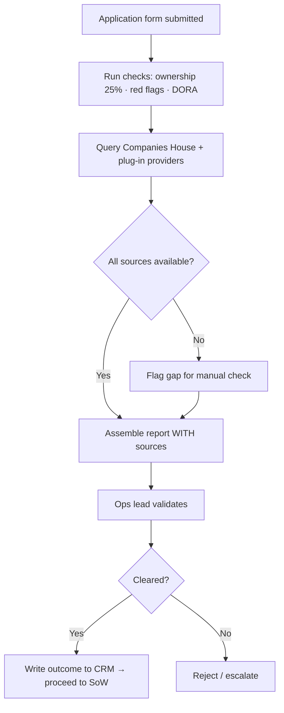

# TXN — Onboarding: Due Diligence

> **Sub-component:** [[customer-onboarding]] · **Component:** [[internal-ops-agents]] · **Vision:** [[vision]]
> **Date:** 2026-06-10
> **Status:** Defined
> **Owner:** _TBC_
> **Sources:** [[10-06-2026-developer-support-and-internal-ops]] (Dorte — due-diligence gate)

---

## 1. What Does This Sub-Sub-Component Do?

**Functional purpose:**

Due Diligence is the **first gate** of onboarding — the checks TXN runs on a prospective client before any Statement of Work. Today it's manual and labour-intensive (Dorte); the aim is an agent that, on **application-form submission**, researches the customer and produces a **report with its sources** for a human to validate. Dorte is still defining exactly *what* the due diligence must cover, but the shape is clear: **ownership (the 25% threshold), negative press / red flags, and DORA-driven checks**, drawn from sources like **Companies House** plus plug-in data providers (some checks need a paid plug-in). It runs **light-to-detailed** depending on the customer.

**Entities that interact with it:**

- **Due-diligence agent** — runs the checks, assembles the sourced report.
- **Operations lead (Dorte)** — owns the gate, defines the requirements, validates the report.
- **Prospective client** — supplies the application form.

---

## 2. What Needs to Happen?

**Functional requirements:**

- Submission of the **application form** triggers the checks.
- Research **ownership (25% threshold)**, **negative press / red flags**, and **DORA**-relevant items.
- Pull from **Companies House** and **plug-in data providers**; assemble a report that **cites every source**.
- Run **light-to-detailed** per customer risk.
- A human **validates** before the client proceeds; the outcome is written to the **CRM**.

**Business rules:**

- **Sourced, never fabricated** — an unavailable source is flagged for manual check, not inferred into a clearance.
- **Human validates** the report before progression.
- Outcome recorded in the **CRM** ([[architecture]]).

**Edge cases:**

- Data source unavailable / rate-limited → flag for manual check.
- Ambiguous negative-press hit → surface to the human with the source, don't auto-reject.
- DD requirement still being defined (Dorte) → the check set must be configurable, not hard-coded.

---

## 3. Entity Journeys

### 3a. Isolated Journeys

#### Journey 1: Run due diligence from the application form

**Entity:** Due-diligence agent + Operations lead (hybrid)

**Input:** A prospective client submits the application form.

**Outcome:** A sourced report is validated; the client is cleared, flagged, or rejected.

**Steps:**

**Acceptance criteria:**

- [ ] The application form triggers the checks automatically.
- [ ] The report covers ownership (25%), red flags / negative press, and DORA items.
- [ ] Every finding cites a source; gaps are flagged for manual check, never inferred.
- [ ] The check set is configurable (the DD definition is still evolving).
- [ ] A human validates before the client proceeds; the outcome lands in the CRM.

---

## 4. Look and Feel (Optional)

A staff **review surface** (via the agentic experience): the report with each finding linked to its source, and a clear validate / flag / reject action.

---

## 5. Data Requirements

| What | Direction | Description | Source / Destination |
|------|-----------|------------|---------------------|
| Application form | In | The trigger + applicant details | Client submission |
| Company / ownership data | In | Ownership structure, officers | Companies House |
| Risk / press / sanctions data | In | Red flags, negative press, DORA inputs | Plug-in data providers |
| Due-diligence report | Out / Stored | Findings with sources + outcome | → CRM |

---

## 6. Dependencies

| Depends on | What we need | Blocking? |
|-----------|-------------|----------|
| Companies House API | Ownership/company data | **Yes** |
| Plug-in DD providers | Red-flag / sanctions / press checks | No — incremental |
| **Freshsales CRM** | Record the outcome | **Yes** |
| DD requirement definition (Dorte) | The authoritative check set | **Yes** — still being defined |

**What siblings/other components need from this one:**
- A cleared outcome is the precondition for [[sow-intent-capture]].

---

## 7. Risks

**Specific risks:**

- **Wrong / unsourced clearance** — a compliance failure.
- **DORA non-compliance** — missing a required check.
- **Stale or unavailable sources** producing a false picture.

**Controls to build into the journeys:**

- **Sourced findings + manual fallback** (never fabricate); **human validation** gate; **configurable check set**; audit of the outcome.

---

## 8. Priority

**Must-have at launch?** Yes — it's the first gate; nothing proceeds without it. Blocked partly on Dorte finalising the DD requirements.

**Sequencing rationale:** Build first among the onboarding stages; depends on Companies House + the agreed check set.

---

## Sub-Sub-Sub-Components

Leaf node — no further decomposition needed.
