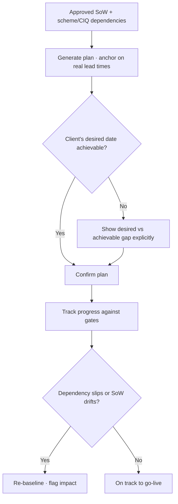

# TXN — Onboarding: Project Plan

> **Sub-component:** [[customer-onboarding]] · **Component:** [[internal-ops-agents]] · **Vision:** [[vision]]
> **Date:** 2026-06-10
> **Status:** Defined
> **Owner:** _TBC_
> **Sources:** [[10-06-2026-developer-support-and-internal-ops]] (project plan, realistic lead times)

---

## 1. What Does This Sub-Sub-Component Do?

**Functional purpose:**

The Project Plan turns the agreed scope into a **realistic, dated path to go-live** — and its whole job is to anchor on **reality** rather than wishful dates. Ian's framing: these plans are *"typically littered with unrealistic dates… 'When do you want to go live?' 'Tomorrow.' 'Yeah, but the lead time with Visa is 12 weeks.'"* The plan is built from the SoW + the scheme/CIQ dependencies, with milestones anchored on **real lead times** (the ~12-week Visa lead time being the obvious one), and it tracks progress against the onboarding gates so slippage and expectation-gaps are visible early.

**Entities that interact with it:**

- **Planning agent** — generates the plan from the SoW + scheme dependencies.
- **CSM** — owns the plan + the client relationship.
- **Client** — sees realistic timelines and dependencies.

---

## 2. What Needs to Happen?

**Functional requirements:**

- Generate a **project plan** from the SoW + the [[scheme-and-ciq]] dependencies.
- **Anchor milestones on real lead times** (e.g. Visa ~12 weeks), not the client's desired date.
- **Surface unrealistic expectations** explicitly (desired vs achievable).
- **Track progress against the onboarding gates**; update the plan as scope drifts ([[sow-intent-capture]]) or dependencies move.

**Business rules:**

- **Reality over wishful dates** — never commit to a date that ignores a known lead time.
- Plan lives in / is sent from the **CRM**; stays in sync with the SoW snapshot and scheme status.

**Edge cases:**

- Client insists on an impossible date → plan shows the gap explicitly (desired vs achievable) rather than absorbing it.
- A scheme/CIQ dependency slips → plan re-baselines and flags the impact.
- SoW drift changes scope → plan updates from the snapshot.

---

## 3. Entity Journeys

### 3a. Isolated Journeys

#### Journey 1: Build and track a realistic plan

**Entity:** Planning agent + CSM (hybrid)

**Input:** An approved SoW + the scheme/CIQ dependencies.

**Outcome:** A dated, realistic plan the client understands, tracked against the gates to go-live.

**Steps:**

**Acceptance criteria:**

- [ ] The plan is generated from the SoW + scheme/CIQ dependencies.
- [ ] Milestones are anchored on real lead times (e.g. Visa ~12 weeks).
- [ ] An unrealistic desired date is shown as an explicit gap, not silently absorbed.
- [ ] Progress is tracked against the onboarding gates.
- [ ] The plan re-baselines and flags impact when a dependency slips or scope drifts.

---

## 4. Look and Feel (Optional)

A shared **plan view** (via the agentic experience / sent to the CRM) showing milestones, real lead times, gate status, and any desired-vs-achievable gap. Surfaced to the client in plain terms.

---

## 5. Data Requirements

| What | Direction | Description | Source / Destination |
|------|-----------|------------|---------------------|
| Approved SoW | In | Scope to plan against | [[sow-intent-capture]] |
| Scheme/CIQ lead times + dependencies | In | The real constraints | [[scheme-and-ciq]] |
| Desired go-live date | In | The client's target | Client |
| Project plan + status | Out / Stored | Milestones, gates, re-baselines | CRM |

---

## 6. Dependencies

| Depends on | What we need | Blocking? |
|-----------|-------------|----------|
| [[sow-intent-capture]] | The scope + the snapshot to track drift against | **Yes** |
| [[scheme-and-ciq]] | Real lead times + dependencies | **Yes** |
| **Freshsales CRM** | Hold + send the plan | **Yes** |

**What siblings/other components need from this one:**
- The plan is the visible go-live track for the CSM + client; closes out the onboarding pipeline.

---

## 7. Risks

**Specific risks:**

- **Unrealistic expectations** baked into commitments.
- **Dependency slippage** not reflected in the plan.
- **Plan-vs-reality drift** as scope changes.

**Controls to build into the journeys:**

- **Anchor on real lead times**; **show the desired-vs-achievable gap explicitly**; **re-baseline on slippage / drift**; keep in sync with the SoW snapshot + scheme status.

---

## 8. Priority

**Must-have at launch?** Useful but follows the earlier stages — there's no plan without a SoW + scheme dependencies. Lower priority than [[due-diligence]] and [[sow-intent-capture]].

**Sequencing rationale:** Last of the onboarding stages; depends on SoW + scheme/CIQ.

---

## Sub-Sub-Sub-Components

Leaf node — no further decomposition needed.
