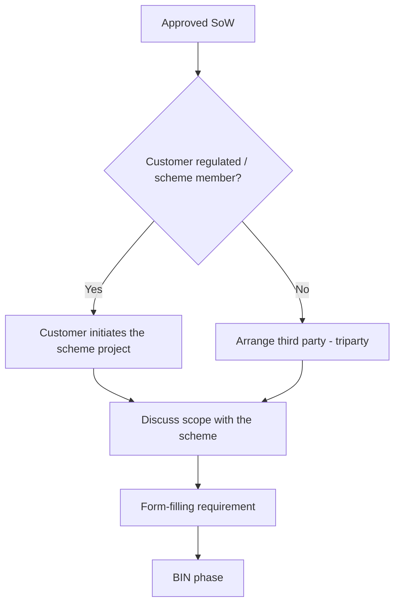
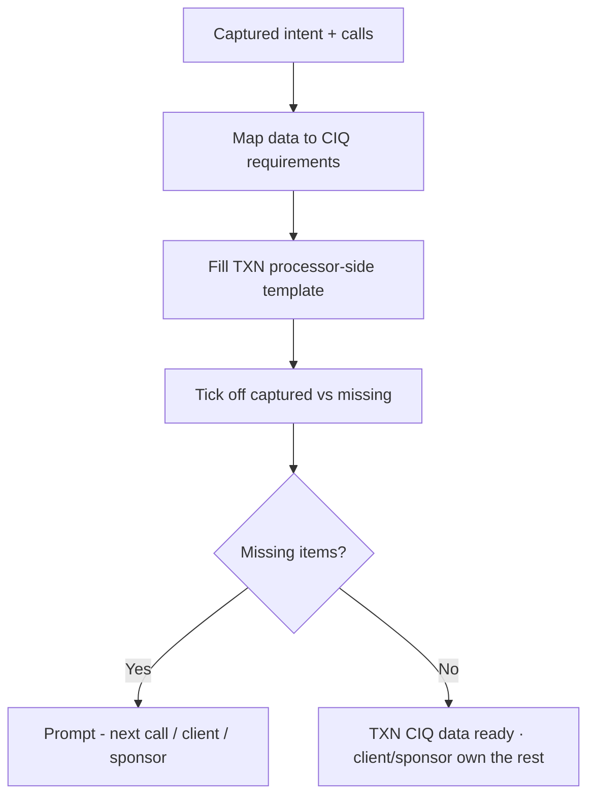

# TXN — Onboarding: Scheme &amp; CIQ

> **Sub-component:** [[customer-onboarding]] · **Component:** [[internal-ops-agents]] · **Vision:** [[vision]]
> **Date:** 2026-06-10
> **Status:** Defined
> **Owner:** _TBC_
> **Sources:** [[10-06-2026-developer-support-and-internal-ops]] (scheme project, triparty/BIN, CIQ boundary)

---

## 1. What Does This Sub-Sub-Component Do?

**Functional purpose:**

This stage takes an agreed SoW and gets the programme **registered with the card scheme** and the **Visa CIQ** populated with TXN's data. Two parts:

- **Scheme project** — raise the implementation project with the scheme. If the customer is **regulated** (a scheme member) they can initiate it themselves; if **not**, a **third party** (a scheme member) has to — a **triparty** arrangement. The scope is discussed with the scheme, then it's a **form-filling requirement** and the **BIN phase**.
- **CIQ** — the document Visa needs to configure its systems for the client. The boundary matters and the room aligned on it: **TXN provides the processor-side data it's responsible for and helps the client capture what they must supply — but TXN does *not* own or complete the whole CIQ.** The agent **knows what the CIQ needs** and **ticks off what's been captured vs still missing** across the onboarding calls, filling TXN's portion from a **template** (fixed settings + the few changeable fields).

**Entities that interact with it:**

- **CIQ / scheme agent** — maps captured data to CIQ requirements, fills TXN's template, tracks completeness.
- **Operations lead (Dorte)** — owns the processor-side template + validates.
- **Card scheme (Visa)** — receives the CIQ / scheme project.
- **Third-party scheme member** — for the triparty (unregulated) case.

---

## 2. What Needs to Happen?

**Functional requirements:**

- **Raise the scheme project**; handle the **regulated** (self-initiated) vs **unregulated** (**triparty**) cases; discuss scope with the scheme; manage the **BIN phase**.
- **Map captured onboarding data to CIQ requirements**; **fill TXN's processor-side template** (fixed + changeable fields); **tick off captured vs missing** across calls; **prompt for missing items**.
- Provide **TXN's data only**; the client/sponsor/program manager own their parts.

**Business rules:**

- **TXN does not complete or own the whole CIQ** — it supplies its processor-side data and helps capture the rest.
- **Template-driven** — a standard TXN settings template with a small set of changeable fields (and the reason for each change captured).
- Outputs recorded in the **CRM**; CIQ data is **attributable + auditable**.

**Edge cases:**

- Unregulated customer with no third party lined up → flag; the triparty must be arranged before the project can be raised.
- CIQ data still missing at submission time → block submission on TXN's portion; prompt for the gaps.
- Scheme lead time vs client's desired go-live → surfaced into the [[project-plan]].

---

## 3. Entity Journeys

### 3a. Isolated Journeys

#### Journey 1: Raise the scheme project

**Entity:** Scheme agent + Operations lead (hybrid)

**Input:** An approved SoW.

**Outcome:** The scheme project is raised correctly for the customer's regulatory status, scoped, and moved into the BIN phase.

**Steps:**

**Acceptance criteria:**

- [ ] The regulated vs unregulated (triparty) path is selected correctly.
- [ ] Scope is agreed with the scheme.
- [ ] The form-filling + BIN phase are tracked to completion.
- [ ] A missing third party (triparty) is flagged before the project is raised.

#### Journey 2: Assemble TXN's CIQ data (capture &amp; tick-off)

**Entity:** CIQ agent + Operations lead (hybrid)

**Input:** Onboarding calls + captured intent.

**Outcome:** TXN's processor-side CIQ data is ready; the team sees what's captured vs missing for Visa.

**Steps:**

**Acceptance criteria:**

- [ ] The agent tracks CIQ requirements and shows captured vs missing.
- [ ] TXN's processor-side fields are filled from a template, with the reason captured for any changeable field.
- [ ] TXN provides its data only — it does not complete/own the whole CIQ.
- [ ] Missing items are surfaced for the next call / the client / the sponsor.

### 3b. Cross-Component Journeys

#### Journey 1: CIQ data to Visa

**Entity:** CIQ agent → card scheme (Visa)

**Input:** TXN's completed processor-side CIQ data.

**Handoff point:** TXN's portion of the CIQ is provided to whoever submits to Visa (the client or their issuer/sponsor); TXN's data is attributable and auditable. TXN does not submit the whole document.

**Components involved:** Internal Ops → client/sponsor → Visa

**Outcome:** Visa can configure its systems for the programme.

**Acceptance criteria:**

- [ ] TXN's CIQ portion is handed off attributable + auditable.
- [ ] TXN does not submit or own the parts that belong to the client/sponsor.

---

## 4. Look and Feel (Optional)

A staff **CIQ tracker** (via the agentic experience): requirements with captured-vs-missing status, the TXN template fields, and prompts for gaps. No client-facing UI beyond requests for missing inputs.

---

## 5. Data Requirements

| What | Direction | Description | Source / Destination |
|------|-----------|------------|---------------------|
| Captured intent / SoW | In | Basis for CIQ mapping | [[sow-intent-capture]] |
| CIQ requirements | In | What Visa needs | Card scheme (Visa) |
| TXN processor-side template | In / Stored | Standard settings + changeable fields | TXN |
| Scheme project details / BIN | In / Out | Project + BIN status | Card scheme |
| TXN CIQ data | Out / Stored | TXN's portion, attributable | → client/sponsor → Visa; CRM |

---

## 6. Dependencies

| Depends on | What we need | Blocking? |
|-----------|-------------|----------|
| [[sow-intent-capture]] | The captured intent the CIQ maps from | **Yes** |
| Card scheme (Visa) | CIQ structure, scheme process, BIN, lead times | **Yes** (external) |
| Third-party scheme member | The triparty case (unregulated customer) | Conditional |
| **Freshsales CRM** | Record CIQ/scheme data | **Yes** |

**What siblings/other components need from this one:**
- Scheme lead times + BIN dependencies feed the [[project-plan]].

---

## 7. Risks

**Specific risks:**

- **CIQ responsibility confusion** — over-reaching into the client/sponsor's part.
- **Triparty coordination** — an unregulated customer without a scheme member.
- **BIN / scheme delays** vs client expectations.
- **Missing CIQ data** at submission.

**Controls to build into the journeys:**

- **Scope TXN to its data only**; **template + reason-for-change**; **captured-vs-missing tracking** with prompts; **flag triparty gaps early**; surface scheme lead times into the [[project-plan]].

---

## 8. Priority

**Must-have at launch?** Yes — without scheme registration + CIQ data, a programme can't go live. Externally gated by Visa's process.

**Sequencing rationale:** Follows [[sow-intent-capture]]; depends on the scheme's structure (external).

---

## Sub-Sub-Sub-Components

Leaf node — no further decomposition needed.
