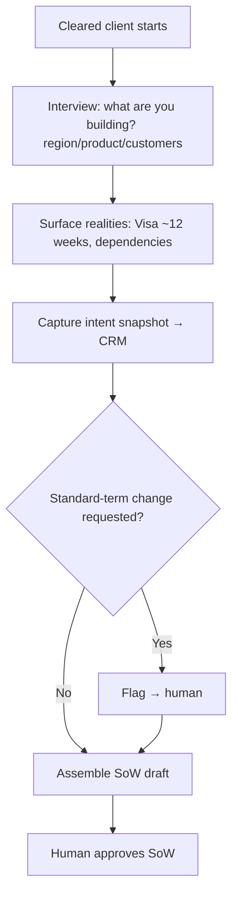
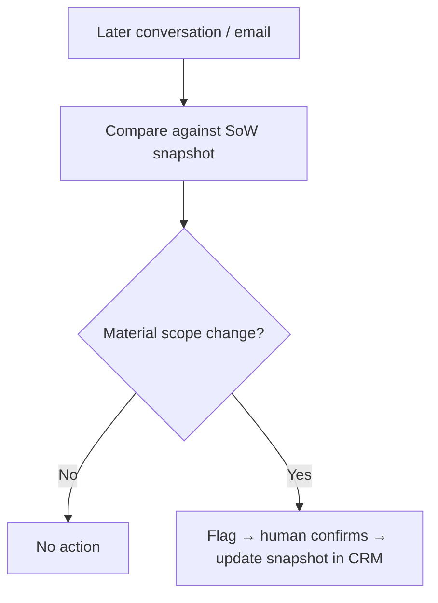

# TXN — Onboarding: SoW &amp; Intent Capture

> **Sub-component:** [[customer-onboarding]] · **Component:** [[internal-ops-agents]] · **Vision:** [[vision]]
> **Date:** 2026-06-10
> **Status:** Defined
> **Owner:** _TBC_
> **Sources:** [[10-06-2026-developer-support-and-internal-ops]] (onboarding-interview agent, intent snapshot, SoW-drift)

---

## 1. What Does This Sub-Sub-Component Do?

**Functional purpose:**

This is where TXN learns **what the client is actually trying to build** — and pins it down so everyone stays aligned. The platform is flexible (clients can build anything), which is exactly the risk: *"you could go off and build anything you like and give it to us and then we go — what is that? That's not what we were thinking"* (Ian). The **Statement of Work is the anchor** — the snapshot of intent that keeps the client accountable (*"customers want more, deliver less"*) and that everything downstream is grounded in.

An **onboarding-interview agent** (the content-workforce interview pattern Brett described) guides the client rather than handing them a form: it asks what they're building (region, product type, target customers), **surfaces the hard realities up front** (Visa's ~12-week lead time, dependencies), captures the **intent snapshot** into the CRM, and **flags any requested change to standard terms** to a human. Once the SoW stands, **drift detection** watches every later conversation — including ones Mike wasn't on — and flags a material scope change so TXN never quietly builds the wrong thing.

**Entities that interact with it:**

- **Client** — guided through the interview; provides intent.
- **Onboarding-interview agent** — captures intent, surfaces realities, flags term changes.
- **Drift-watch agent** — compares later interactions to the SoW snapshot.
- **CSM / Mike** — approve the SoW; receive flagged changes.

---

## 2. What Needs to Happen?

**Functional requirements:**

- A **guided interview** (not a bare form) captures the client's intended build as a **snapshot**.
- **Surface real timelines/dependencies up front** (Visa ~12 weeks).
- Write the **intent snapshot to the CRM**; assemble a **SoW draft** for human approval.
- **Flag requested changes to standard terms** to a human.
- **SoW-drift detection** — compare any later conversation/email against the snapshot; flag material scope changes; update the snapshot on approval.

**Business rules:**

- The **SoW is the single grounding artefact**; the snapshot lives in the **CRM**.
- **Human approves** the SoW and any drift-driven change.
- **Field provenance** preserved (agent- vs client- vs TXN-entered).

**Edge cases:**

- Client supplies partial intent / wants to do it across sessions → support resume; don't force one sitting.
- A change is agreed in a call no one logged → drift detection + [[meeting-capture-analysis]] capture it.
- Client requests a non-standard term → flag, don't silently accept.

---

## 3. Entity Journeys

### 3a. Isolated Journeys

#### Journey 1: Capture intent &amp; assemble the SoW

**Entity:** Client + onboarding-interview agent (hybrid)

**Input:** A cleared client begins onboarding.

**Outcome:** Intent is captured as a CRM snapshot, real timelines are set, term changes flagged, and a SoW is approved.

**Steps:**

**Acceptance criteria:**

- [ ] The client is guided by an interview, not a bare form, and can complete it across sessions.
- [ ] Real timelines/dependencies are surfaced up front.
- [ ] The intent snapshot is written to the CRM with field provenance.
- [ ] A requested standard-term change is flagged to a human.
- [ ] The SoW is human-approved before it stands.

#### Journey 2: SoW-drift detection

**Entity:** Drift-watch agent → human

**Input:** Any later conversation/email (incl. via [[meeting-capture-analysis]]).

**Outcome:** A material scope change is flagged before it causes the wrong build.

**Steps:**

**Acceptance criteria:**

- [ ] Later interactions (incl. ones Mike wasn't on) are compared to the SoW snapshot.
- [ ] A material change is flagged and routed for human confirmation.
- [ ] On confirmation, the CRM snapshot is updated.

---

## 4. Look and Feel (Optional)

For the client: a supportive **conversational interview**, resumable. For staff: a **SoW review** + a **drift alert** (via the agentic experience + Teams), each showing the captured/changed items with provenance.

---

## 5. Data Requirements

| What | Direction | Description | Source / Destination |
|------|-----------|------------|---------------------|
| Interview responses | In | The client's stated intent | Client |
| Intent / SoW snapshot | Stored | The grounding artefact | CRM |
| Conversation / email record | In | Basis for drift detection | [[meeting-capture-analysis]] + email |
| Term-change flags | Out | Non-standard requests | → human |
| Approved SoW | Stored | The signed-off scope | CRM |

---

## 6. Dependencies

| Depends on | What we need | Blocking? |
|-----------|-------------|----------|
| [[due-diligence]] | A cleared client (precondition) | **Yes** |
| [[meeting-capture-analysis]] | Conversations feeding intent + drift | **Yes** |
| **Freshsales CRM** | Store the snapshot/SoW | **Yes** |

**What siblings/other components need from this one:**
- The captured intent feeds [[scheme-and-ciq]] and the [[project-plan]].

---

## 7. Risks

**Specific risks:**

- **SoW drift** — the off-record change problem (the reason drift detection exists).
- **Wrong intent captured** — misreading what the client wants.
- **Drop-off** in a long interview.

**Controls to build into the journeys:**

- **Drift detection** vs the snapshot; **human approval** on SoW + changes; **resumable** interview; **provenance** on captured fields.

---

## 8. Priority

**Must-have at launch?** Yes — the SoW is the accountability anchor everything downstream grounds in.

**Sequencing rationale:** Follows [[due-diligence]]; needs [[meeting-capture-analysis]] + the CRM.

---

## Sub-Sub-Sub-Components

Leaf node — no further decomposition needed.
