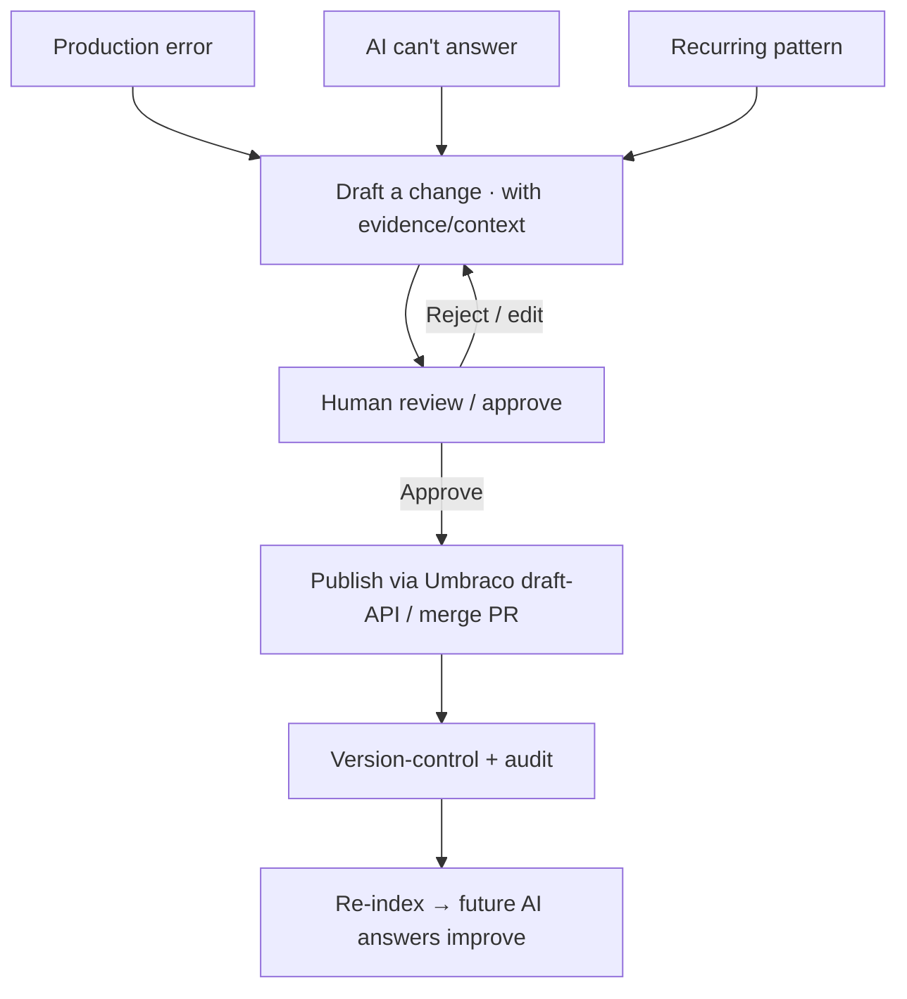

# TXN — Internal Ops: Knowledge Engine

> **Component:** [[internal-ops-agents]] · **Vision:** [[vision]]
> **Journey sources:** [[ux-ai-knowledge-learning|Knowledge Learning]], [[ux-ai-knowledge-base-updates|KB Updates]]
> **Date:** 2026-06-10
> **Status:** Defined
> **Owner:** _TBC_
> **Sources:** [[13-05-2026-txn-vision-meeting]] (self-healing docs), [[10-06-2026-developer-support-and-internal-ops]] (Umbraco draft-API, chat analysis + cron, divergent doc versions), [[ux-ai-knowledge-learning]] + [[ux-ai-knowledge-base-updates]] (the two halves of the loop)

---

## 1. What Does This Sub-Component Do?

**Functional purpose:**

The Knowledge Engine is the **self-improving documentation / knowledge-base loop** — and the heart of Internal Ops' day-one, no-transaction-data value. It closes the gap Mike named: *"the worst thing is you're answering questions but you might do the same question the next day — there's a gap in the documentation."* The engine keeps **one knowledge base** (the same corpus the [[co-pilot]] and Developer Portal answer from) continually improving from three inputs, all **human-approved, version-controlled, and re-indexed** so the *next* identical question is answered automatically — *"the next ticket of that shape never escalates."*

```
Knowledge Engine        (one KB · human-approved · version-controlled · re-indexed)
├── Self-healing docs    production error (Sentry) → navigate knowledge graph → open a PR
├── Reactive capture     AI can't answer → support case → human resolves → validated answer → KB
└── Proactive mining     recurring pattern / per-chat analysis → suggested article → approve → publish
```

Mike confirmed it's buildable on the chosen stack: **Umbraco supports edit-via-API in draft mode**, so the AI pushes proposed changes as drafts and a human approves before publish (and can preview in the Umbraco editor). The operating order is **documentation → AI → human**: documentation is the first line of defence, the AI the second, a human the last — and whatever the human resolves flows **back into both the AI and the documentation**. A design option raised by George: keep **divergent doc versions** — a tight, concise *user-facing* version and a more fleshed-out *agent-facing* version (they may turn out identical). And before launch, the engine is **cold-started** by the [[internal-ops-agents]] simulation & evaluation harness so day-zero isn't a blank, useless knowledge hub.

**Entities that interact with it:**

- **TXN Support Specialist** — the human in the loop; resolves escalations, approves suggested articles.
- **TXN Ops / Product Specialist** — reviews documentation accuracy.
- **TXN Dev / Release team** — reviews/merges self-healing PRs.
- **AI assistants** ([[co-pilot]], portal) — consume the improved KB; trigger reactive capture when they can't answer.
- **Client / developer** (indirect) — their unanswered question seeds the loop.

> **Decomposes further** into the three input mechanisms (below). The shared concerns — the KB store, the human-approval gate, version control + re-indexing — live here; the input-specific journeys live in the children.

---

## 2. What Needs to Happen?

**Functional requirements:**

- Maintain **one knowledge base** the AI answers from; updates from any of the three inputs go through the same gate.
- **Human approval on every change** — the AI proposes (drafts / PRs), a human approves before anything goes live.
- **Publish via Umbraco draft-API**; **version-control + audit** every change; **re-index** so future AI retrieval picks it up.
- **Trends, not one-offs** (Mike) — only generalise a genuine pattern, not one client's way of building.
- Optionally maintain **agent-facing vs user-facing** doc versions.
- **Cold-start** the KB pre-launch via the [[internal-ops-agents]] simulation harness.

**Business rules:**

- **Validated-only inclusion** — only human-verified content enters the KB (prevents knowledge corruption).
- **No speculative answers** — below confidence, escalate (reactive capture), don't guess.
- **PRs, not direct commits** for code/doc self-healing.
- Guides stay **stable/business-level**; code specifics link to the live API reference (avoid staleness).

**Edge cases:**

- One-off pattern mistaken for a trend → threshold gating (proactive mining).
- AI-drafted article inaccurate → human approval gate; evidence attached.
- Self-healing PR targets the wrong component → it's a reviewed PR, not a commit.
- Conflicting updates → version control + review before publish.

---

## 3. Entity Journeys

### 3a. Isolated Journeys

#### Journey 1: The knowledge loop (overview)

**Entity:** AI + human (hybrid) — detailed per input in the children

**Input:** A trigger from any of the three inputs (a production error, an unanswered question, or a recurring pattern).

**Outcome:** A human-approved, version-controlled, re-indexed KB update that improves future answers.

**Steps:**



**Acceptance criteria:**

- [ ] Every input produces a *draft* change, never a live one, until a human approves.
- [ ] Approved changes are version-controlled and audited.
- [ ] Re-indexing makes the change retrievable by the AI on the next relevant query.
- [ ] The loop demonstrably reduces repeat questions of the same shape.

_Input-specific journeys + acceptance criteria are in [[self-healing-docs]], [[reactive-capture]], and [[proactive-mining]]._

---

## 4. Look and Feel (Optional)

Staff see a **clean review queue** (suggested article + its evidence; resolved case ready to promote; PR to review) via the agentic experience + Teams, with the Umbraco editor available to preview before publish. Approve / edit / reject — humans curate, they don't author from scratch.

---

## 5. Data Requirements

| What | Direction | Description | Source / Destination |
|------|-----------|------------|---------------------|
| Production errors | In | Self-healing trigger | Sentry |
| Support interactions / chats | In | Reactive + proactive inputs | Support system / AI assistants |
| Documentation / knowledge base | In / Out | Read for grounding; write (draft) on approval | Umbraco CMS (draft-API) + knowledge graph |
| Validated content | Stored | Only after human approval | KB (version-controlled) |
| Re-index signal | Out | Make new content retrievable | Vector index / retrieval layer |

---

## 6. Dependencies

| Depends on | What we need | Blocking? |
|-----------|-------------|----------|
| Umbraco CMS (draft-API) + knowledge graph | Draft writes + the corpus | **Yes** |
| [[developer-support]] | The support-interaction feed (reactive + proactive) | **Yes** |
| Sentry + repo (GitHub) | Self-healing trigger + PRs | No — for self-healing |
| [[agent-access-layer]] | Tools + audit | **Yes** |
| [[internal-ops-agents]] simulation | Pre-launch cold-start of the KB | No — de-risks launch |

**What siblings/other components need from this one:**
- [[developer-support]] and [[co-pilot]] answer from the KB this engine improves.

---

## 7. Risks

**Specific risks:**
- **Knowledge corruption** — unvalidated content propagating to client answers.
- **False patterns** from sparse early data.
- **Documentation drift** — a PR/article lagging the live API.
- **One-off mistaken for a trend** (Mike).

**Controls to build into the journeys:**
- **Human-approval gate** on all publishing; **validated-only** inclusion; **threshold gating**; **version control + audit**; **PRs not commits**; link code specifics to the API reference rather than copying them.

---

## 8. Priority

**Must-have at launch?** Yes — day-one, no-data value, and the antidote to "answering the same question tomorrow." Cold-start (via simulation) is needed *before* launch.

**Sequencing rationale:** Reactive capture + proactive mining ride the support feed ([[developer-support]]) and Umbraco draft-API; self-healing needs Sentry + repo access. Build the reactive/proactive pair first (highest day-one value).

---

## Sub-Sub-Components

| Sub-Sub-Component | Overview | Status | Link |
|------------------|----------|--------|------|
| Self-healing docs | Sentry error → navigate knowledge graph → open a PR | Defined | [[self-healing-docs]] |
| Reactive capture | AI can't answer → support case → human resolves → validated → KB | Defined | [[reactive-capture]] |
| Proactive mining | Per-chat analysis + recurring-pattern detection → suggested article → approve → publish | Defined | [[proactive-mining]] |

_Note: proactive mining's per-chat analysis also flags **agent-prompt issues** (vs doc gaps) — those route to agent/prompt improvement rather than the KB; tracked there, not as a KB sub-sub-component._
