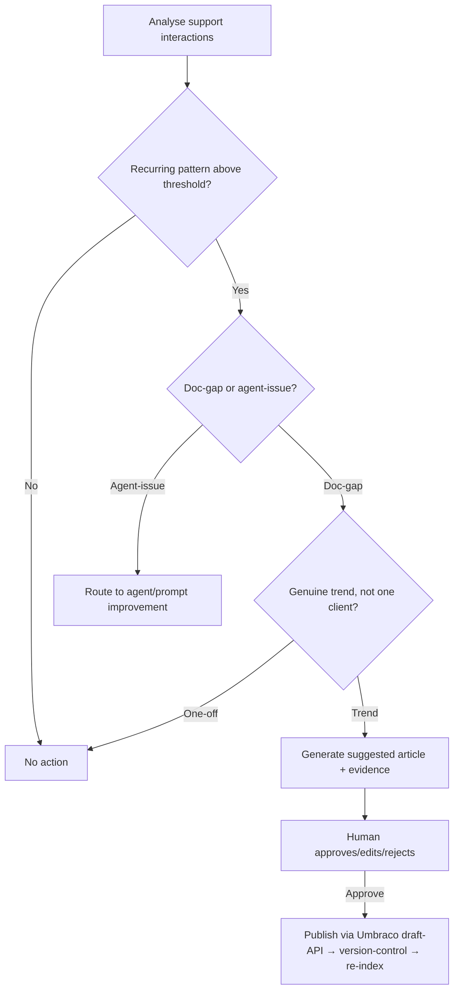
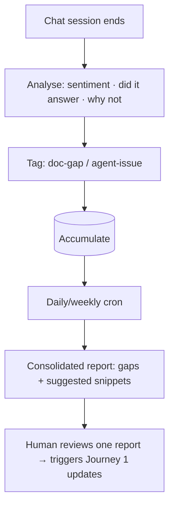

# TXN — Knowledge Engine: Proactive Mining

> **Sub-component:** [[knowledge-engine]] · **Component:** [[internal-ops-agents]] · **Vision:** [[vision]]
> **Date:** 2026-06-10
> **Status:** Defined
> **Owner:** _TBC_
> **Journey source:** [[ux-ai-knowledge-base-updates|KB Updates]]
> **Sources:** [[ux-ai-knowledge-base-updates]] (recurring-pattern → suggested article), [[10-06-2026-developer-support-and-internal-ops]] (per-chat analysis, cron consolidation, doc-gap vs agent-issue)

---

## 1. What Does This Sub-Sub-Component Do?

**Functional purpose:**

Where [[reactive-capture]] waits for a question the AI *couldn't* answer, Proactive Mining goes looking — it **continuously analyses support interactions to find recurring patterns** and turns them into proposed documentation, before they pile up as repeat tickets. The [[ux-ai-knowledge-base-updates]] journey is the spine: detect a recurring issue above a threshold (e.g. *"high volume of Visa partial-approval tickets"*), **generate a suggested KB article** (problem, explanation, recommended guidance) **with its supporting evidence**, and route it for **human approval** before publishing.

The 10-Jun session added the **analysis mechanism** (George): analyse **every chat** — sentiment, did-it-answer, and *why not* — and classify each gap as a **documentation issue** (improve the docs — this engine) or an **agent issue** (the agent's prompt needs to ask better clarifying questions — routed to agent/prompt improvement). A daily/weekly **cron job** consolidates all the support queries into a **single report with suggestions and snippets**, so a human doesn't read every chat. And **Mike's caution** governs it: only raise a change for a **genuine trend**, not one client's idiosyncratic way of building.

**Entities that interact with it:**

- **Mining agent** — analyses interactions, detects trends, drafts suggested articles.
- **TXN Support / Product Specialist** — reviews the consolidated report, approves/edits/rejects.

---

## 2. What Needs to Happen?

**Functional requirements:**

- **Continuously analyse support interactions** (tickets, AI-escalated cases, chat sessions): frequency, topic similarity, affected features, sentiment, and whether the AI answered.
- **Detect recurring patterns above a threshold** before suggesting anything; **classify** each gap as **doc-gap** (→ this engine) or **agent-issue** (→ agent/prompt improvement).
- **Generate a suggested KB article** (problem description, explanation, recommended guidance) **with the supporting evidence** that triggered it.
- Run a daily/weekly **cron consolidation** → a single report with suggestions + snippets (so humans don't read every chat).
- Route for **human approval** → publish via Umbraco draft-API → version-control → re-index.

**Business rules:**

- **Trends, not one-offs** (Mike) — validate a genuine pattern, not one client's pattern.
- **Evidence-attached** — every suggestion shows the patterns/tickets behind it.
- **Human approves** before publish; **validated-only** inclusion.
- Optionally produce **agent-facing vs user-facing** versions of an article.

**Edge cases:**

- Small/noisy sample → threshold gating; don't suggest off thin evidence.
- A pattern that's really an agent-prompt problem → route to agent improvement, not the docs.
- A client-specific pattern → do **not** generalise into the shared docs.

---

## 3. Entity Journeys

### 3a. Isolated Journeys

#### Journey 1: Recurring pattern → suggested article → publish

**Entity:** Mining agent + Support/Product Specialist (hybrid)

**Input:** Accumulated support interactions.

**Outcome:** A human-approved KB article ships for a genuine recurring issue, improving future self-service + AI answers.

**Steps:**

**Acceptance criteria:**

- [ ] Patterns are only surfaced above a defined threshold (no thin-evidence suggestions).
- [ ] Each gap is classified as doc-gap (→ KB) or agent-issue (→ agent improvement).
- [ ] A suggested article includes the supporting evidence that triggered it.
- [ ] A client-specific pattern is **not** generalised into the shared docs.
- [ ] A human approves before publish; the article is version-controlled + re-indexed.

#### Journey 2: Per-chat analysis + cron consolidation

**Entity:** Mining agent (agent)

**Input:** Every support chat/session as it ends; a daily/weekly schedule.

**Outcome:** A consolidated report of gaps + suggested snippets, so a human reviews one report, not every chat.

**Steps:**

**Acceptance criteria:**

- [ ] Each session is analysed for sentiment, answer-success, and failure reason.
- [ ] A scheduled job consolidates findings into one report with suggested snippets.
- [ ] The human reviews the consolidated report rather than individual chats.

---

## 5. Data Requirements

| What | Direction | Description | Source / Destination |
|------|-----------|------------|---------------------|
| Support interactions / chats | In | Tickets, AI-escalated cases, sessions | Support system / AI assistants |
| Pattern indicators | In | Frequency, topic similarity, sentiment, answer-success | Analysis layer |
| Suggested article + evidence | Out | The proposed doc change + its support | → human review |
| Consolidated report | Out | Daily/weekly gaps + snippets | → human review |
| Published article | Stored | After approval | KB (Umbraco draft-API) |

---

## 6. Dependencies

| Depends on | What we need | Blocking? |
|-----------|-------------|----------|
| Support-interaction feed | The raw material to mine | **Yes** |
| [[knowledge-engine]] parent (KB + Umbraco draft-API) | Publish + version-control + re-index | **Yes** |
| Agent / prompt improvement | Destination for agent-issue classifications | No — routing target |
| [[agent-access-layer]] | Tools + audit | No |

**What siblings/other components need from this one:**
- Complements [[reactive-capture]] (it mines patterns; capture handles single unanswered questions); routes agent-issues out to agent improvement.

---

## 7. Risks

**Specific risks:**
- **False pattern** from a small/noisy sample.
- **Over-generalising** one client's pattern (Mike).
- **Inaccurate AI-drafted article**.
- **Mis-classifying** an agent-issue as a doc-gap (or vice versa).

**Controls to build into the journeys:**
- **Threshold gating**; **trend-not-one-off** check; **evidence-attached** suggestions; **human approval**; explicit **doc-gap vs agent-issue** classification.

---

## 8. Priority

**Must-have at launch?** Yes — one of the two day-one loops; turns repeat questions into documentation. (The cron consolidation can follow the core suggestion flow.)

**Sequencing rationale:** Build with [[reactive-capture]]; rides the support feed + Umbraco draft-API.

---

## Sub-Sub-Sub-Components

Leaf node — no further decomposition needed.
