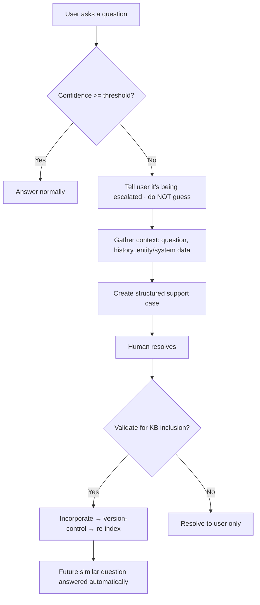

# TXN — Knowledge Engine: Reactive Capture

> **Sub-component:** [[knowledge-engine]] · **Component:** [[internal-ops-agents]] · **Vision:** [[vision]]
> **Date:** 2026-06-10
> **Status:** Defined
> **Owner:** _TBC_
> **Journey source:** [[ux-ai-knowledge-learning|Knowledge Learning]]
> **Sources:** [[ux-ai-knowledge-learning]] (governed learning through support resolution), [[10-06-2026-developer-support-and-internal-ops]] (the docs→AI→human loop)

---

## 1. What Does This Sub-Sub-Component Do?

**Functional purpose:**

Reactive Capture turns the questions the AI **couldn't** answer into validated knowledge. When the AI assistant ([[co-pilot]] or the portal) hits a query it can't answer confidently — its confidence falls below a defined threshold — it **does not guess** (a speculative answer is worse than none). Instead it tells the user the request is being escalated, **gathers the relevant context** (the question, the conversation history, the entity/system context), and creates a **structured support case** for a TXN specialist. Once the human resolves it, the verified answer is **validated and incorporated into the knowledge base**, so the same question is answered automatically next time. This is the "AI learns through governed support resolution" journey ([[ux-ai-knowledge-learning]]).

**Entities that interact with it:**

- **Client / developer** — asks the question that can't be answered.
- **AI assistant** — detects the knowledge gap, gathers context, opens the case.
- **TXN Support Specialist** — resolves the case and validates the answer for inclusion.

---

## 2. What Needs to Happen?

**Functional requirements:**

- Detect when the AI **cannot confidently answer** (confidence below the defined minimum) and **escalate rather than answer**.
- **Inform the user** the request is being escalated to TXN support.
- **Gather context** into a structured support case: user question, conversation history, relevant entity/system context, associated operational data.
- A **human resolves** the case; the resolution is **reviewed/validated** for knowledge inclusion.
- The validated answer is **incorporated into the KB**, **version-controlled**, and **re-indexed** so similar questions are answered automatically.

**Business rules:**

- **No speculative answers** below the confidence threshold.
- **Validated-only inclusion** — only human-verified resolutions enter the KB.
- The support case must carry **enough context** for efficient resolution.

**Edge cases:**

- Incomplete context → the case may stall; capture as much as possible and flag gaps.
- A resolution that conflicts with existing KB content → version control + review before inclusion.
- The same gap recurs before resolution → link cases so the pattern is visible to [[proactive-mining]].

---

## 3. Entity Journeys

### 3a. Isolated Journeys

#### Journey 1: Unanswered question → validated knowledge

**Entity:** AI assistant + Support Specialist (hybrid)

**Input:** A user asks a question the AI can't confidently answer.

**Outcome:** The user gets a reliable (human) answer, and the KB gains a validated entry so it's automatic next time.

**Steps:**

**Acceptance criteria:**

- [ ] Below the confidence threshold, the AI escalates instead of answering.
- [ ] The user is told their request is being escalated.
- [ ] The support case contains the question, conversation history, and relevant context.
- [ ] Only a human-validated resolution is incorporated into the KB.
- [ ] The included answer is version-controlled and re-indexed.
- [ ] A subsequent similar question is answered automatically.

---

## 5. Data Requirements

| What | Direction | Description | Source / Destination |
|------|-----------|------------|---------------------|
| User query | In | The unanswered question | AI assistant |
| Conversation + entity context | In | Context for the case | AI assistant / platform |
| Support case | Out / Stored | Structured, context-rich | Support system |
| Validated resolution | Stored | Human-verified answer | KB (Umbraco draft-API) |

---

## 6. Dependencies

| Depends on | What we need | Blocking? |
|-----------|-------------|----------|
| AI assistant ([[co-pilot]] / portal) | Confidence signal + context | **Yes** |
| Support system | Where the case lives + resolution | **Yes** |
| [[knowledge-engine]] parent (KB + Umbraco draft-API) | Publish + version-control + re-index | **Yes** |
| [[developer-support]] | The portal-side support entry point | No — shared |

**What siblings/other components need from this one:**
- Feeds the KB; recurring unresolved gaps surface to [[proactive-mining]].

---

## 7. Risks

**Specific risks:**
- **Speculative answers** if the threshold is mis-set.
- **Incomplete context** delaying resolution.
- **Knowledge corruption** from an unvalidated answer.

**Controls to build into the journeys:**
- **Confidence-gated escalation**; **rich context capture**; **validated-only inclusion**; version control + re-index via the parent.

---

## 8. Priority

**Must-have at launch?** Yes — one of the two day-one loops; ensures users get reliable answers and the KB grows from real gaps.

**Sequencing rationale:** Build with [[proactive-mining]]; rides the AI-assistant confidence signal + the support feed.

---

## Sub-Sub-Sub-Components

Leaf node — no further decomposition needed.
