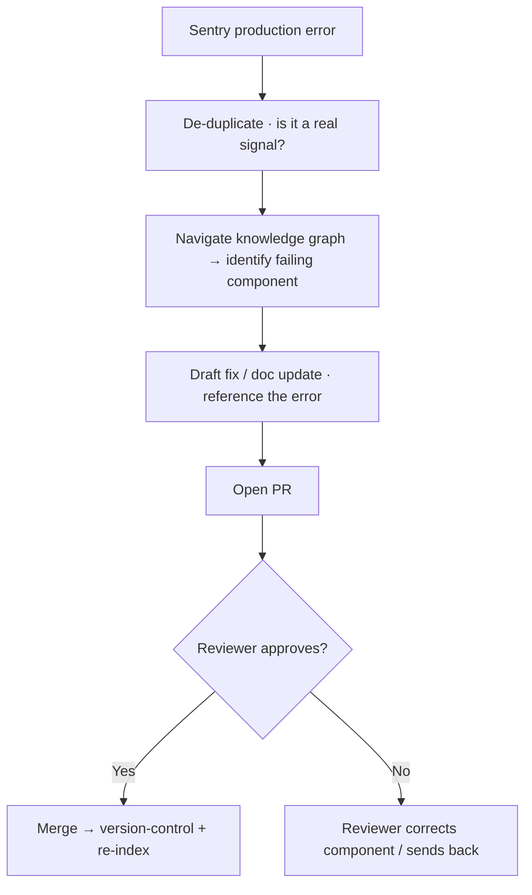

# TXN — Knowledge Engine: Self-Healing Docs

> **Sub-component:** [[knowledge-engine]] · **Component:** [[internal-ops-agents]] · **Vision:** [[vision]]
> **Date:** 2026-06-10
> **Status:** Defined
> **Owner:** _TBC_
> **Sources:** [[13-05-2026-txn-vision-meeting]] (self-healing documentation via Sentry → PR)

---

## 1. What Does This Sub-Sub-Component Do?

**Functional purpose:**

Self-Healing Docs is the **error-driven** input to the knowledge engine. Where the other two inputs are triggered by *questions*, this one is triggered by *production reality*: when a production error is caught by **Sentry**, an agent **navigates the knowledge graph**, identifies the **failing component**, and **opens a PR** with the fix/update for a human to review and merge. It keeps documentation (and, where relevant, code) honest against what's actually happening in production — closing the loop between an error in the wild and the doc/component that should have prevented it.

It is deliberately a **PR, not a direct commit** — a human stays in the loop.

**Entities that interact with it:**

- **Self-healing agent** — investigates the error, locates the component, drafts the PR.
- **TXN Dev / Release team** — reviews and merges the PR.

---

## 2. What Needs to Happen?

**Functional requirements:**

- A **Sentry production error** triggers the agent (webhook).
- The agent **navigates the knowledge graph** to identify the **failing component**.
- It **opens a PR** with the proposed fix/doc update, **referencing the error**.
- A human **reviews and merges**; the change then flows through the engine's version-control + re-index.

**Business rules:**

- **PR, not direct commit** — always human-reviewed.
- The PR must **reference the triggering error** and the component it targets.

**Edge cases:**

- Error maps to the wrong component → reviewer corrects; the PR makes the agent's reasoning visible.
- Noisy / duplicate errors → de-duplicate before opening a PR.
- Error is a symptom, not a root cause → flag for human triage rather than a superficial fix.

---

## 3. Entity Journeys

### 3a. Isolated Journeys

#### Journey 1: Error → PR

**Entity:** Self-healing agent → Dev/Release reviewer

**Input:** A production error caught by Sentry.

**Outcome:** A reviewed PR fixes/updates the right component or its docs.

**Steps:**

**Acceptance criteria:**

- [ ] A Sentry error triggers the agent.
- [ ] The agent identifies the failing component via the knowledge graph and references the error in the PR.
- [ ] It opens a PR (never a direct commit) for human review.
- [ ] Noisy/duplicate errors are de-duplicated before a PR is opened.
- [ ] A symptom-not-cause case is flagged rather than superficially fixed.

---

## 5. Data Requirements

| What | Direction | Description | Source / Destination |
|------|-----------|------------|---------------------|
| Production error | In | The trigger | Sentry |
| Knowledge graph | In | To locate the failing component | Vault / knowledge graph |
| PR (fix / doc update) | Out | The proposed change | Repo (GitHub) |

---

## 6. Dependencies

| Depends on | What we need | Blocking? |
|-----------|-------------|----------|
| Sentry | The production-error trigger (webhook) | **Yes** |
| Repo (GitHub) | To open PRs | **Yes** |
| Knowledge graph | Component identification | **Yes** |
| [[agent-access-layer]] | Tools + audit | No |

**What siblings/other components need from this one:**
- Feeds the [[knowledge-engine]] publish/version-control/re-index pipeline on merge.

---

## 7. Risks

**Specific risks:**
- **Wrong-component PR** — mis-located fix.
- **Noise** — too many low-value PRs from noisy errors.
- **Symptom not cause** — a superficial fix masking a real issue.

**Controls to build into the journeys:**
- **PR + human review** (never commit); **error de-duplication**; **reasoning visible** in the PR; **flag symptom-vs-cause** for triage.

---

## 8. Priority

**Must-have at launch?** No — needs production traffic + Sentry to be useful; comes after the reactive/proactive pair.

**Sequencing rationale:** Depends on Sentry + repo access; lower day-one value than the support-driven loops.

---

## Sub-Sub-Sub-Components

Leaf node — no further decomposition needed.
