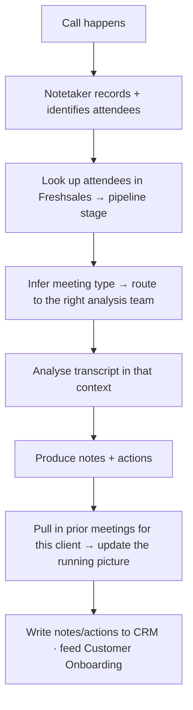

# TXN — Internal Ops: Meeting Capture &amp; Analysis

> **Component:** [[internal-ops-agents]] · **Vision:** [[vision]]
> **Date:** 2026-06-10
> **Status:** Defined
> **Owner:** _TBC_
> **Sources:** [[10-06-2026-developer-support-and-internal-ops]] (notetaker, CRM-aware meeting analysis, looped across meetings)

---

## 1. What Does This Sub-Component Do?

**Functional purpose:**

Meeting Capture &amp; Analysis is the agent that means **no one has to take notes and replay them** — the recurring manual grind Ian and Mike both flagged (kick-off calls that ended with "can you put all that in a document?"). A **notetaker** joins/records a call (via a meeting API — *"sounds more intimidating than it is"*, George), identifies the attendees, and looks them up in the **Freshsales CRM** to determine **where they are in the pipeline**. That stage tells the agent **what kind of meeting this is**, so it routes the transcript to the right **meeting-analysis agent team**, which analyses it **in that specific context** and produces structured **notes + actions**. Crucially it **loops across meetings**: meeting one's information and plan inform meeting two's analysis, building the full picture over a sequence rather than treating each call in isolation.

It is the feeder for [[customer-onboarding]] — the captured intent and any agreed changes flow into the SoW snapshot and the drift-detection watch — and the same pattern serves internal meetings generally.

**Entities that interact with it:**

- **Notetaker agent** — records the call, identifies attendees.
- **Meeting-analysis agent teams** — context-specific analysis (a bank of teams keyed to meeting type/stage).
- **TXN staff** (CSM / Ops / Mike) — receive the notes + actions; approve anything that updates a record.
- **Freshsales CRM** — the lookup that supplies pipeline stage + attendee context, and the destination for outputs.

---

## 2. What Needs to Happen?

**Functional requirements:**

- A **notetaker** captures the meeting (via the meeting API) and identifies attendees.
- The agent **looks attendees up in Freshsales** to infer the **pipeline stage** and meeting type.
- It **routes to the right meeting-analysis agent team** and analyses the transcript **in that context**.
- It produces **structured notes + actions**, and **carries context forward** across a sequence of meetings (meeting N informs meeting N+1).
- Outputs (notes, actions, captured intent, flagged changes) are written/sent to the **CRM** and to [[customer-onboarding]].

**Business rules:**

- **CRM-aware** — stage/context comes from Freshsales; outputs land back there.
- **Human approves record changes** — analysis can draft, but updates to a SoW/CIQ record are human-approved (via [[customer-onboarding]]).
- **Looped, not isolated** — prior meetings are context for the next.

**Edge cases:**

- Attendee not in the CRM → analyse with reduced context; flag for CRM enrichment.
- Meeting type ambiguous → default to a general analysis team; let the human reclassify.
- A captured item conflicts with a prior meeting (X≠Y vs X=Z) → surface the discrepancy across the two meetings (it knows the field came from an agent, not the client).

---

## 3. Entity Journeys

### 3a. Isolated Journeys

#### Journey 1: Capture and analyse a meeting in context

**Entity:** Notetaker + meeting-analysis agent team (agent)

**Input:** A scheduled call takes place (e.g. an onboarding kick-off).

**Outcome:** Structured notes + actions, analysed for the correct meeting type, written to the CRM and available to [[customer-onboarding]].

**Steps:**

**Acceptance criteria:**

- [ ] The notetaker captures the call and identifies attendees.
- [ ] Attendees are matched in Freshsales to derive the pipeline stage / meeting type.
- [ ] Analysis is performed by a team appropriate to that meeting type.
- [ ] Notes + actions are produced in a structured form.
- [ ] Prior meetings for the same client are used as context (the picture builds across the sequence).
- [ ] Outputs are written to the CRM and made available to [[customer-onboarding]].

### 3b. Cross-Component Journeys

#### Journey 1: Feed intent + drift into onboarding

**Entity:** Meeting-analysis agent → [[customer-onboarding]]

**Input:** Analysed notes/actions from an onboarding call.

**Handoff point:** Captured intent flows into the **SoW snapshot**, and any agreed change is passed to the **drift-detection** watch — both in [[customer-onboarding]], landing in the CRM.

**Components involved:** Meeting Capture → [[customer-onboarding]] → CRM

**Outcome:** Onboarding's record stays current from the conversations without anyone transcribing.

**Acceptance criteria:**

- [ ] Captured intent updates the SoW snapshot (human-approved).
- [ ] An agreed change triggers the drift watch.
- [ ] Field provenance (agent vs client vs TXN) is preserved for later review.

---

## 4. Look and Feel (Optional)

No client-facing UI — TXN staff receive the notes/actions through the agentic experience + Teams. A shared form/record view can show captured fields with provenance + status (see [[customer-onboarding]]).

---

## 5. Data Requirements

| What | Direction | Description | Source / Destination |
|------|-----------|------------|---------------------|
| Meeting transcript + attendees | In | The recorded call | Meeting-capture API |
| Pipeline stage / attendee context | In | Who they are, where they are in the pipeline | Freshsales CRM |
| Prior meeting notes | In | Context for the running picture | CRM |
| Notes + actions | Out / Stored | Structured analysis output | CRM, [[customer-onboarding]] |

---

## 6. Dependencies

| Depends on | What we need | Blocking? |
|-----------|-------------|----------|
| Meeting-capture API | Recording + attendee identification | **Yes** |
| **Freshsales CRM** | Stage/attendee lookup + output destination | **Yes** |
| [[customer-onboarding]] (sibling) | The consumer of intent/drift outputs | **Yes** |
| [[agent-access-layer]] | Tools + audit | No |

**What siblings/other components need from this one:**
- Feeds [[customer-onboarding]] (intent → SoW, agreed changes → drift watch).

---

## 7. Risks

**Specific risks:**

- **Mis-classified meeting** → wrong-context analysis.
- **Missing attendee context** → weaker analysis.
- **Silent record changes** — analysis must not change a SoW/CIQ record without approval.

**Controls to build into the journeys:**

- CRM-derived context with a general fallback team + human reclassification; **field provenance** so agent-written items are distinguishable; human-approval gate on any record change (via [[customer-onboarding]]).

---

## 8. Priority

**Must-have at launch?** Yes alongside [[customer-onboarding]] — it removes the kick-off-call note-taking grind and feeds the onboarding record.

**Sequencing rationale:** Depends on the meeting-capture API + Freshsales; build with [[customer-onboarding]].

---

## Sub-Sub-Components

Leaf node — no further decomposition needed.
