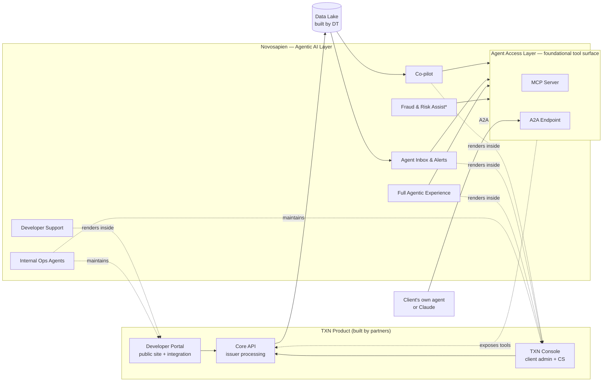

# TXN — Vision

> **Client:** TXN
> **Date:** 2026-05-13
> **Status:** Draft
> **Owner:** Ian Johnson (TXN)
> **Sources:** [[13-05-2026-txn-vision-meeting]], [[29-05-2026-stackworkz-meeting]] (partner landscape)

---

## 1. What Are You Building?

**One-liner:**

TXN is an issuer processor delivered through three product surfaces — a Core API, a TXN Console for client admins, and a Developer Portal for integrators. Novosapien provides the agentic AI layer that powers every human and agent-facing interaction across all three.

**Primer — how a card transaction works, and where TXN sits:**

TXN is an *issuer processor*: the technical engine that lets a business launch and run its own card programme without building card infrastructure itself and without becoming a bank. Same category as Marqeta or Galileo. TXN's customer is the **issuer** — the business whose name is on the card — not the cardholder.

Every card transaction passes through a chain of players:

- **Cardholder** — the person holding the card
- **Merchant** — where they spend
- **Acquirer** — the merchant's side / merchant's bank
- **Card network (Visa/Mastercard)** — the rails connecting both sides
- **Issuer** — the business whose card it is; owns the customer relationship and the funds
- **Issuer processor (TXN)** — operates the cards for the issuer: mints them, sets their rules, and answers the real-time *"approve or decline?"*

When a card is tapped:

1. Cardholder taps → merchant → acquirer → Visa.
2. Visa routes the authorisation request to TXN, because TXN runs that card.
3. TXN checks the card-level rules — valid, not suspended, within its spend controls.
4. **The MVP twist:** TXN doesn't hold the money. Rather than deciding itself, it asks the client's own banking system — which holds the accounts and balances — *"approve this for £X?"*
5. The client's system (the system of record) returns approve/decline.
6. TXN relays that back through Visa → acquirer → merchant — in well under a second.

So TXN does two core jobs: **issuing** (defining card products and minting individual cards — the "50–60 properties" configuration object) and **processing** (handling Visa's real-time authorisation messages and the pass-through approval above).

What TXN is **not**, in MVP: not a bank (no accounts, balances, or held funds — the client's stack stays the system of record), and not a complete fraud system (it signals; the client decides). This pass-through model is why several Novosapien components — particularly transaction/fraud assist — are shaped as *advise, don't decide*.

**Detailed narrative:**

Structurally, TXN is a card issuing platform — an issuer processor in the same category as Marqeta or Galileo. It is composed of three connected product surfaces: a **Core API** that does the actual card issuing and transactional processing; a **TXN Console** where TXN's clients run their card programs day-to-day (admin + customer service); and a **Developer Portal** that is simultaneously a public marketing site, an integration tool, and a self-serve support hub for developers building against the API. On its own this is a standard issuer-processor stack. What makes TXN distinct is that **AI is not a feature on the side — it is the operating principle of the product**, and Novosapien provides that AI layer end-to-end across all three surfaces.

The trust philosophy is structured around **three concepts** that map to how AI matures alongside the user. **Concept 1 — co-pilot:** the user drives, the AI recommends and explains impact ("if you make this change, X,000 cards will be affected"). **Concept 2 — agent-advisor:** the AI initiates ("I've noticed this, here are the actions I think you should take, may I execute?") and the human approves. **Concept 3 — full agentic / A2A:** the user's own agent talks to TXN's agent through standard protocols (MCP, A2A), and even approval flows are agent-mediated where authorisation rules allow. Multi-user approval queues — which the console already supports for sensitive changes — are first-class in this model: an agent can submit a change for approval, the named approver (or their agent) reviews and approves, and the action executes. The product ships Concepts 1 and 2 close together; Concept 3 is the destination.

The **core client experience** is built around the principle that the user is not a card expert and doesn't want to become one. A client logs into the Console, the AI knows what page they're on and pre-loads relevant context, and surfaces *actionable* alerts — never information for information's sake. The bar is: "if there isn't an action to take, why are you telling me?" Onboarding a new card program — historically a multi-week exercise — collapses into a guided conversation where the AI recognises the pattern ("this is a travel rewards programme, here's what most clients in your shape do") and applies the right configuration with the client confirming, not configuring. The phrase that captures the target outcome, from the discovery call: *"watch dashboards, watch the money, fine-tune P&L."*

The **developer experience** is a self-serve portal optimised for both human integrators and their AI assistants. The API reference is auto-rendered from the live YAML spec — always current. The change log is generated from git commits and Linear issues — release notes written in business-readable English rather than commit messages. A public sandbox lets developers try the API without signing up. A scoped chatbot answers integration questions from the documentation, and routes anything it can't answer to a defensive support stack. Every interaction has a feedback path — bug, product enhancement, or support request — that flows into the right internal queue without the developer having to choose.

A **data flywheel** makes the platform smarter over time. TXN launches with no customers and no transaction history. Early AI is navigation, configuration help, and ticket triage — value the platform can deliver from day one with no data. As transaction volume accumulates the AI moves to fraud signalling, anomaly detection, and cross-program recommendations ("five programs in your sector apply this control — should we apply it for you?"). Where data is sparse early, **simulation fills the gap**: agent-driven personas exercise the platform in tens of thousands of synthetic flows to test, train, and surface gaps in the documentation and the product itself.

**Internal operations are part of the vision, not a side-project.** Ian Johnson (TXN's CEO) was explicit: the worst outcome is delivering an agentic client experience while the business behind it is throttled by humans doing manual work. Release notes are auto-drafted by an agent that reads git + Linear and produces business-readable output. Support tickets are pre-triaged and partially diagnosed before they ever reach a human queue, with the human-resolved answer feeding back into the documentation so the next ticket of that shape never escalates. Documentation is self-healing: production errors caught by Sentry route to an agent that navigates the knowledge graph, identifies the failing component, and opens a PR. The same agentic philosophy that powers the client surfaces powers the business that runs them.

### How the parts connect

**Form factor:**

- **Primary:** REST API (issuer processing endpoints) — the actual product
- **Secondary:** Web Console (browser, for client admin + customer service users)
- **Secondary:** Web Developer Portal (public + auth'd integration tools)
- **Emerging:** Agent surfaces — MCP server, A2A endpoint — for client-owned agents and external LLMs (Claude, etc.)
- The AI is rendered **inside** the web surfaces; there is no separate AI UI

**Scope boundary:**

**TXN as a product IS:**

- An issuer processor (card issuing + card-level transaction handling, MVP scope)
- The agentic operating layer for card programs
- A real-time transaction approval pass-through to the client's system of record (TXN does not hold balances in MVP — the client's system is authoritative for funds and accounts)

**TXN as a product IS NOT:**

- Core banking — no accounts, no balance management. The client's existing banking stack remains the system of record.
- A complete fraud solution — TXN surfaces signals and offers rule-building; the client owns the fraud decision and ultimately tells TXN what was fraud after the fact.
- A marketing / corporate website — that lives separately from the Developer Portal.
- A general-purpose AI assistant — the AI is scoped to TXN's domain, not a Claude/ChatGPT replacement.

**Novosapien's delivery scope** (within the TXN product):

- ✅ The agentic AI layer rendered inside the Console and Developer Portal (co-pilot, alerts, agent inbox, scoped chatbot)
- ✅ The MCP server and A2A endpoint that expose TXN's capabilities to external agents
- ✅ Internal-operations agents (release-note generation, support triage, doc self-healing, simulation testing)
- ❌ **The Core API / card-system backend** — built by **Direct Transact (DT)**, TXN's internal dev partner. This is the same API TXN's clients call directly (not only via the Console). *Novosapien works from existing Core API documentation.*
- ❌ **The TXN Console (frontend + back-end-for-frontend)** — built by **Stackworkz**; frontend design by **Super Ultra**. The BFF talks to the Core API over API only, and **permissions + user management live in Stackworkz's BFF, not the Core API**. *Novosapien works from existing console design prototype documentation.*
- ❌ **The Developer Portal (site + Umbraco headless CMS)** — built by **Stackworkz**. *Novosapien works from existing developer portal site documentation.*
- ❌ **The Data Lake** — built by **Direct Transact (DT)**.
- 🤝 **Influence on the above** where the AI layer integrates: API shapes, console component instrumentation, portal AI plug-in points, data lake schema/tables for AI consumption.

---

## 2. Who Are You Building It For?

_This section is deliberately lightweight. TXN's product is B2B and Novosapien delivers only the agentic AI layer — we don't need marketing-grade buyer personas, demographics, or switching-trigger analysis. We need enough understanding of who uses each surface to build an AI layer that serves them well._

### Business context

TXN sells to **businesses that need card issuing capabilities**. Two broad shapes:

- **Established issuers** — businesses with a card already in market who want to migrate to a more modern / agentic processor, or expand their offering
- **New entrants** — businesses with an existing customer base who want to add financial services (cards) to what they already do

This is B2B. There is no consumer persona to model. TXN's customers are the businesses; their cardholders are not Novosapien's concern.

### Audiences Novosapien's AI layer serves

End users at those businesses interact with TXN through different surfaces — and the agentic AI layer is what they encounter on each.

| Audience | Surface | What they're trying to do |
|----------|---------|----------------------------|
| **Card Program Operators** | TXN Console | Run a card program day-to-day — configure, monitor, intervene, respond. Admin and customer-service users both sit here (permissions vary; experience design is shared). |
| **Integrators** | Developer Portal | Build against the TXN API. Find the right endpoint, understand it, test it, ship the integration. |
| **The client's own agents** | MCP / A2A | A client-built AI agent (or an LLM like Claude in the client team's hands) that needs to act on TXN's behalf, scoped to the human user it represents. |

Plus the internal audience Novosapien also serves:

| Audience | Surface | What they're trying to do |
|----------|---------|----------------------------|
| **TXN's internal team** | Internal-ops agents | Run the TXN business itself agentically — release notes, support triage, doc self-healing. Served by the [[internal-ops-agents]] component. |

### The unifying thesis

The user — whichever surface they're on — **does not want to become a card expert**. Ian Johnson (TXN's CEO) framed it as:

> *"I want to know as little as possible about the details about card programs and all those things. I don't want to employ a card expert. I want you to be my card expert."*

Michael Moores (TXN's CTO) reinforced:

> *"With AI and making banking easier we get more and more people through that just really don't understand banking or transactional stuff. So that's the sort of people we're trying to target there. If you don't have that expert knowledge, we can help and provide our own guidance."*

This is the load-bearing positioning. Every agentic feature in Novosapien's scope justifies itself by reducing the expertise burden on the user — the co-pilot explains what is about to happen; the agent-advisor proposes the right action so the user doesn't have to know what it is; the A2A endpoint means even the agent layer doesn't have to be configured by hand.

### Explicitly out of scope for this document

- **Demographics** — not Novosapien's concern; this is B2B
- **Switching triggers** — not Novosapien's concern; that's TXN's commercial team's question
- **Consumer-level personas** (cardholders) — not our users
- **Marketing-grade buyer personas** — TXN will develop these for their own go-to-market; we don't need them to build the AI

---

## 3. Why Are You Building It?

### Business opportunity

The card issuer processor market is dominated by API-first players (Marqeta, Galileo, and similar) that are technically capable but operationally heavy — clients still need teams of card experts to configure, monitor, and operate their programs. **The opportunity is to be the agentic-native issuer processor** — built from day one assuming the user does not want to (and increasingly does not have to) configure and operate the platform themselves. Incumbents have to retrofit AI onto existing SaaS consoles; a new entrant can build the agentic experience as the primary interface, not a side panel.

A point of timing surfaced in the conversation: this thesis only becomes buildable now. The underlying agentic technology (MCP, A2A protocols, dependable tool-use, multi-step reasoning) reached production-readiness in recent months. A small lead in agentic maturity translates into a structural product advantage during this window.

### Client's motivation

The framing from **Ian Johnson, TXN's CEO**, dominates this section. He was explicit that **differentiation against existing issuer processors is the strategic priority**, and that differentiation is the agentic experience itself — not feature parity with incumbents:

> *"We need to go to market with something that offers differentiation against what people are used to working with."*

The strategic concern is also visible: Ian repeatedly pushed back on a "concept 1 first, concept 2 later" rollout because he believes the window for concept 2 leadership is short:

> *"I don't think we can do concept one and then at some point in the future do concept two because I think somebody will beat us to it."*

This is a positioning bet. TXN believes that within a short period the *baseline* user expectation will shift from "SaaS console with an AI helper" to "agent that runs the thing." Being first to that baseline is the win.

### Cost of inaction

Three layers, increasingly serious:

1. **Commoditisation.** Without agentic differentiation, TXN competes head-on with established API-first issuer processors on features and price. The market backdrop discussed in the call (the broader squeeze on traditional SaaS) applies directly.
2. **Competitive displacement.** Ian's explicit fear — *"somebody will beat us to it"* on Concept 2. If a competitor lands the agent-advisor experience first, TXN's launch positioning is a year behind on day one.
3. **Internal-ops drag.** Even if the client-facing product is agentic, manual internal processes (release notes, support triage, doc maintenance) become the new bottleneck. Ian flagged this directly: *"You are the single point of failure."* Without internal-ops automation, the experience the client sees can't keep up.

### Gaps to raise next call

- **Market sizing** — what TAM is TXN going after? Specific named competitor weaknesses — who is most vulnerable to displacement and why?
- **Drivers beyond agentic-tech maturity** — any regulatory shift, platform deprecation, or partner movement also opening the window?
- **Financial cost of inaction** — what does TXN forecast if Concept 2 ships 12 months later than ideal?
- **Personal motivation for the founding team** — is TXN a standalone venture, a strategic bet within a larger business, or a pivot? Affects risk appetite and patience.

---

## 4. What Makes This Better Than the Alternatives?

### The differentiation thesis

TXN's differentiation against existing issuer processors is **agentic-native vs. retrofitted**. Incumbents (Marqeta, Galileo, and the broader API-first category) are mature SaaS platforms now adding AI features on top of consoles designed for expert users. TXN inverts the assumption: agentic experience is the primary interface from day one — humans drive in Concept 1, agents drive in Concept 3, and the product is built so users move along that trajectory without re-platforming.

This is a **structural** difference, not a feature-list difference. An incumbent can ship AI features tomorrow; they cannot retroactively redesign their console for an agent-first user without disrupting their existing customers.

### Incumbent weaknesses surfaced in the conversation

Michael Moores (TXN's CTO) named two specific points of weakness drawn from his experience at previous issuer processors (companies unnamed):

> *"You'd have to build out to the APIs to do standard simple operating functionality."*

Incumbents are API-first but UX-thin. Common operations require integration work that customers have to do themselves.

> *"Yes we have all these properties but unless you know what they mean and understand truly what they do in terms of the business sense people turn them on and off and they can break things."*

Configuration exposes raw mechanics. Card products have 50–60 properties on the JSON object; users without card-domain expertise cannot reason about which to change or what the consequences will be. There is no business-language wrapper over the technical interface. _[⚠ open — see [[open-questions]] #1]_

### Unfair advantage

None proprietary. TXN's advantage is **timing and positional commitment**:

- The agentic technology stack (MCP, A2A, dependable tool-use, multi-step reasoning) reached production-readiness in recent months.
- Building agentic-as-primary (rather than agentic-as-feature) is a structural decision that is harder for incumbents to make without disrupting their existing user base.
- Novosapien's agentic-AI delivery capability supports this — TXN does not have to build the agentic layer themselves.

This is a positional advantage, not a defensible moat.

### Competitor table — explicitly empty for this vault

| Competitor / Alternative | What they do | What works well | What doesn't work | Link |
|-------------------------|-------------|----------------|-------------------|------|
| _Not researched in this vault — owned by TXN's commercial team_ | | | | |

### Explicitly out of scope for this document

- Named-competitor feature-by-feature comparison — owned by TXN's commercial team
- Pricing analysis against incumbents — same
- Market analyst reports — same

What Novosapien needs from §4 is just enough understanding of the strategic differentiation to build AI components that lean into it. The positioning above is sufficient for that.

### Gaps to raise next call

- **Validate the incumbent-weakness framing** — does TXN's broader team agree these are the right points to differentiate against, or are there others (latency, fraud capability, geographic coverage, etc.) that matter more?
- **Concept 2 timing assumption** — Ian's "someone will beat us to it" assumes a market move that has not been quantified. Worth asking: which competitors are actively building agent-advisor experiences, and on what timeline?
- **Positional defence** — once TXN ships, what stops an incumbent from copying the agentic-native approach within 12–18 months?

---

## 5. How Does It Make Money?

### Pricing strategy is owned by TXN

TXN has existing commercial discussions and pricing in place. **Pricing strategy is not a Novosapien decision area** — we do not influence rates, tier structure, deal terms, or commercial models.

### Pricing structure matters to Novosapien's deliverables

That said, pricing tiers and usage limits **do** create surface area for the AI layer. Several Novosapien components depend on understanding tier structure (without needing the rates themselves):

- **Tier-limit alerts** — if TXN's model has volume tiers (transactions, cards, fraud check volume, etc.), the Console needs proactive alerts when clients approach limits. This is *Agent Inbox* surface area.
- **Pricing-aware recommendations** — if the agent-advisor proposes actions with billing implications ("issuing 10,000 more cards moves you to the next tier"), the AI needs read access to a client's current tier and the next breakpoint.
- **Self-serve tier changes** — if clients can change tiers via the Console, the co-pilot may need to mediate (proposing the change, surfacing the impact, confirming before submission).

### Billing system ownership

The billing system is **not Novosapien's deliverable**. Its location and ownership has not been confirmed in this discovery call. Possibilities to validate:

- Part of the **Core API** (typical for issuer processors)
- Part of the **TXN Console** (as an admin surface)
- A **third-party billing provider** integrated by TXN
- Managed by **DT** alongside the data lake

This affects how the AI layer integrates: read-only data access for recommendations vs. consuming a structured API.

### Gaps to raise next call

- **Tier structure** — what tiers exist, what dimensions define them (transaction volume, card count, fraud check volume, etc.), what events trigger an upgrade conversation. We don't need pricing detail — just enough to design AI surface area.
- **Billing system location** — Core API, Console, third-party, or DT. Affects integration design.
- **Pricing transparency in the product** — is pricing surfaced inside the Console (so the co-pilot can reference it) or held externally?

### Explicitly out of scope for Novosapien

- Pricing strategy, competitor pricing analysis, deal structure
- Sales motion (self-serve vs. enterprise)
- Margin analysis, unit economics
- The billing system itself, wherever it lives

---

## 6. Constraints

### Technology constraints

Multi-vendor build environment that Novosapien plugs into rather than controls:

- **Core API** — built by TXN's dev team. Novosapien works from existing API documentation.
- **TXN Console** — built by TXN's console build team; frontend designed by a third-party designer. Novosapien works from existing console design prototype documentation.
- **Developer Portal** — built by a third-party portal team using **Umbraco CMS**. Novosapien works from existing developer portal site documentation.
- **Data Lake** — built by **DT** (TXN's internal dev partner). Novosapien provides input on schema/tables for AI consumption but does not build the lake.
- **Visa** is the upstream payment network. The transaction approval flow passes through TXN to the client's system of record.
- **Anticipated agent-layer technologies:** MCP server (for tool-style agent access) and A2A protocol endpoint (for agent-to-agent integration).

### Legal / compliance constraints

- **Payments domain → elevated risk tolerance.** What the AI is allowed to do without explicit human (or agent) approval is constrained by the action's blast radius. Single-card actions sit at one end; program-wide configuration changes sit at the other.
- **TXN owns all compliance frameworks.** Every regulatory and compliance question — PCI-DSS, KYC/AML, ISO 27001, GDPR, data residency, audit retention, and anything else that applies — is TXN's responsibility. Novosapien's job is to build AI components that *respect* whatever rules TXN sets, not to determine those rules.
- **The client (TXN's customer) owns their own regulatory compliance.** TXN surfaces region-specific requirements ("we've noticed you're in the UK, you should do this") and offers to apply them — but the client accepts or declines. Michael Moores (TXN's CTO): *"we offer a solution that allows them to be compliant but we are not responsible for the compliance."*
- **Fraud decisions sit with the client.** TXN signals; the client (or their agent) decides. Novosapien's components do not auto-execute fraud responses.
- **Multi-user approval queues are first-class.** The Console already has *"someone else must approve your change"* flows for sensitive operations — the AI must respect this model and route actions through approval where required.

### Dependencies

- **Visa** — upstream payment network; transaction flow depends on Visa connectivity. Out of Novosapien's control entirely.
- **TXN's Core API team** — Novosapien's AI layer cannot ship before stable API endpoints exist for it to call.
- **TXN's Console build team** — the in-app Co-pilot and Agent Inbox depend on Console instrumentation points (page state, component identifiers, action handlers). Michael flagged this directly: *"they may do additional work to allow you to you know plug in the AI basically."*
- **Third-party Developer Portal team** — the Scoped Support Chatbot depends on portal AI plug-in points.
- **DT** — data lake schema affects what the AI can query for analytics, recommendations, and alerts.

### Non-negotiables

- **Approval workflows exist and must be respected.** Any AI-initiated state change must flow through the Console's existing approval queue when policy requires it.
- **TXN does not hold balances in MVP.** Every transaction approval is a pass-through to the client's system of record. The AI cannot make authoritative decisions on funds.
- **The client owns fraud decisions.** AI surfaces signals; the client decides.
- **AI is scoped to TXN's domain.** Not a general-purpose Claude/ChatGPT replacement.
- **Don't build what someone else owns.** Novosapien delivers the agentic AI layer only. We do not build the Core API, Console, Developer Portal site/CMS, or Data Lake — even if we have opinions.

### Gaps to raise next call

- **Risk-tolerance specifics around AI** — what AI actions are *never* allowed even with approval? Where is the boundary between agent-advisor and full-agentic for high-risk operations? What blast radius requires explicit human override regardless of trust level?
- **Console instrumentation depth** — does the Console build team have a planned AI plug-in interface, or does Novosapien need to influence its build to enable Co-pilot and Agent Inbox?
- **API stability and timing** — when does the Core API stabilise enough for Novosapien to build against it? What is the YAML release cadence? How are breaking changes managed?
- **Audit / observability** — what audit trail does TXN require for AI-initiated actions? Where does the audit log live (Console, API, separate system)? What's retained, for how long, and who can read it?

---

## 7. What Exists Today?

### Existing systems / platforms

TXN is **pre-launch**. The platform is being built by multiple partners and is at different stages of maturity:

- **Core API** — under active development by TXN's own dev team. A YAML spec is generated on every deploy and is the canonical interface definition.
- **TXN Console** — design is "pretty clear" (Michael Moores, TXN's CTO); being built by TXN's Console build team with frontend designed by a third-party designer. Approval queue logic, granular permissions model, and notifications/alerts backend are already part of the design.
- **Developer Portal** — in MVP build phase, started 12 May 2026. Built by a third-party portal team using **Umbraco CMS**. Full prototype reviewed; MVP narrowing in progress. **A final prototype review is scheduled for Thursday 19 May 2026 — Novosapien is invited.**
- **Data Lake** — planned, being built by DT (TXN's internal dev partner). Not yet operational.
- **Visa** — upstream payment network. Connectivity assumed in place at the API level.

### Existing user base

None. TXN is pre-launch — no customers, no signed pilots referenced in this call.

### Existing data / content

- **No transaction data.** This drove a significant portion of the discovery call — the AI cannot rely on production data for fraud signalling, anomaly detection, or cross-program recommendations until volume accumulates. Simulation-based testing was discussed as the early substitute.
- **Core API documentation** — exists, from TXN. Available as Novosapien's reference for API capabilities.
- **TXN Console design prototype documentation** — exists, from the third-party designer. Available as Novosapien's reference for Console structure, component model, and interaction patterns.
- **Developer Portal site documentation** — exists, from the third-party portal builder. Available as Novosapien's reference for portal structure and content surfaces.
- **Brand guidelines** — Dorte Dye (TXN's COO) referenced a brief PowerPoint of program/brand guidelines, to be shared.

### Previous work

- **AI user-journey designs** — Michael referenced existing user-journey work on specific AI use cases that TXN had drafted before this discovery call. To be shared with Novosapien.
- **Domain experience embedded in TXN's team** — Michael's experience at previous issuer processors directly informs the product's positioning. The configuration-overhead and onboarding-time pain points (§4) come from that background, not from research.

### Existing branding / design language

- Brief brand guidelines PowerPoint held by Dorte Dye, to be shared.
- **Novosapien commitment**: the review portal and console surfaces Novosapien builds for TXN will respect TXN's brand guidelines once received.

### Gaps to raise next call

**Materials to request from TXN:**

- Core API documentation (full set)
- Console design prototype documentation
- Developer Portal site documentation
- Brand guidelines PowerPoint
- AI user-journey designs Michael referenced

**Events / touchpoints to action:**

- Attend the Developer Portal final prototype review on **Thursday 19 May 2026** and capture findings
- Schedule a working session with the Console build team about the AI plug-in interface

**Information to confirm:**

- Data Lake schema visibility — when does DT share the schema so Novosapien can plan AI query patterns?
- Console build team and third-party Portal team direct points of contact

---

## 8. Risks

_Risks were not discussed directly in the discovery call. The risks below are Novosapien's read of the AI-layer threat surface, framed against what we've learned about TXN's product and constraints. They focus on Novosapien's deliverables — risks at the platform level (Visa, infrastructure security, regulatory shifts) sit with TXN._

### Abuse and gaming (AI layer)

- **Prompt injection through user-controlled fields.** Card names, merchant descriptors, support-ticket content, and any other user input flowing into AI context is an attack vector. Malicious or careless users could embed instructions that change AI behaviour.
- **Permission escalation via the AI.** A user (or their agent) tries to get the AI to perform actions beyond their authorisation — by social engineering or by exploiting gaps between the AI's tool-permission model and the Console's permission model.
- **Approval-queue bypass.** The AI must not find (or be coaxed into finding) paths around approval workflows. If the Console requires a second person to approve a change, the AI cannot self-approve or impersonate.
- **Cross-tenant leakage.** An agent serving Client A must not surface data from Client B in any response, suggestion, or implicit training signal.
- **A2A protocol abuse.** A client's own agent communicating via A2A could send misleading framing or falsified context to escalate scope. TXN's agent must validate, not just trust.

### Data and integrity risks

- **Hallucination of card-domain knowledge.** Card issuing has high-cost wrong answers (a misconfigured spend control can lose money or break compliance). AI must be grounded in TXN's documentation, not relying on generic LLM training.
- **Stale data.** Data lake queries that read state before a write completes will produce recommendations based on outdated state. AI must be aware of consistency boundaries.
- **Documentation drift.** Auto-generated docs from the YAML spec are only as accurate as the spec. A Core API change unreflected in the YAML will break the chatbot silently.
- **Schema change breakage.** Data Lake schema changes from DT can break AI queries without warning if not coordinated. Versioning and contract testing matters.

### Compliance and regulatory

TXN owns the compliance frameworks themselves (per §6). Novosapien's exposure is in *implementation*:

- **Audit log gaps** — AI-initiated actions must be attributed with enough metadata that the audit trail satisfies whatever framework TXN selects.
- **Data residency** — Some frameworks require data stay in specific regions. Novosapien must respect TXN's residency rules when choosing LLM provider deployments.
- **PII handling in LLM context** — Cardholder data (PANs, names, addresses) should not flow into LLM prompts unless the deployment is appropriately scoped and certified.
- **Right-to-erasure** — If a client invokes data deletion, AI training data, cached embeddings, and audit logs may need to honour that.

### User experience risks

- **Trust collapse.** AI gets one big thing visibly wrong, users disable the co-pilot wholesale and TXN's differentiation evaporates. The blast-radius framing (§6) becomes critical here.
- **Alert fatigue.** Too many notifications — users stop reading them and miss the important one. Ian's *"if there isn't an action to take, why are you telling me?"* principle directly counters this.
- **Latency mismatch.** Console rendering must not wait for AI; AI assistant responses are acceptable at Claude-like speeds. Mixing the two is what causes "this product feels slow" perception even when only one path is slow.
- **A2A protocol immaturity.** The agent-to-agent space is still evolving. A client's integration could break when standards shift, even if Novosapien follows current best practice.
- **Concept-2 readiness.** Ian's concern (§3): shipping Concept 1 without Concept 2 close behind risks the product feeling already-dated at launch. Sequencing risk on Novosapien's roadmap.

### Out of scope for Novosapien (for the avoidance of doubt)

- General card-fraud at the transactional level (Visa risk, AML through the platform) — TXN
- Platform-level security (Console / Portal / API infrastructure) — TXN and the respective build teams
- Vendor concentration risk (LLM provider availability, etc.) — operational/architecture concern, captured elsewhere
- Macro regulatory shifts (a regulator banning AI in payments, etc.) — TXN's compliance team

### Gaps to raise next call

- **Catastrophe scenario** — what is TXN most worried about going wrong with the AI, and what is the agreed mitigation?
- **PII handling policy** — what cardholder data can flow into LLM context, under what conditions, with what redaction?
- **A2A protocol position** — does TXN have a preferred A2A standard, or are we tracking the space and adopting late?
- **Incident response** — when the AI gets something wrong publicly, who is on-call, what is the rollback path, what is the user communication?

---

## Components

_Components are identified during vision extraction (visible in the §1 narrative) and formalised through component deep-dives. Status `Collecting` means surfaced in vision but not yet documented._

| Component | Overview | Status | Link |
|-----------|----------|--------|------|
| Co-pilot | Reactive in-console assistant (C1) — Q&A, inline recommendations, impact preview, guided onboarding | Defining | [[co-pilot]] |
| Agent Inbox & Alerts | Proactive lane (C1→C2) — event analysis surfaced as actionable alerts and investigated, approvable plans | Defined | [[agent-inbox-alerts]] |
| Full Agentic Experience | Agent-as-interface (C2→C3) — do-anything, renders UI in real time | Defining | [[full-agentic-experience]] |
| Developer Support | Portal/docs chatbot, scoped Q&A, defensive triage, feedback routing; MCP/LLMS.txt machine layer | Defining | [[developer-support]] |
| Agent Access Layer | Foundational tool surface every agent calls, permission-scoped; Core API wrapped as MCP tools; **includes the A2A endpoint** for clients' own external agents | Defined | [[agent-access-layer]] |
| Fraud & Risk Assist | Real-time enrichment of the approve/decline pass-through + rules engine; advise, don't decide | Collecting | [[fraud-risk-assist]] |
| Internal Ops Agents | Run TXN agentically — release pipeline, Documentation Engine, ticket routing, process automation | Collecting | [[internal-ops-agents]] |
